# 🚀 K3s ArgoCD Proxmox Cluster
=========================

> Modern GitOps deployment structure using ArgoCD on Kubernetes with Proxmox virtualization

A GitOps-driven Kubernetes cluster using K3s, ArgoCD, and Cilium, with integrated Cloudflare Tunnel for secure external access. Built for both home lab and small production environments.

## 📋 Table of Contents

- [Prerequisites](#-prerequisites)
- [Architecture](#-architecture)
- [Quick Start](#-quick-start)
  - [System Setup](#1-system-dependencies)
  - [K3s Installation](#2-k3s-installation)
  - [Networking Setup](#3-cilium-installation)
  - [GitOps Setup](#4-argocd-installation)
  - [Secret Management](#5-secret-management)
- [Verification](#-verification)
- [Documentation](#-documentation)
- [Hardware Stack](#-hardware-stack)
- [Scaling](#-scaling-options)
- [Troubleshooting](#-troubleshooting)
- [Contributing](#-contributing)
- [License](#-license)

## 📋 Prerequisites

- Linux server/VM (can be Proxmox VM, mini PC, NUC, or similar)
  - Minimum 4GB RAM (8GB+ recommended)
  - 2 CPU cores (4+ recommended)
  - 20GB storage (100GB+ recommended for applications)
- Domain configured in Cloudflare
- 1Password account for secrets management
  - 1Password Connect credentials and token
  - Cloudflare API tokens and tunnel configuration
- `kubectl` installed locally
- `cloudflared` installed locally

## 🏗️ Architecture



```mermaid
graph TD
    subgraph "Argo CD Projects"
        IP[Infrastructure Project] --> IAS[Infrastructure ApplicationSet]
        AP[Applications Project] --> AAS[Applications ApplicationSet]
        MP[Monitoring Project] --> MAS[Monitoring ApplicationSet]
        AIP[AI Project] --> AIAS[AI ApplicationSet]
    end
    
    subgraph "Infrastructure Components"
        IAS --> N[Networking]
        IAS --> S[Storage]
        IAS --> C[Controllers]
        IAS --> DB[Database]
        
        N --> Cilium
        N --> Cloudflared
        N --> Gateway
        
        S --> OpenEBS
        S --> VolumeSnapshots
        
        C --> CertManager
        C --> ExternalSecrets
        
        DB --> CloudNativePG
    end
    
    subgraph "Monitoring Stack"
        MAS --> Prometheus
        MAS --> Grafana
        MAS --> AlertManager
        MAS --> Loki
    end
    
    subgraph "User Applications"
        AAS --> Home[Home Apps]
        AAS --> Media[Media Apps]
        AAS --> Dev[Dev Tools]
        AAS --> Privacy[Privacy Apps]
        
        Home --> Frigate
        Home --> WyzeBridge
        
        Media --> Plex
        Media --> Jellyfin
        
        Dev --> Kafka
        Dev --> Temporal
        
        Privacy --> SearXNG
        Privacy --> LibReddit
    end
    
    subgraph "AI Applications"
        AIAS --> Ollama
        AIAS --> ComfyUI
    end

    style IP fill:#f9f,stroke:#333,stroke-width:2px
    style AP fill:#f9f,stroke:#333,stroke-width:2px
    style MP fill:#f9f,stroke:#333,stroke-width:2px
    style AIP fill:#f9f,stroke:#333,stroke-width:2px
    style IAS fill:#bbf,stroke:#333,stroke-width:2px
    style MAS fill:#bbf,stroke:#333,stroke-width:2px
    style AAS fill:#bbf,stroke:#333,stroke-width:2px
    style AIAS fill:#bbf,stroke:#333,stroke-width:2px
```

### Key Features
- **Three-Tier Architecture**: Separate infrastructure, monitoring, and applications
- **Sync Waves**: Controlled deployment order through ArgoCD sync waves
- **Simple Directory Patterns**: No complex include/exclude logic
- **All-in-One Management**: Just three ApplicationSets to manage everything
- **GPU Integration**: Support for hardware acceleration with NVIDIA GPUs

## 🚀 Quick Start

### 1. System Dependencies
```bash
# Install required system packages
sudo apt install zfsutils-linux nfs-kernel-server cifs-utils open-iscsi
sudo apt install --reinstall zfs-dkms

# Install 1Password CLI (follow instructions at https://1password.com/downloads/command-line/)
```

### 2. K3s Installation
```bash
export SETUP_NODEIP=192.168.10.11
export SETUP_CLUSTERTOKEN=randomtokensecret123333334

curl -sfL https://get.k3s.io | INSTALL_K3S_VERSION="v1.32.0+k3s1" \
  INSTALL_K3S_EXEC="--node-ip $SETUP_NODEIP \
  --disable=flannel,local-storage,metrics-server,servicelb,traefik \
  --flannel-backend='none' \
  --disable-network-policy \
  --disable-cloud-controller \
  --disable-kube-proxy" \
  K3S_TOKEN=$SETUP_CLUSTERTOKEN \
  K3S_KUBECONFIG_MODE=644 sh -s -

# Setup kubeconfig
mkdir -p $HOME/.kube
sudo cp -i /etc/rancher/k3s/k3s.yaml $HOME/.kube/config
sudo chown $(id -u):$(id -g) $HOME/.kube/config
chmod 600 $HOME/.kube/config
```

### Adding Worker Nodes
```bash
# On worker node
curl -sfL https://get.k3s.io | K3S_URL=https://myserver:6443 K3S_TOKEN=mynodetoken sh -

# Worker nodes:
# - Don't run storage workloads
# - Only handle compute tasks
# - Automatically join the cluster
```

### 3. Cilium Installation
```bash
# Install Helm if not already installed
curl https://raw.githubusercontent.com/helm/helm/main/scripts/get-helm-3 | bash

# Add Cilium Helm repository
helm repo add cilium https://helm.cilium.io/
helm repo update

# Install Cilium using Helm
helm install cilium cilium/cilium -n kube-system \
  -f infrastructure/networking/cilium/values.yaml \
  --version 1.17.1 \
  --set operator.replicas=1

# Verify the installation
kubectl -n kube-system get pods -l k8s-app=cilium
kubectl -n kube-system get pods -l k8s-app=cilium-operator

# Install Gateway API CRDs
kubectl apply -f https://github.com/kubernetes-sigs/gateway-api/releases/download/v1.2.0/standard-install.yaml
kubectl apply -f https://github.com/kubernetes-sigs/gateway-api/releases/download/v1.2.0/experimental-install.yaml

```

### 4. ArgoCD Installation
```bash


# Install ArgoCD with custom configuration
k3s kubectl kustomize --enable-helm infrastructure/controllers/argocd | k3s kubectl apply -f -
//talos 
kubectl kustomize --enable-helm infrastructure/controllers/argocd | kubectl apply -f -

# Wait for ArgoCD to be ready
kubectl wait --for=condition=available deployment -l app.kubernetes.io/name=argocd-server -n argocd --timeout=300s

# Wait for CRDs to be established
kubectl wait --for=condition=established crd/applications.argoproj.io --timeout=60s
kubectl wait --for=condition=established crd/appprojects.argoproj.io --timeout=60s
```

### 5. Secret Management
```bash
# Create required namespaces
kubectl create namespace 1passwordconnect
kubectl create namespace external-secrets

# Generate and apply 1Password Connect credentials
op connect server create  # Creates 1password-credentials.json
export CONNECT_TOKEN="your-1password-connect-token"

# Create required secrets
kubectl create secret generic 1password-credentials \
  --from-file=1password-credentials.json=credentials.base64 \
  --namespace 1passwordconnect

kubectl create secret generic 1password-operator-token \
  --from-literal=token=$CONNECT_TOKEN \
  --namespace 1passwordconnect

kubectl create secret generic 1passwordconnect \
  --from-literal=token=$CONNECT_TOKEN \
  --namespace external-secrets
```

## 🛠️ Final Deployment

Deploy the three-tier structure in order:

```bash
# 1. First apply the ArgoCD projects
kubectl apply -f infrastructure/controllers/argocd/projects.yaml -n argocd

# 2. Apply infrastructure components (sync wave -2 ensures they run first)
kubectl apply -f infrastructure/infrastructure-components-appset.yaml -n argocd

# 3. Apply monitoring components (sync wave 0)
kubectl apply -f monitoring/monitoring-components-appset.yaml -n argocd

# 4. Finally, apply user applications (sync wave 1 ensures they run last)
kubectl apply -f my-apps/myapplications-appset.yaml -n argocd
```

### Key Deployment Features
- Three-tier architecture separating infrastructure, monitoring, and applications
- Sync waves ensure proper deployment order
- Simple directory patterns without complex include/exclude logic
- All components managed through just three top-level ApplicationSets

## 🔍 Verification
```bash
# Check core components
kubectl get pods -A
cilium status

# Check ArgoCD
kubectl get application -A
kubectl get pods -n argocd

# Check secrets
kubectl get pods -n 1passwordconnect
kubectl get externalsecret -A
```

## 📋 Documentation
- **[View Documentation Online](https://mitchross.github.io/k3s-argocd-proxmox)** - Full documentation website
- **[Local Documentation](docs/)** - Browse documentation in the repository:
  - [ArgoCD Setup](docs/argocd.md)
  - [Network Configuration](docs/network.md)
  - [Storage Configuration](docs/storage.md)
  - [Security Setup](docs/security.md)
  - [GPU Configuration](docs/gpu.md)
  - [External Services](docs/external-services.md)
  - [Project Structure](docs/structure.md)

## 💻 Hardware Stack
```
🧠 Compute
├── AMD Threadripper 2950X (16c/32t)
├── 128GB ECC DDR4 RAM
├── 2× NVIDIA RTX 3090 24GB
└── Google Coral TPU

💾 Storage
├── 4TB ZFS RAID-Z2
├── NVMe OS Drive
└── Local Path Storage for K8s

🌐 Network
├── 2.5Gb Networking
├── Firewalla Gold
└── Internal DNS Resolution
```

## 🔄 Scaling Options

While this setup uses a single node, you can add worker nodes for additional compute capacity:

| Scaling Type | Description | Benefits |
|--------------|-------------|----------|
| **Single Node** | All workloads on one server | Simplified storage, easier management |
| **Worker Nodes** | Add compute-only nodes | Increased capacity without storage complexity |
| **Multi-Master** | High availability control plane | Production-grade resilience |

## 📁 Directory Structure

```
.
├── infrastructure/           # Infrastructure components
│   ├── controllers/          # Kubernetes controllers
│   │   └── argocd/           # ArgoCD configuration and projects
│   ├── networking/           # Network configurations
│   ├── storage/              # Storage configurations
│   └── infrastructure-components-appset.yaml  # Main infrastructure ApplicationSet
├── monitoring/               # Monitoring components
│   ├── k8s-monitoring/       # Kubernetes monitoring stack
│   └── monitoring-components-appset.yaml  # Main monitoring ApplicationSet
├── my-apps/                  # User applications
│   ├── ai/                   # AI-related applications
│   ├── media/                # Media applications
│   ├── development/          # Development tools
│   ├── external/             # External service integrations
│   ├── home/                 # Home automation apps
│   ├── privacy/              # Privacy-focused applications
│   └── myapplications-appset.yaml  # Main applications ApplicationSet
├── docs/                     # Documentation
│   ├── argocd.md             # ArgoCD setup and workflow
│   ├── network.md            # Network configuration
│   ├── security.md           # Security setup
│   ├── storage.md            # Storage configuration
│   └── external-services.md  # External services setup
```

## 🔍 Troubleshooting

| Issue Type | Troubleshooting Steps |
|------------|----------------------|
| **Network Issues** | • Check Gateway API status<br>• Verify Cloudflare Tunnel connectivity<br>• Test DNS resolution |
| **Storage Issues** | • Verify PV binding<br>• Check storage provisioner logs<br>• Validate node affinity |
| **ArgoCD Issues** | • Check application sync status<br>• Verify Git repository access<br>• Review application logs |
| **Finalizer Cleanup** | • `kubectl patch applications -n argocd app-name --type json -p '[{"op":"remove","path":"/metadata/finalizers"}]'`<br>• `kubectl delete applications --all -n argocd` |

### ArgoCD Application Cleanup
If you need to remove all existing applications to rebuild:

```bash
# Patch to remove finalizers from all applications
kubectl get applications -n argocd -o name | xargs -I{} kubectl patch {} -n argocd --type json -p '[{"op": "remove", "path": "/metadata/finalizers"}]'

# Delete all applications
kubectl delete applications --all -n argocd

# For stuck ApplicationSets
kubectl get applicationsets -n argocd -o name | xargs -I{} kubectl patch {} -n argocd --type json -p '[{"op": "remove", "path": "/metadata/finalizers"}]'
kubectl delete applicationsets --all -n argocd

# Only then apply the new structure in order
kubectl apply -f infrastructure/controllers/argocd/projects.yaml -n argocd
kubectl apply -f infrastructure/infrastructure-components-appset.yaml -n argocd
kubectl apply -f monitoring/monitoring-components-appset.yaml -n argocd
kubectl apply -f my-apps/myapplications-appset.yaml -n argocd
```

## 🤝 Contributing

1. Fork the repository
2. Create a feature branch
3. Submit a pull request

## 📜 License

MIT License - See [LICENSE](LICENSE) for details