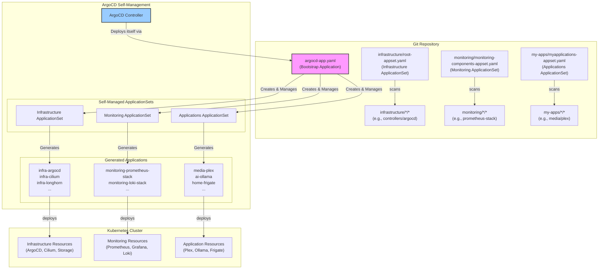

# 🚀 Talos ArgoCD Proxmox Cluster

> Modern GitOps deployment structure using Talos OS, ArgoCD, and Cilium, with Proxmox virtualization

A GitOps-driven Kubernetes cluster using **Talos OS** (secure, immutable Linux for K8s), ArgoCD, and Cilium, with integrated Cloudflare Tunnel for secure external access. Built for both home lab and production environments using **enterprise-grade GitOps patterns**.

## 📋 Table of Contents

- [Prerequisites](#-prerequisites)
- [Architecture](#-architecture)
- [Quick Start](#-quick-start)
  - [1. System Dependencies](#1-system-dependencies)
  - [2. Generate Talos Configs](#2-generate-talos-configs-with-talhelper)
  - [3. Boot & Bootstrap Talos Nodes](#3-boot--bootstrap-talos-nodes)
  - [4. Apply Machine Configs](#4-apply-machine-configs)
  - [5. Install Gateway API CRDs](#5-install-gateway-api-crds)
  - [6. Bootstrap ArgoCD (One Command)](#6-bootstrap-argocd-one-command)
  - [7. Configure Secret Management](#7-configure-secret-management)
- [Verification](#-verification)
- [Documentation](#-documentation)
- [Hardware Stack](#-hardware-stack)
- [Scaling](#-scaling-options)
- [Troubleshooting](#-troubleshooting)
- [Contributing](#-contributing)
- [License](#-license)

## 📋 Prerequisites

- Proxmox VMs or bare metal (see hardware below)
- Domain configured in Cloudflare
- 1Password account for secrets management
- [Talosctl](https://www.talos.dev/v1.10/introduction/getting-started/) and [Talhelper](https://github.com/budimanjojo/talhelper) installed
- `kubectl` installed locally
- `cloudflared` installed locally

## 🏗️ Architecture



### Key Features
- **Enterprise GitOps Pattern**: Three separate ApplicationSets for clear separation of concerns
- **Self-Managing ArgoCD**: ArgoCD manages its own installation, upgrades, and ApplicationSets
- **Simple Directory Discovery**: No complex patterns - easy to understand and maintain
- **Production Ready**: Proper error handling, retries, and monitoring integration
- **GPU Integration**: Full NVIDIA GPU support via Talos system extensions and GPU Operator
- **Zero SSH**: All node management via Talosctl API

## 🚀 Quick Start

### 1. System Dependencies
```bash
# On your workstation
brew install talosctl sops yq kubectl
brew install budimanjojo/tap/talhelper
# Or see Talos/Talhelper docs for Linux/Windows
```

### 2. Generate Talos Configs (with Talhelper)
```bash
cd iac/talos
# Edit talconfig.yaml for your cluster topology
# Generate secrets (encrypted with SOPS)
talhelper gensecret > talsecret.sops.yaml
sops -e -i talsecret.sops.yaml
# Generate node configs
talhelper genconfig
```

### 3. Boot & Bootstrap Talos Nodes
- Boot each VM/host with the generated Talos `machine.yaml` (PXE, ISO, or cloud-init)
- Use `talosctl` to bootstrap the control plane:
```bash
# Set kubeconfig and talosconfig env vars
export TALOSCONFIG=./clusterconfig/talosconfig
export KUBECONFIG=./clusterconfig/kubeconfig
# Bootstrap the cluster
# (Run ONCE, on a single control plane node)
talosctl bootstrap --nodes <control-plane-ip>
```

### 4. Apply Machine Configs
```bash
# Apply config to all nodes
talosctl apply-config --insecure --nodes <node-ip> --file clusterconfig/<node>.yaml
```

### 5. Install Gateway API CRDs
```bash
kubectl apply -f https://github.com/kubernetes-sigs/gateway-api/releases/download/v1.2.0/standard-install.yaml
kubectl apply -f https://github.com/kubernetes-sigs/gateway-api/releases/download/v1.2.0/experimental-install.yaml
```

### 6. Bootstrap ArgoCD (One Command)
Deploy the self-managing ArgoCD bootstrap application. This will:
1. **Install ArgoCD itself** using Helm
2. **Create all three ApplicationSets** (infrastructure, monitoring, applications)
3. **Automatically discover and deploy** all components and applications

```bash
# Single command to deploy everything - ArgoCD will manage itself from here
kubectl apply -f infrastructure/argocd-app.yaml
```

**That's it!** ArgoCD will now:
- Manage its own installation and upgrades
- Deploy all infrastructure components (Cilium, storage, etc.)
- Deploy monitoring stack (Prometheus, Grafana, Loki)
- Deploy all applications (media, AI, home automation, etc.)

### 7. Configure Secret Management
```bash
# Create required namespaces
kubectl create namespace 1passwordconnect
kubectl create namespace external-secrets

# Generate and apply 1Password Connect credentials
# This command creates 1password-credentials.json
op connect server create
export CONNECT_TOKEN="your-1password-connect-token"

# Create required secrets
kubectl create secret generic 1password-credentials \
  --from-file=1password-credentials.json=1password-credentials.base64 \
  --namespace 1passwordconnect

kubectl create secret generic 1password-operator-token \
  --from-literal=token=$CONNECT_TOKEN \
  --namespace 1passwordconnect

kubectl create secret generic 1passwordconnect \
  --from-literal=token=$CONNECT_TOKEN \
  --namespace external-secrets
```

## 🛡️ Talos-Specific Notes
- **No SSH**: All management via `talosctl` API
- **Immutable OS**: No package manager, no shell
- **Declarative**: All config in Git, applied via Talhelper/Talosctl
- **System Extensions**: GPU, storage, and other drivers enabled via config
- **SOPS**: Used for encrypting Talos secrets
- **No plaintext secrets in Git**

## 🗄️ MinIO S3 Backup Configuration

This cluster uses **TrueNAS Scale MinIO** for S3-compatible storage backups, particularly for Longhorn persistent volume backups.

### MinIO Setup on TrueNAS Scale

1. **Install MinIO App** in TrueNAS Scale Apps
2. **Access MinIO Console** at `http://192.168.10.133:9002`
3. **Configure via MinIO Client (mc)**:

```bash
# Access MinIO container shell in TrueNAS
sudo docker exec -it <minio_container_name> /bin/sh

# Set up MinIO client alias (use your MinIO root credentials)
mc alias set local http://localhost:9000 minio <your-root-password>

# Verify connection
mc admin info local

# Create dedicated user for Longhorn backups
mc admin user add local longhorn-user SecurePassword123!

# Create service account for the user (generates access keys)
mc admin user svcacct add local longhorn-user --name "longhorn-backup-access"
# Output: Access Key: ABC123XYZ789EXAMPLE0
# Output: Secret Key: ExampleSecretKey123+RandomChars/ForDocumentation

# Create backup bucket
mc mb local/longhorn-backups

# Create IAM policy for Longhorn bucket access
cat > /tmp/longhorn-policy.json << 'EOF'
{
  "Version": "2012-10-17",
  "Statement": [
    {
      "Effect": "Allow",
      "Action": [
        "s3:GetBucketLocation",
        "s3:ListBucket",
        "s3:ListBucketMultipartUploads"
      ],
      "Resource": "arn:aws:s3:::longhorn-backups"
    },
    {
      "Effect": "Allow",
      "Action": [
        "s3:GetObject",
        "s3:PutObject",
        "s3:DeleteObject",
        "s3:AbortMultipartUpload",
        "s3:ListMultipartUploadParts"
      ],
      "Resource": "arn:aws:s3:::longhorn-backups/*"
    }
  ]
}
EOF

# Apply the policy
mc admin policy create local longhorn-backup-policy /tmp/longhorn-policy.json
mc admin policy attach local longhorn-backup-policy --user longhorn-user

# Verify setup
mc ls local/longhorn-backups
```

### 1Password Secret Management

Store MinIO credentials securely in 1Password:

1. **Create 1Password item** named `minio`
2. **Add fields**:
   - `minio_access_key`: `ABC123XYZ789EXAMPLE0`
   - `minio_secret_key`: `ExampleSecretKey123+RandomChars/ForDocumentation`  
   - `minio_endpoint`: `http://192.168.10.133:9000`

### Longhorn S3 Backup Configuration

The cluster automatically configures Longhorn to use MinIO via:

- **External Secret**: `infrastructure/storage/longhorn/externalsecret.yaml`
- **Backup Settings**: `infrastructure/storage/longhorn/backup-settings.yaml`
- **Backup Target**: `s3://longhorn-backups@us-east-1/`

### Backup Schedule

Automated backups are configured with different tiers:

| Data Tier | Snapshot Frequency | Backup Frequency | Retention |
|-----------|-------------------|------------------|-----------|
| **Critical** | Hourly | Daily (2 AM) | 30 days |
| **Important** | Every 4 hours | Daily (3 AM) | 14 days |
| **Standard** | Daily | Weekly | 4 weeks |

## 🔍 Verification
```bash
# Check Talos node health
talosctl health --nodes <node-ip>

# Check Kubernetes core components
kubectl get pods -A
cilium status

# Check ArgoCD self-management
kubectl get applications -n argocd
kubectl get applicationsets -n argocd

# Check generated applications
kubectl get applications -n argocd -l type=infrastructure
kubectl get applications -n argocd -l type=monitoring  
kubectl get applications -n argocd -l type=application

# Check secrets
kubectl get pods -n 1passwordconnect
kubectl get externalsecret -A

# Verify Longhorn backup configuration
kubectl get backuptarget -n longhorn-system
kubectl get secret longhorn-backup-credentials -n longhorn-system

# Test MinIO connectivity from cluster
kubectl run -it --rm debug --image=minio/mc --restart=Never -- \
  mc alias set test http://192.168.10.133:9000 <access-key> <secret-key>
```

## 📋 Documentation
- **[View Documentation Online](https://mitchross.github.io/k3s-argocd-proxmox)** - Full documentation website
- **[Local Documentation](docs/)** - Browse documentation in the repository:
  - [ArgoCD Setup](docs/argocd.md) - **Enterprise GitOps patterns and self-management**
  - [Network Configuration](docs/network.md)
  - [Storage Configuration](docs/storage.md)
  - [**Longhorn Backup & Disaster Recovery**](docs/longhorn-backup-guide.md) 🗄️ - **TrueNAS Scale integration**
  - [Security Setup](docs/security.md)
  - [GPU Configuration](docs/gpu.md)
  - [External Services](docs/external-services.md)
  - [Project Structure](docs/structure.md)

### 🚨 Emergency Runbooks
- [**Longhorn Emergency Procedures**](docs/runbooks/longhorn-emergency-procedures.md) - **Critical storage recovery**
- [Monitoring Runbooks](docs/runbooks/monitoring.md)

## 💻 Hardware Stack
```
🧠 Compute
├── AMD Threadripper 2950X (16c/32t)
├── 128GB ECC DDR4 RAM
├── 2× NVIDIA RTX 3090 24GB
└── Google Coral TPU

💾 Storage
├── 4TB ZFS RAID-Z2
├── NVMe OS Drive
└── Longhorn/Local Path Storage for K8s

🌐 Network
├── 2.5Gb Networking
├── Firewalla Gold
└── Internal DNS Resolution
```

## 🔄 Scaling Options

While this setup uses a single node, you can add worker nodes for additional compute capacity:

| Scaling Type | Description | Benefits |
|--------------|-------------|----------|
| **Single Node** | All workloads on one server | Simplified storage, easier management |
| **Worker Nodes** | Add compute-only nodes | Increased capacity without storage complexity |
| **Multi-Master** | High availability control plane | Production-grade resilience |

## 📁 Directory Structure

```
.
├── infrastructure/           # Infrastructure ApplicationSet
│   ├── controllers/          # ArgoCD, External Secrets, etc.
│   │   └── argocd/           # ArgoCD self-management configuration
│   ├── networking/           # Cilium, Gateway API, etc.
│   ├── storage/              # Longhorn, CSI drivers, etc.
│   ├── database/             # PostgreSQL, Redis operators
│   ├── projects.yaml         # ArgoCD projects
│   └── root-appset.yaml      # Infrastructure ApplicationSet
├── monitoring/               # Monitoring ApplicationSet
│   ├── prometheus-stack/     # Prometheus, Grafana, AlertManager
│   ├── loki-stack/           # Loki, Promtail
│   └── monitoring-components-appset.yaml
├── my-apps/                  # Applications ApplicationSet
│   ├── ai/                   # AI tools (Ollama, ComfyUI, etc.)
│   ├── media/                # Media servers (Plex, Jellyfin, etc.)
│   ├── home/                 # Home automation (Frigate, HA, etc.)
│   ├── development/          # Dev tools (Headlamp, IT-Tools, etc.)
│   ├── privacy/              # Privacy tools (SearXNG, ProxiTok, etc.)
│   └── myapplications-appset.yaml
└── docs/                     # Documentation
    ├── argocd.md             # Enterprise GitOps setup
    ├── network.md            # Network configuration
    ├── security.md           # Security setup
    ├── storage.md            # Storage configuration
    └── external-services.md  # External services setup
```

## ✅ Enterprise GitOps Features

This setup implements **production-grade patterns** used in enterprise environments:

1. **Self-Managing Infrastructure**: ArgoCD manages its own lifecycle
2. **Clear Separation of Concerns**: Three distinct ApplicationSets
3. **Simple Directory Discovery**: Easy for developers to add applications
4. **Automated Operations**: Zero-touch deployments after bootstrap
5. **Production Monitoring**: Full observability stack
6. **Proper RBAC**: Project-based access controls

## 🔍 Troubleshooting

| Issue Type | Troubleshooting Steps |
|------------|----------------------|
| **Talos Node Issues** | • `talosctl health`<br>• Check Talos logs: `talosctl logs -n <node-ip> -k` |
| **ArgoCD Self-Management** | • `kubectl get application argocd -n argocd`<br>• Check ApplicationSet status<br>• Review ArgoCD logs |
| **ApplicationSet Issues** | • `kubectl get applicationsets -n argocd`<br>• Check directory patterns<br>• Verify Git connectivity |
| **Network Issues** | • Check Cilium status<br>• Verify Gateway API<br>• Test DNS resolution |
| **Storage Issues** | • Verify PV binding<br>• Check Longhorn/Local PV logs<br>• Validate node affinity |
| **Secrets Issues** | • Check External Secrets Operator logs<br>• Verify 1Password Connect status |
| **GPU Issues** | • Check GPU node labels<br>• Verify NVIDIA Operator pods<br>• Check `nvidia-smi` on GPU nodes |

### ArgoCD Application Cleanup
If you need to remove all existing applications to rebuild:

```bash
# Remove finalizers from all applications
kubectl get applications -n argocd -o name | xargs -I{} kubectl patch {} -n argocd --type json -p '[{"op": "remove","path": "/metadata/finalizers"}]'

# Delete all applications
kubectl delete applications --all -n argocd

# For stuck ApplicationSets
kubectl get applicationsets -n argocd -o name | xargs -I{} kubectl patch {} -n argocd --type json -p '[{"op": "remove","path": "/metadata/finalizers"}]'
kubectl delete applicationsets --all -n argocd

# Bootstrap with the new enterprise pattern
kubectl apply -f infrastructure/argocd-app.yaml
```

## 🚀 Taking to Production

This homelab setup translates directly to enterprise environments:

1. **Replace Git repo** with your organization's repository
2. **Add proper RBAC** for team-based access
3. **Configure notifications** for Slack/Teams integration  
4. **Add policy enforcement** with tools like OPA Gatekeeper
5. **Implement proper secrets management** with External Secrets or Vault
6. **Add multi-cluster support** with ArgoCD ApplicationSets

The patterns and structure remain the same - this is **production-grade GitOps**.

## 🤝 Contributing

1. Fork the repository
2. Create a feature branch
3. Submit a pull request

## 📜 License

MIT License - See [LICENSE](LICENSE) for details