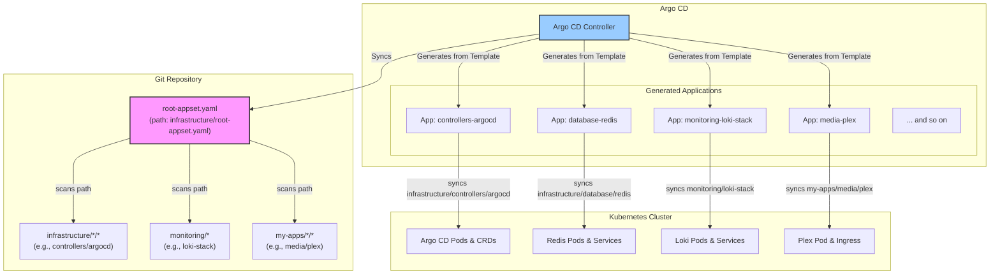

# 🚀 Talos ArgoCD Proxmox Cluster
=========================

> Modern GitOps deployment structure using Talos OS, ArgoCD, and Cilium, with Proxmox virtualization

A GitOps-driven Kubernetes cluster using **Talos OS** (secure, immutable Linux for K8s), ArgoCD, and Cilium, with integrated Cloudflare Tunnel for secure external access. Built for both home lab and small production environments.

## 📋 Table of Contents

- [Prerequisites](#-prerequisites)
- [Architecture](#-architecture)
- [Quick Start](#-quick-start)
  - [1. System Dependencies](#1-system-dependencies)
  - [2. Generate Talos Configs](#2-generate-talos-configs-with-talhelper)
  - [3. Boot & Bootstrap Talos Nodes](#3-boot--bootstrap-talos-nodes)
  - [4. Apply Machine Configs](#4-apply-machine-configs)
  - [5. Install Gateway API CRDs](#5-install-gateway-api-crds)
  - [6. Install ArgoCD & All Apps](#6-install-argocd--all-apps)
  - [7. Configure Secret Management](#7-configure-secret-management)
  - [8. Final Deployment](#8-final-deployment)
- [Verification](#-verification)
- [Documentation](#-documentation)
- [Hardware Stack](#-hardware-stack)
- [Scaling](#-scaling-options)
- [Troubleshooting](#-troubleshooting)
- [Contributing](#-contributing)
- [License](#-license)

## 📋 Prerequisites

- Proxmox VMs or bare metal (see hardware below)
- Domain configured in Cloudflare
- 1Password account for secrets management
- [Talosctl](https://www.talos.dev/v1.10/introduction/getting-started/) and [Talhelper](https://github.com/budimanjojo/talhelper) installed
- `kubectl` installed locally
- `cloudflared` installed locally

## 🏗️ Architecture



### Key Features
- **Three-Tier Architecture**: Separate infrastructure, monitoring, and applications
- **Sync Waves**: Controlled deployment order via ArgoCD
- **Declarative GitOps**: All cluster state managed in Git
- **GPU Integration**: Full NVIDIA GPU support via Talos system extensions and GPU Operator
- **Zero SSH**: All node management via Talosctl API

## 🚀 Quick Start

### 1. System Dependencies
```bash
# On your workstation
brew install talosctl sops yq kubectl
brew install budimanjojo/tap/talhelper
# Or see Talos/Talhelper docs for Linux/Windows
```

### 2. Generate Talos Configs (with Talhelper)
```bash
cd iac/talos
# Edit talconfig.yaml for your cluster topology
# Generate secrets (encrypted with SOPS)
talhelper gensecret > talsecret.sops.yaml
sops -e -i talsecret.sops.yaml
# Generate node configs
talhelper genconfig
```

### 3. Boot & Bootstrap Talos Nodes
- Boot each VM/host with the generated Talos `machine.yaml` (PXE, ISO, or cloud-init)
- Use `talosctl` to bootstrap the control plane:
```bash
# Set kubeconfig and talosconfig env vars
export TALOSCONFIG=./clusterconfig/talosconfig
export KUBECONFIG=./clusterconfig/kubeconfig
# Bootstrap the cluster
# (Run ONCE, on a single control plane node)
talosctl bootstrap --nodes <control-plane-ip>
```

### 4. Apply Machine Configs
```bash
# Apply config to all nodes
talosctl apply-config --insecure --nodes <node-ip> --file clusterconfig/<node>.yaml
```

### 5. Install Gateway API CRDs
```bash
kubectl apply -f https://github.com/kubernetes-sigs/gateway-api/releases/download/v1.2.0/standard-install.yaml
kubectl apply -f https://github.com/kubernetes-sigs/gateway-api/releases/download/v1.2.0/experimental-install.yaml
```

### 6. Install ArgoCD & All Apps
With the CRDs in place, we can bootstrap Argo CD and deploy the entire cluster with a single command.

This `Application` manifest tells Argo CD how to manage its own installation. Once running, Argo CD will automatically sync the `root-appset.yaml` located in the `infrastructure` directory. This `ApplicationSet` will then discover and deploy every other component and application in the repository.

```bash
# Apply the Argo CD application. It will self-manage and deploy everything else.
kubectl apply -f infrastructure/argocd-app.yaml
```

From this point on, every component of your cluster is managed via Git. Any changes pushed to the `main` branch will be automatically synced by Argo CD.

### 7. Configure Secret Management
```bash
# Create required namespaces
kubectl create namespace 1passwordconnect
kubectl create namespace external-secrets

# Generate and apply 1Password Connect credentials
# This command creates 1password-credentials.json
op connect server create
export CONNECT_TOKEN="your-1password-connect-token"

# Create required secrets
kubectl create secret generic 1password-credentials \
  --from-file=1password-credentials.json=1password-credentials.base64 \
  --namespace 1passwordconnect

kubectl create secret generic 1password-operator-token \
  --from-literal=token=$CONNECT_TOKEN \
  --namespace 1passwordconnect

kubectl create secret generic 1passwordconnect \
  --from-literal=token=$CONNECT_TOKEN \
  --namespace external-secrets
```

### Key Deployment Features
- Three-tier architecture separating infrastructure, monitoring, and applications
- Sync waves ensure proper deployment order
- Simple directory patterns without complex include/exclude logic
- All components managed through just three top-level ApplicationSets

## 🛡️ Talos-Specific Notes
- **No SSH**: All management via `talosctl` API
- **Immutable OS**: No package manager, no shell
- **Declarative**: All config in Git, applied via Talhelper/Talosctl
- **System Extensions**: GPU, storage, and other drivers enabled via config
- **SOPS**: Used for encrypting Talos secrets
- **No plaintext secrets in Git**

## 🔍 Verification
```bash
# Check Talos node health
talosctl health --nodes <node-ip>

# Check Kubernetes core components
kubectl get pods -A
cilium status

# Check ArgoCD
kubectl get application -A
kubectl get pods -n argocd

# Check secrets
kubectl get pods -n 1passwordconnect
kubectl get externalsecret -A
```

## 📋 Documentation
- **[View Documentation Online](https://mitchross.github.io/k3s-argocd-proxmox)** - Full documentation website
- **[Local Documentation](docs/)** - Browse documentation in the repository:
  - [ArgoCD Setup](docs/argocd.md)
  - [Network Configuration](docs/network.md)
  - [Storage Configuration](docs/storage.md)
  - [Security Setup](docs/security.md)
  - [GPU Configuration](docs/gpu.md)
  - [External Services](docs/external-services.md)
  - [Project Structure](docs/structure.md)

## 💻 Hardware Stack
```
🧠 Compute
├── AMD Threadripper 2950X (16c/32t)
├── 128GB ECC DDR4 RAM
├── 2× NVIDIA RTX 3090 24GB
└── Google Coral TPU

💾 Storage
├── 4TB ZFS RAID-Z2
├── NVMe OS Drive
└── Longhorn/Local Path Storage for K8s

🌐 Network
├── 2.5Gb Networking
├── Firewalla Gold
└── Internal DNS Resolution
```

## 🔄 Scaling Options

While this setup uses a single node, you can add worker nodes for additional compute capacity:

| Scaling Type | Description | Benefits |
|--------------|-------------|----------|
| **Single Node** | All workloads on one server | Simplified storage, easier management |
| **Worker Nodes** | Add compute-only nodes | Increased capacity without storage complexity |
| **Multi-Master** | High availability control plane | Production-grade resilience |

## 📁 Directory Structure

```
.
├── infrastructure/           # Infrastructure components
│   ├── controllers/          # Kubernetes controllers
│   │   └── argocd/           # ArgoCD configuration and projects
│   ├── networking/           # Network configurations
│   ├── storage/              # Storage configurations
│   └── root-appset.yaml      # Main infrastructure ApplicationSet
├── monitoring/               # Monitoring components
│   ├── loki-stack/           # Loki logging stack
│   └── prometheus-stack/     # Prometheus monitoring stack
├── my-apps/                  # User applications
│   ├── ai/                   # AI-related applications
│   ├── media/                # Media applications
│   ├── development/          # Development tools
│   ├── home/                 # Home automation apps
│   └── privacy/              # Privacy-focused applications
├── docs/                     # Documentation
│   ├── argocd.md             # ArgoCD setup and workflow
│   ├── network.md            # Network configuration
│   ├── security.md           # Security setup
│   ├── storage.md            # Storage configuration
│   └── external-services.md  # External services setup
```

## 🔍 Troubleshooting

| Issue Type | Troubleshooting Steps |
|------------|----------------------|
| **Talos Node Issues** | • `talosctl health`<br>• Check Talos logs: `talosctl logs -n <node-ip> -k` |
| **Network Issues** | • Check Cilium status<br>• Verify Gateway API<br>• Test DNS resolution |
| **Storage Issues** | • Verify PV binding<br>• Check Longhorn/Local PV logs<br>• Validate node affinity |
| **ArgoCD Issues** | • Check application sync status<br>• Review application logs |
| **Secrets Issues** | • Check External Secrets Operator logs<br>• Verify 1Password Connect status |
| **GPU Issues** | • Check GPU node labels<br>• Verify NVIDIA Operator pods<br>• Check `nvidia-smi` on GPU nodes |

### ArgoCD Application Cleanup
If you need to remove all existing applications to rebuild:

```bash
# Remove finalizers from all applications
kubectl get applications -n argocd -o name | xargs -I{} kubectl patch {} -n argocd --type json -p '[{"op": "remove","path": "/metadata/finalizers"}]'

# Delete all applications
kubectl delete applications --all -n argocd

# For stuck ApplicationSets
kubectl get applicationsets -n argocd -o name | xargs -I{} kubectl patch {} -n argocd --type json -p '[{"op": "remove","path": "/metadata/finalizers"}]'
kubectl delete applicationsets --all -n argocd

# Only then apply the new structure in order
kubectl apply -f infrastructure/argocd-app.yaml
kubectl apply -f infrastructure/root-appset.yaml
```

## 🤝 Contributing

1. Fork the repository
2. Create a feature branch
3. Submit a pull request

## 📜 License

MIT License - See [LICENSE](LICENSE) for details