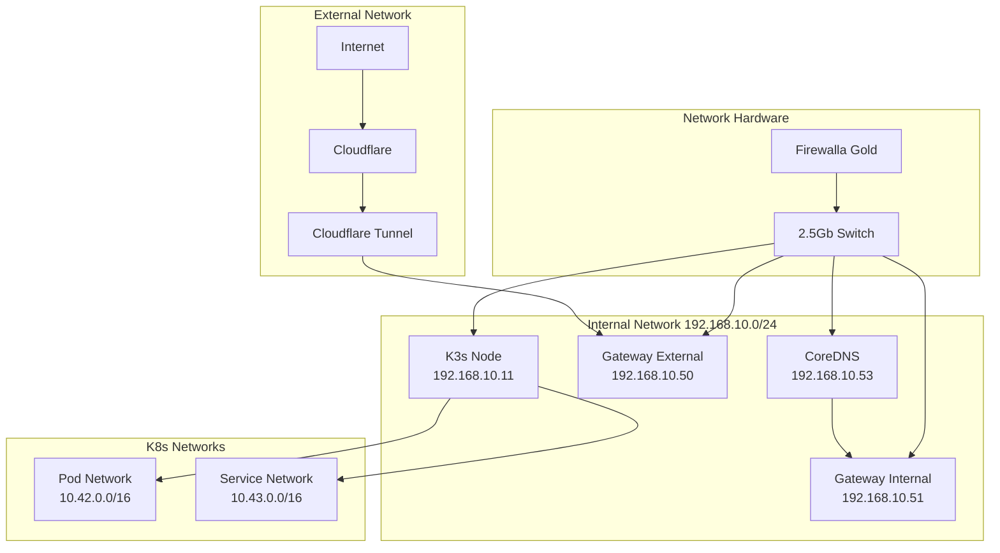

# 🚀 K3s ArgoCD Cluster

A GitOps-driven Kubernetes cluster using K3s, ArgoCD, and Cilium, with integrated Cloudflare Tunnel for secure external access.

## 📋 Documentation
- **[View Documentation Online](https://mitchross.github.io/k3s-argocd-proxmox)** - Full documentation website
- **[Local Documentation](docs/)** - Browse documentation in the repository
  - [ArgoCD Setup](docs/argocd.md)
  - [Network Configuration](docs/network.md)
  - [Storage Configuration](docs/storage.md)
  - [Security Setup](docs/security.md)
  - [GPU Configuration](docs/gpu.md)
  - [External Services](docs/external-services.md)
  - [Project Structure](docs/structure.md)

## 📋️ Current Setup

This repository demonstrates a single-node K3s cluster setup, optimized for home lab and small production environments. While K3s supports multi-node clusters, this setup uses a single node to simplify storage management and reduce complexity.

### Why Single Node?
- Fixed storage location for applications (no need for distributed storage)
- Simplified backup and restore procedures
- Perfect for home lab and small production workloads
- Can be expanded with worker nodes for compute-only scaling

### Current Hardware Stack
```
🧠 Compute
├── AMD Threadripper 2950X (16c/32t)
├── 128GB ECC DDR4 RAM
├── 2× NVIDIA RTX 3090 24GB
└── Google Coral TPU

💾 Storage
├── 4TB ZFS RAID-Z2
├── NVMe OS Drive
└── Local Path Storage for K8s

🌐 Network
├── 2.5Gb Networking
├── Firewalla Gold
└── Internal DNS Resolution
```

## 📋 Prerequisites

- 💻 A Linux server/VM (can be Proxmox VM, mini PC, NUC, or similar)
  - Minimum 4GB RAM (8GB+ recommended)
  - 2 CPU cores (4+ recommended)
  - 20GB storage (100GB+ recommended for applications)
  - Note: These are minimum requirements, see hardware stack above for current setup
- 🌐 Domain configured in Cloudflare
- 🔐 1Password account for secrets management
  - 1Password Connect credentials and token ([setup guide](docs/external-services.md#1password-setup))
  - Cloudflare API tokens and tunnel configuration ([setup guide](docs/external-services.md#cloudflare-setup))
- 🛠️ `kubectl` installed locally
- ☁️ `cloudflared` installed locally

## 🔄 Scaling Options

While this setup uses a single node, you can add worker nodes for additional compute capacity:

```bash
# On worker node
curl -sfL https://get.k3s.io | K3S_URL=https://myserver:6443 K3S_TOKEN=mynodetoken sh -

# Worker nodes can be added without affecting storage, as they:
# - Don't run storage workloads
# - Only handle compute tasks
# - Automatically join the cluster
```

Note: Storage remains on the main node to maintain data locality and simplify management.

## 🏃 Getting Started

### 1. System Dependencies
```bash
# Install required system packages
sudo apt install zfsutils-linux nfs-kernel-server cifs-utils open-iscsi
sudo apt install --reinstall zfs-dkms

# Install 1Password CLI (follow instructions at https://1password.com/downloads/command-line/)
```

### 2. Install K3s 🎯
```bash
export SETUP_NODEIP=192.168.10.11
export SETUP_CLUSTERTOKEN=randomtokensecret123456192381029321

curl -sfL https://get.k3s.io | INSTALL_K3S_VERSION="v1.32.0+k3s1" \
  INSTALL_K3S_EXEC="--node-ip $SETUP_NODEIP \
  --disable=flannel,local-storage,metrics-server,servicelb,traefik,coredns \
  --flannel-backend='none' \
  --disable-network-policy \
  --disable-cloud-controller \
  --disable-kube-proxy" \
  K3S_TOKEN=$SETUP_CLUSTERTOKEN \
  K3S_KUBECONFIG_MODE=644 sh -s -

# Setup kubeconfig
mkdir -p $HOME/.kube
sudo cp -i /etc/rancher/k3s/k3s.yaml $HOME/.kube/config
sudo chown $(id -u):$(id -g) $HOME/.kube/config
chmod 600 $HOME/.kube/config
```

### 3. Install Cilium 🔄
```bash
# Install Cilium CLI
CILIUM_CLI_VERSION=$(curl -s https://raw.githubusercontent.com/cilium/cilium-cli/main/stable.txt)
CLI_ARCH=amd64
curl -L --fail --remote-name-all https://github.com/cilium/cilium-cli/releases/download/${CILIUM_CLI_VERSION}/cilium-linux-${CLI_ARCH}.tar.gz
sudo tar xzvfC cilium-linux-${CLI_ARCH}.tar.gz /usr/local/bin
rm cilium-linux-${CLI_ARCH}.tar.gz

# Install Cilium
cilium install \
  --version 1.16.5 \
  --set kubeProxyReplacement=true \
  --helm-set=operator.replicas=1

# Verify installation
cilium status
```

### 4. Install CoreDNS 🔍 (Optional)
CoreDNS can be installed in two ways:

#### Option A: Use K3s Built-in CoreDNS
```bash
# Remove the --disable coredns flag from K3s installation
curl -sfL https://get.k3s.io | INSTALL_K3S_VERSION="v1.32.0+k3s1" \
  INSTALL_K3S_EXEC="--node-ip $SETUP_NODEIP \
  --disable=flannel,local-storage,metrics-server,servicelb,traefik \
  --flannel-backend='none' \
  --disable-network-policy \
  --disable-cloud-controller \
  --disable-kube-proxy" \
  K3S_TOKEN=$SETUP_CLUSTERTOKEN \
  K3S_KUBECONFIG_MODE=644 sh -s -
```

#### Option B: Custom CoreDNS Installation
Use this option if you need to customize CoreDNS configuration:
```bash
# First, ensure CoreDNS is disabled in K3s (as shown in step 2)
# Then install custom CoreDNS:
k3s kubectl kustomize --enable-helm infra/network/coredns | k3s kubectl apply -f -

# Verify installation
kubectl get pods -n kube-system -l k8s-app=coredns
```

Key differences:
- Option A: Uses K3s default CoreDNS configuration
- Option B: Allows full customization of CoreDNS settings
  - Custom DNS forwarding rules
  - Split DNS configuration
  - Advanced plugin configuration

### 5. Setup Secret Management 🔐
```bash
# Create required namespaces
kubectl create namespace 1passwordconnect
kubectl create namespace external-secrets

# Generate and apply 1Password Connect credentials
op connect server create  # Creates 1password-credentials.json
export CONNECT_TOKEN="your-1password-connect-token"

# Create required secrets
kubectl create secret generic 1password-credentials \
  --from-file=1password-credentials.json=credentials.base64 \
  --namespace 1passwordconnect

kubectl create secret generic 1password-operator-token \
  --from-literal=token=$CONNECT_TOKEN \
  --namespace 1passwordconnect

kubectl create secret generic 1passwordconnect \
  --from-literal=token=$CONNECT_TOKEN \
  --namespace external-secrets
```

### 6. Install ArgoCD ⚓
```bash
# Install Gateway API CRDs
kubectl apply -f https://github.com/kubernetes-sigs/gateway-api/releases/latest/download/experimental-install.yaml

# Install ArgoCD with our custom configuration
k3s kubectl kustomize --enable-helm infra/controllers/argocd | k3s kubectl apply -f -

# Wait for ArgoCD to be ready
kubectl wait --for=condition=available deployment -l app.kubernetes.io/name=argocd-server -n argocd --timeout=300s

# Wait for CRDs to be established
kubectl wait --for=condition=established crd/applications.argoproj.io --timeout=60s
kubectl wait --for=condition=established crd/appprojects.argoproj.io --timeout=60s

# Now apply the root applications
kubectl apply -k infra/root-apps/

# Apply core infrastructure
kubectl kustomize infra | kubectl apply -f -
```

This installation method includes:
- Custom plugin configurations (Kustomize with Helm support)
- Resource limits and requests
- Security settings
- CMP (Config Management Plugin) setup

For detailed ArgoCD configuration, see [ArgoCD Documentation](docs/argocd.md)

### 7. Verify Installation ✅
```bash
# Check core components
kubectl get pods -A
cilium status

# Check ArgoCD
kubectl get application -A
kubectl get pods -n argocd

# Check secrets
kubectl get pods -n 1passwordconnect
kubectl get externalsecret -A
```

For detailed configuration and advanced setup:

## 🌐 Network Configuration

The cluster uses a split network configuration with the following topology:



- Internal access via Gateway API (192.168.10.51)
- External access via Cloudflare Tunnel
- DNS split horizon for internal/external resolution

[Detailed Network Documentation](docs/network.md)

## 💾 Storage Configuration

Local path provisioner and SMB storage options:
- Node-specific PV binding
- Storage classes for different use cases
- Volume lifecycle management

[Detailed Storage Documentation](docs/storage.md)

## 🔒 GPU Configuration

Hardware accelerated workloads using:
- NVIDIA GPU Operator
- 2× RTX 3090 for AI/ML tasks
- Google Coral TPU for inference
- Optimized for Ollama and ComfyUI

[Detailed GPU Documentation](docs/gpu.md)

## 🔒 Security Configuration

Secure access through:
- Cloudflare Zero Trust
- Split DNS configuration
- Internal certificate management

[Detailed Security Documentation](docs/security.md)

## 🔐 Secrets Management

Secure secret handling using:
- 1Password integration
- External Secrets Operator
- Automated secret rotation
- RBAC-based access control

[Detailed Secrets Documentation](docs/secrets.md)

## ⚓ ArgoCD Configuration

GitOps workflow using:
- Pure Kubernetes manifests with Kustomize
- Selective Helm chart usage
- Multi-environment management

[Detailed ArgoCD Documentation](docs/argocd.md)

## 📁 Directory Structure

```
.
├── apps/                 # Application manifests
│   ├── core/            # Core system applications
│   ├── monitoring/      # Monitoring stack
│   └── services/        # User applications
├── docs/                # Documentation
│   ├── argocd.md       # ArgoCD setup and workflow
│   ├── network.md      # Network configuration
│   ├── security.md     # Security setup
│   ├── storage.md      # Storage configuration
│   └── external-services.md # External services setup
├── infra/              # Infrastructure components
│   ├── root-apps/      # ArgoCD root applications
│   └── base/           # Base infrastructure
└── sets/               # ApplicationSet configurations
```

## 🔍 Troubleshooting

Common issues and solutions:
1. **Network Issues** 🌐
   - Check Gateway API status
   - Verify Cloudflare Tunnel connectivity
   - Test DNS resolution

2. **Storage Issues** 💾
   - Verify PV binding
   - Check storage provisioner logs
   - Validate node affinity

3. **ArgoCD Issues** ⚓
   - Check application sync status
   - Verify Git repository access
   - Review application logs

## 🤝 Contributing

1. Fork the repository
2. Create a feature branch
3. Submit a pull request

## 📜 License

MIT License - See [LICENSE](LICENSE) for details

## 🔧 Infrastructure Components

### CoreDNS Configuration 🔍

When running K3s with CoreDNS disabled (`--disable coredns`), the manual CoreDNS setup requires specific configuration to work properly:

#### Key Configuration Points:
- **Service IP**: Must use K3s's default DNS IP `10.43.0.10`
- **Service Name**: Must be `kube-dns` for K3s compatibility
- **Namespace**: Deployed in `kube-system` namespace
- **DNS Configuration**:
  ```yaml
  plugins:
    - kubernetes: Configured for cluster.local domain
    - hosts: For node resolution
    - forward: Using host's /etc/resolv.conf
  ```

#### Installation Steps:
1. Disable CoreDNS in K3s installation:
   ```bash
   curl -sfL https://get.k3s.io | INSTALL_K3S_EXEC="--disable coredns" sh -
   ```

2. Apply CoreDNS configuration:
   ```bash
   k3s kubectl kustomize --enable-helm infra/network/coredns | k3s kubectl apply -f -
   ```

3. Verify DNS resolution:
   ```bash
   kubectl get pods -n kube-system -l k8s-app=kube-dns
   kubectl get svc -n kube-system kube-dns
   ```