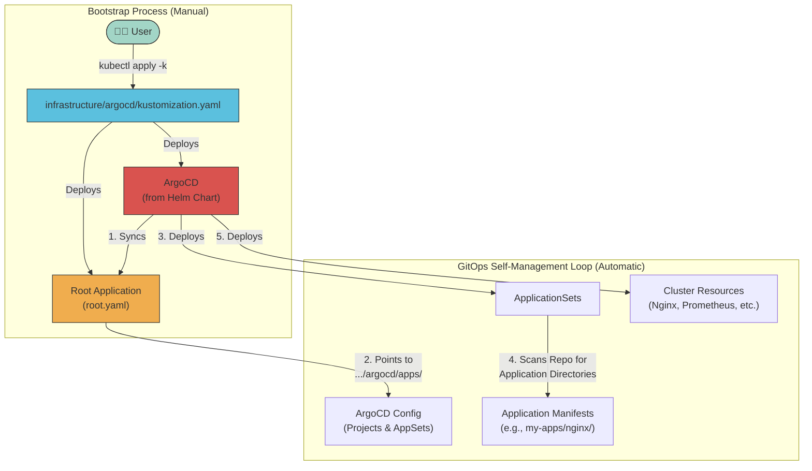

# 🚀 Talos ArgoCD Proxmox Cluster

> Modern GitOps deployment structure using Talos OS, ArgoCD, and Cilium, with Proxmox virtualization

A GitOps-driven Kubernetes cluster using **Talos OS** (secure, immutable Linux for K8s), ArgoCD, and Cilium, with integrated Cloudflare Tunnel for secure external access. Built for both home lab and production environments using **enterprise-grade GitOps patterns**.

## 📋 Table of Contents

- [Prerequisites](#-prerequisites)
- [Architecture](#-architecture)
- [Quick Start](#-quick-start)
  - [1. System Dependencies](#1-system-dependencies)
  - [2. Generate Talos Configs](#2-generate-talos-configs)
  - [3. Boot & Bootstrap Talos Nodes](#3-boot--bootstrap-talos-nodes)
  - [4. Install Gateway API CRDs](#4-install-gateway-api-crds)
  - [5. Configure Secret Management](#5-configure-secret-management)
  - [6. Bootstrap ArgoCD & Deploy The Stack](#6-bootstrap-argocd--deploy-the-stack)
- [Verification](#-verification)
- [Talos-Specific Notes](#️-talos-specific-notes)
- [MinIO S3 Backup Configuration](#-minio-s3-backup-configuration)
- [Documentation](#-documentation)
- [Troubleshooting](#-troubleshooting)

## 📋 Prerequisites

- Proxmox VMs or bare metal (see hardware below)
- Domain configured in Cloudflare
- 1Password account for secrets management
- [Talosctl](https://www.talos.dev/v1.10/introduction/getting-started/) and [Talhelper](https://github.com/budimanjojo/talhelper) installed
- `kubectl`, `kustomize`, `sops` installed locally

## 🏗️ Architecture



### Key Features
- **2025 Homelab GitOps Pattern**: Flattened ApplicationSets provide clean separation of concerns.
- **Self-Managing ArgoCD**: ArgoCD manages its own installation, upgrades, and ApplicationSets from Git.
- **Simple Directory Discovery**: Applications are discovered automatically based on their directory path. No extra files needed.
- **Production Ready**: Proper error handling, retries, and monitoring integration.
- **GPU Integration**: Full NVIDIA GPU support via Talos system extensions and GPU Operator
- **Zero SSH**: All node management via Talosctl API

## 🚀 Quick Start

### 1. System Dependencies
```bash
# On your macOS workstation using Homebrew
brew install talosctl sops yq kubectl kustomize
brew install budimanjojo/tap/talhelper

# For Linux/Windows, please see the official installation docs for each tool.
```

### 2. Generate Talos Configs
```bash
# Navigate to the Talos configuration directory
cd iac/talos

# Edit talconfig.yaml to match your cluster topology and node IPs
# Then, generate the encrypted secrets file
talhelper gensecret > talsecret.sops.yaml

# IMPORTANT: You must encrypt the file with SOPS for Talos to use it
sops --encrypt --in-place talsecret.sops.yaml

# Generate the machine configs for each node
talhelper genconfig
```

### 3. Boot & Bootstrap Talos Nodes
- Boot each VM or bare-metal host with its corresponding generated ISO from `iac/talos/clusterconfig/`.
- Set your `TALOSCONFIG` and `KUBECONFIG` environment variables to point to the generated files.
```bash
# Set environment variables for your shell session
export TALOSCONFIG=./iac/talos/clusterconfig/talosconfig
export KUBECONFIG=./iac/talos/clusterconfig/kubeconfig
```
- Bootstrap the cluster on a **single control plane node**.
```bash
# Run ONCE on a single control plane node IP
talosctl bootstrap --nodes <control-plane-ip>
```
- Apply the machine configuration to all nodes in the cluster. This command should be run from the root of the repository after setting `TALOSCONFIG`.
```bash
talosctl apply-config --nodes <node-ip-1> --file iac/talos/clusterconfig/<node-1-name>.yaml
talosctl apply-config --nodes <node-ip-2> --file iac/talos/clusterconfig/<node-2-name>.yaml
# ... repeat for all nodes
```

### 4. Install Gateway API CRDs
This is a prerequisite for Cilium's Gateway API integration.
```bash
kubectl apply -f https://github.com/kubernetes-sigs/gateway-api/releases/download/v1.3.0/standard-install.yaml
kubectl apply -f https://github.com/kubernetes-sigs/gateway-api/releases/download/v1.3.0/experimental-install.yaml
```

### 5. Configure Secret Management
This cluster uses [1Password Connect](https://developer.1password.com/docs/connect) and [External Secrets Operator](https://external-secrets.io/) to manage secrets.

1.  **Generate 1Password Connect Credentials**: Follow the [1Password documentation](https://developer.1password.com/docs/connect/get-started#step-2-deploy-the-1password-connect-server) to generate your `1password-credentials.json` file and your access token.

2.  **Create Namespaces**:
    ```bash
    kubectl create namespace 1passwordconnect
    kubectl create namespace external-secrets
    ```

3.  **Create Kubernetes Secrets**:
    ```bash
    # IMPORTANT: Place your generated `1password-credentials.json` in the root of this repository first.
    kubectl create secret generic 1password-credentials \
      --from-file=1password-credentials.json \
      --namespace 1passwordconnect

    # Replace YOUR_CONNECT_TOKEN with your actual token
    export CONNECT_TOKEN="YOUR_CONNECT_TOKEN"

    kubectl create secret generic 1password-operator-token \
      --from-literal=token=$CONNECT_TOKEN \
      --namespace 1passwordconnect

    kubectl create secret generic 1passwordconnect \
      --from-literal=token=$CONNECT_TOKEN \
      --namespace external-secrets
    ```

### 6. Bootstrap ArgoCD & Deploy The Stack
This final step uses our "App of Apps" pattern to bootstrap the entire cluster. This is a multi-step process to avoid race conditions with CRD installation.

```bash
# 1. Apply the ArgoCD main components and CRDs
# This deploys the ArgoCD Helm chart, which creates the CRDs and controller.
kustomize build infrastructure/controllers/argocd --enable-helm | kubectl apply -f -

# 2. Wait for the ArgoCD CRDs to be established in the cluster
# This command pauses until the Kubernetes API server recognizes the 'Application' resource type.
echo "Waiting for ArgoCD CRDs to be established..."
kubectl wait --for condition=established --timeout=60s crd/applications.argoproj.io

# 3. Wait for the ArgoCD server to be ready
# This ensures the ArgoCD server is running before we apply the root application.
echo "Waiting for ArgoCD server to be available..."
kubectl wait --for=condition=Available deployment/argocd-server -n argocd --timeout=300s

# 4. Apply the Root Application
# Now that ArgoCD is running and its CRDs are ready, we can apply the 'root' application
# to kickstart the self-managing GitOps loop.
echo "Applying the root application..."
kubectl apply -f infrastructure/controllers/argocd/root.yaml
```
**That's it!** You have successfully and reliably bootstrapped the cluster.

### What Happens Next Automatically?

1.  **ArgoCD Syncs Itself**: The `root` Application tells ArgoCD to sync the contents of `infrastructure/argocd/apps/`.
2.  **Projects & AppSets Created**: ArgoCD creates the `AppProject`s and the three `ApplicationSet`s (`infrastructure`, `monitoring`, `my-apps`).
3.  **Applications Discovered**: The `ApplicationSet`s scan the repository for any directories matching their defined paths (e.g., `infrastructure/*`, `monitoring/*`, `my-apps/*/*`) and create the corresponding ArgoCD `Application` resources.
4.  **Cluster Reconciliation**: ArgoCD syncs all discovered applications, building the entire cluster state declaratively from Git.

## 🔍 Verification
After the final step, you can monitor the deployment and verify that everything is working correctly.

```bash
# Check Talos node health (run for each node)
talosctl health --nodes <node-ip>

# Watch ArgoCD sync status
# The `STATUS` column should eventually show `Synced` for all applications
kubectl get applications -n argocd -w

# Verify all pods are running across the cluster
# It may take 10-15 minutes for all images to pull and pods to become Ready.
kubectl get pods -A

# Check that secrets have been populated by External Secrets
kubectl get externalsecret -A
# You should see secrets like `cloudflare-api-credentials` in the `cert-manager` namespace

# Verify the Longhorn UI is accessible and backups are configured
kubectl get backuptarget -n longhorn-system
```

## 🛡️ Talos-Specific Notes
- **No SSH**: All management via `talosctl` API
- **Immutable OS**: No package manager, no shell
- **Declarative**: All config in Git, applied via Talhelper/Talosctl
- **System Extensions**: GPU, storage, and other drivers enabled via config
- **SOPS**: Used for encrypting Talos secrets
- **No plaintext secrets in Git**

#### Upgrading Nodes
When a new version of Talos is released or system extensions in `iac/talos/talconfig.yaml` are changed, follow this process to upgrade your nodes. This method uses the direct `upgrade` command to ensure the new system image is correctly applied, which is more reliable than `apply-config` for image changes.

**Important:** Always upgrade control plane nodes **one at a time**, waiting for each node to successfully reboot and rejoin the cluster before proceeding to the next. This prevents losing etcd quorum. Worker nodes can be upgraded in parallel after the control plane is healthy.

1.  **Update Configuration**:
    Modify `iac/talos/talconfig.yaml` with the new `talosVersion` or changes to `systemExtensions`.

2.  **Ensure Environment is Set**:
    Make sure your `TALOSCONFIG` variable is pointing to your generated cluster configuration file as described in the Quick Start.

3.  **Upgrade a Control Plane Node**:
    Run the following commands from the root of the repository. Replace `<node-name>` and `<node-ip>` with the target node's details. Run this for each control plane node sequentially.

    ```bash
    # Example for the first control plane node
    NODE_NAME="talos-cluster-control-00"
    NODE_IP="192.168.10.100" # Replace with your node's IP
    INSTALLER_URL=$(talhelper genurl installer -c iac/talos/talconfig.yaml -n "$NODE_NAME")
    talosctl upgrade --nodes "$NODE_IP" --image "$INSTALLER_URL"
    ```
    Wait for the command to complete and verify the node is healthy with `talosctl health --nodes <node-ip>` before moving to the next control plane node.

4.  **Upgrade Worker Nodes**:
    Once the control plane is fully upgraded and healthy, you can upgrade the worker nodes. These can be run in parallel from separate terminals.
    ```bash
    # Example for the GPU worker node
    NODE_NAME="talos-cluster-gpu-worker-00"
    NODE_IP="192.168.10.200" # Replace with your node's IP
    INSTALLER_URL=$(talhelper genurl installer -c iac/talos/talconfig.yaml -n "$NODE_NAME")
    talosctl upgrade --nodes "$NODE_IP" --image "$INSTALLER_URL"
    ```

## 🗄️ MinIO S3 Backup Configuration

This cluster uses **TrueNAS Scale MinIO** for S3-compatible storage backups, particularly for Longhorn persistent volume backups.

### MinIO Setup on TrueNAS Scale

1.  **Install MinIO App** in TrueNAS Scale Apps
2.  **Access MinIO Console** at `http://192.168.10.133:9002`
3.  **Configure via MinIO Client (mc)**:

```bash
# Access MinIO container shell in TrueNAS
sudo docker exec -it <minio_container_name> /bin/sh

# Set up MinIO client alias (use your MinIO root credentials)
mc alias set local http://localhost:9000 minio <your-root-password>

# Verify connection
mc admin info local

# Create dedicated user for Longhorn backups
mc admin user add local longhorn-user SecurePassword123!

# Create service account for the user (generates access keys)
mc admin user svcacct add local longhorn-user --name "longhorn-backup-access"
# Output: Access Key: ABC123XYZ789EXAMPLE0
# Output: Secret Key: ExampleSecretKey123+RandomChars/ForDocumentation

# Create backup bucket
mc mb local/longhorn-backups

# Create IAM policy for Longhorn bucket access
cat > /tmp/longhorn-policy.json << 'EOF'
{
  "Version": "2012-10-17",
  "Statement": [
    {
      "Effect": "Allow",
      "Action": [
        "s3:GetBucketLocation",
        "s3:ListBucket",
        "s3:ListBucketMultipartUploads"
      ],
      "Resource": "arn:aws:s3:::longhorn-backups"
    },
    {
      "Effect": "Allow",
      "Action": [
        "s3:GetObject",
        "s3:PutObject",
        "s3:DeleteObject",
        "s3:AbortMultipartUpload",
        "s3:ListMultipartUploadParts"
      ],
      "Resource": "arn:aws:s3:::longhorn-backups/*"
    }
  ]
}
EOF

# Apply the policy
mc admin policy create local longhorn-backup-policy /tmp/longhorn-policy.json
mc admin policy attach local longhorn-backup-policy --user longhorn-user

# Verify setup
mc ls local/longhorn-backups
```

### 1Password Secret Management

Store MinIO credentials securely in 1Password:

1.  **Create 1Password item** named `minio`
2.  **Add fields**:
    -   `minio_access_key`: `ABC123XYZ789EXAMPLE0`
    -   `minio_secret_key`: `ExampleSecretKey123+RandomChars/ForDocumentation`  
    -   `minio_endpoint`: `http://192.168.10.133:9000`

### Longhorn S3 Backup Configuration

The cluster automatically configures Longhorn to use MinIO via:

-   **External Secret**: `infrastructure/storage/longhorn/externalsecret.yaml`
-   **Backup Settings**: `infrastructure/storage/longhorn/backup-settings.yaml`
-   **Backup Target**: `s3://longhorn-backups@us-east-1/`

### Backup Schedule

Automated backups are configured with different tiers:

| Data Tier | Snapshot Frequency | Backup Frequency | Retention |
|-----------|-------------------|------------------|-----------|
| **Critical** | Hourly | Daily (2 AM) | 30 days |
| **Important** | Every 4 hours | Daily (3 AM) | 14 days |
| **Standard** | Daily | Weekly | 4 weeks |

## 📋 Documentation
- **[View Documentation Online](https://mitchross.github.io/k3s-argocd-proxmox)** - Full documentation website
- **[Local Documentation](docs/)** - Browse documentation in the repository:
  - [ArgoCD Setup](docs/argocd.md) - **Enterprise GitOps patterns and self-management**
  - [Network Configuration](docs/network.md)
  - [Storage Configuration](docs/storage.md)
  - [**Backup & Recovery**](docs/backup-recovery.md) 🗄️ - **Simple backup and disaster recovery guide**
  - [Security Setup](docs/security.md)
  - [GPU Configuration](docs/gpu.md)
  - [External Services](docs/external-services.md)
  - [Project Structure](docs/structure.md)

### 🚨 Emergency Runbooks
- [**Longhorn Emergency Procedures**](docs/runbooks/longhorn-emergency-procedures.md) - **Critical storage recovery**
- [Monitoring Runbooks](docs/runbooks/monitoring.md)

## 💻 Hardware Stack
```
🧠 Compute
├── AMD Threadripper 2950X (16c/32t)
├── 128GB ECC DDR4 RAM
├── 2× NVIDIA RTX 3090 24GB
└── Google Coral TPU

💾 Storage
├── 4TB ZFS RAID-Z2
├── NVMe OS Drive
└── Longhorn/Local Path Storage for K8s

🌐 Network
├── 2.5Gb Networking
├── Firewalla Gold
└── Internal DNS Resolution
```

## 🔄 Scaling Options

While this setup uses a single node, you can add worker nodes for additional compute capacity:

| Scaling Type | Description | Benefits |
|--------------|-------------|----------|
| **Single Node** | All workloads on one server | Simplified storage, easier management |
| **Worker Nodes** | Add compute-only nodes | Increased capacity without storage complexity |
| **Multi-Master** | High availability control plane | Production-grade resilience |

## 🔍 Troubleshooting

| Issue Type | Troubleshooting Steps |
|------------|----------------------|
| **Talos Node Issues** | • `talosctl health`<br>• Check Talos logs: `talosctl logs -n <node-ip> -k` |
| **ArgoCD Self-Management** | • `kubectl get application argocd -n argocd`<br>• Check ApplicationSet status<br>• Review ArgoCD logs |
| **ApplicationSet Issues** | • `kubectl get applicationsets -n argocd`<br>• Check directory patterns<br>• Verify Git connectivity |
| **Network Issues** | • Check Cilium status<br>• Verify Gateway API<br>• Test DNS resolution |
| **Storage Issues** | • Verify PV binding<br>• Check Longhorn/Local PV logs<br>• Validate node affinity |
| **Secrets Issues** | • Check External Secrets Operator logs<br>• Verify 1Password Connect status |
| **GPU Issues** | • Check GPU node labels<br>• Verify NVIDIA Operator pods<br>• Check `nvidia-smi` on GPU nodes |

### ArgoCD Application Cleanup
If you need to remove all existing applications to rebuild:

```bash
# Remove finalizers from all applications
kubectl get applications -n argocd -o name | xargs -I{} kubectl patch {} -n argocd --type json -p '[{"op": "remove","path": "/metadata/finalizers"}]'

# Delete all applications
kubectl delete applications --all -n argocd

# For stuck ApplicationSets
kubectl get applicationsets -n argocd -o name | xargs -I{} kubectl patch {} -n argocd --type json -p '[{"op": "remove","path": "/metadata/finalizers"}]'
kubectl delete applicationsets --all -n argocd

# Bootstrap with the new 2025 homelab pattern
# Note: This is the full, correct bootstrap sequence.
kustomize build infrastructure/argocd --enable-helm | kubectl apply -f -
kubectl wait --for condition=established --timeout=60s crd/applications.argoproj.io
kubectl wait --for=condition=Available deployment/argocd-server -n argocd --timeout=300s
kubectl apply -f infrastructure/argocd/root.yaml
```

## 🚀 Taking to Production

This homelab setup translates directly to enterprise environments:

1.  **Replace Git repo** with your organization's repository
2.  **Add proper RBAC** for team-based access
3.  **Configure notifications** for Slack/Teams integration  
4.  **Add policy enforcement** with tools like OPA Gatekeeper
5.  **Implement proper secrets management** with External Secrets or Vault
6.  **Add multi-cluster support** with ArgoCD ApplicationSets

The patterns and structure remain the same - this is **production-grade GitOps**.

## 🤝 Contributing

1.  Fork the repository
2.  Create a feature branch
3.  Submit a pull request

## 📜 License

MIT License - See [LICENSE](LICENSE) for details