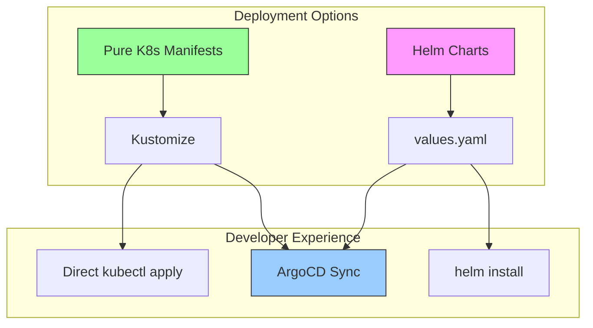
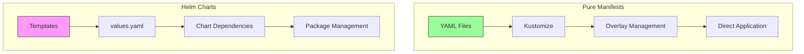
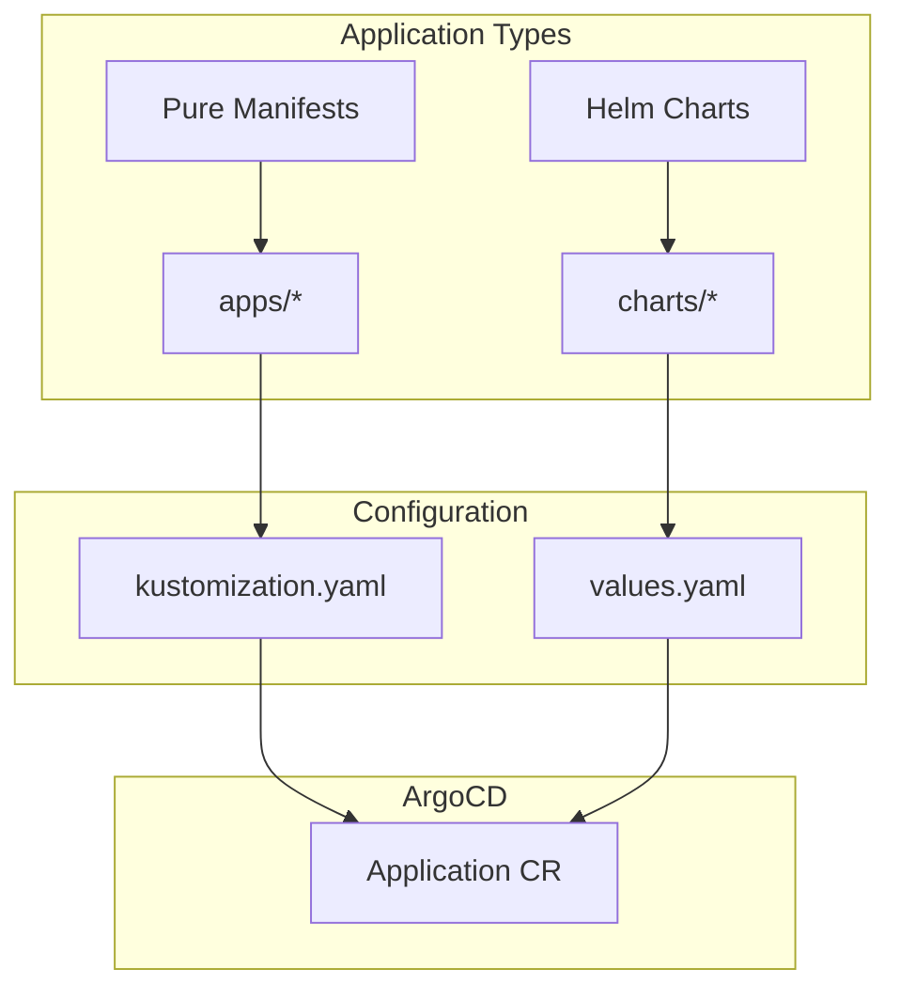
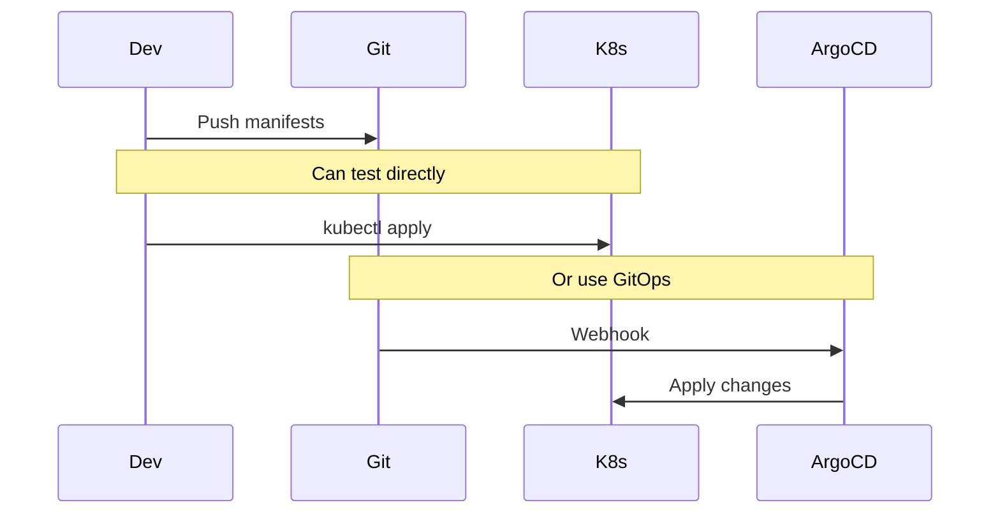
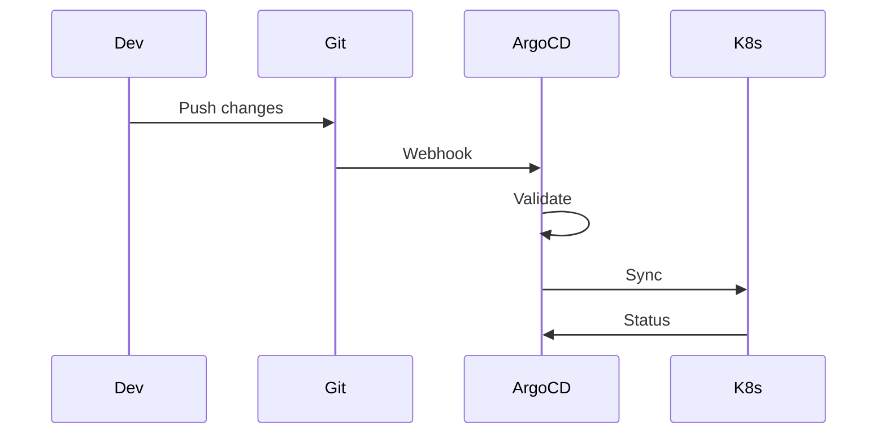
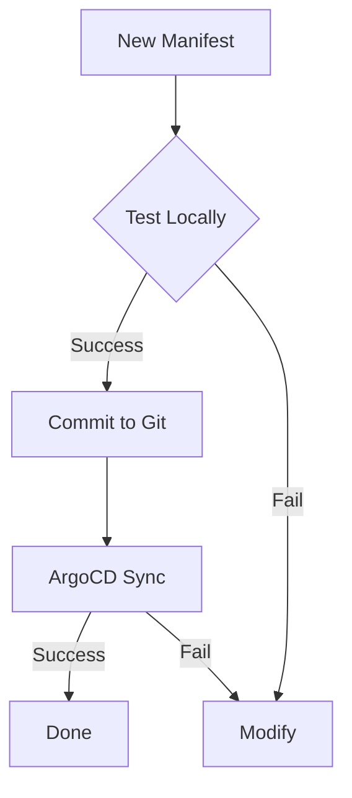
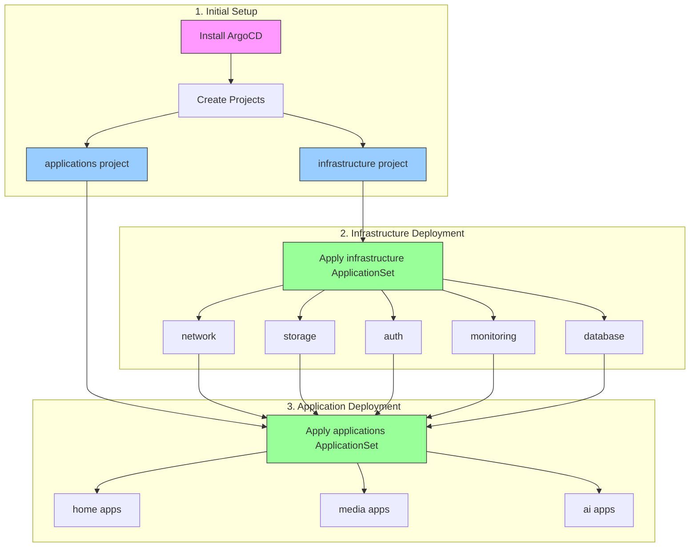

# ArgoCD Setup and Workflow

## Design Philosophy



### Why Pure Kubernetes Manifests?

1. **Portability**
   - Manifests can be applied directly with `kubectl`
   - No dependency on ArgoCD for development/testing
   - Easy to understand and modify

2. **Transparency**
   - Clear view of what's being deployed
   - No templating abstraction
   - Direct mapping to Kubernetes objects

3. **Flexibility**
   - Mix and match with Helm when needed
   - Easy to customize with Kustomize
   - No lock-in to specific tools

## Manifest vs Helm Comparison



### When to Use Each

1. **Pure Manifests + Kustomize**
   - Simple applications
   - Clear configuration needs
   - Direct control requirements
   - Development environments

2. **Helm Charts**
   - Complex applications
   - Many configuration options
   - Version management needed
   - Third-party applications

## ArgoCD Configuration

### Helm Support
```yaml
apiVersion: argoproj.io/v1alpha1
kind: Application
metadata:
  name: example-helm-app
spec:
  source:
    chart: example
    repoURL: https://charts.example.com
    targetRevision: 1.2.3
    helm:
      values: |
        key: value
```

### Pure Manifest Support
```yaml
apiVersion: argoproj.io/v1alpha1
kind: Application
metadata:
  name: example-kustomize-app
spec:
  source:
    path: apps/example
    repoURL: https://github.com/org/repo
    targetRevision: HEAD
```

## Repository Structure



## Deployment Strategies

### 1. Development Workflow


### 2. Production Workflow


## Best Practices

### 1. Manifest Organization
- Group related resources
- Use consistent naming
- Leverage labels and annotations
```yaml
metadata:
  labels:
    app.kubernetes.io/name: example
    app.kubernetes.io/part-of: system
```

### 2. Kustomize Usage
```yaml
# kustomization.yaml
resources:
  - deployment.yaml
  - service.yaml
commonLabels:
  app: example
```

### 3. Helm Integration
```yaml
# Application with both Kustomize and Helm
spec:
  source:
    plugin:
      name: kustomize-with-helm
```

## ArgoCD Enhancement

### 1. Plugin Support
```yaml
configManagementPlugins: |
  - name: kustomize-with-helm
    generate:
      command: ["sh", "-c"]
      args: ["kustomize build --enable-helm"]
```

### 2. Sync Waves
```yaml
metadata:
  annotations:
    argocd.argoproj.io/sync-wave: "1"
```

### 3. Health Checks
```yaml
spec:
  ignoreDifferences:
  - group: apps
    kind: Deployment
    jsonPointers:
    - /spec/replicas
```

## Migration Strategies

### From Helm to Pure Manifests
1. Export current Helm values
2. Generate manifests
3. Adapt to Kustomize
4. Test with kubectl
5. Commit to Git

### From Pure Manifests to Helm
1. Create Helm templates
2. Extract values
3. Test locally
4. Update ArgoCD application

## Validation and Testing



## Deployment Flow



## Installation

Our ArgoCD installation uses a Kustomize-based approach with custom configurations:

### 1. Installation Steps
```bash
# Install Gateway API CRDs first
kubectl apply -f https://github.com/kubernetes-sigs/gateway-api/releases/latest/download/experimental-install.yaml

# Install ArgoCD with our custom configuration
k3s kubectl kustomize --enable-helm infra/controllers/argocd | k3s kubectl apply -f -

# Wait for ArgoCD to be ready
kubectl wait --for=condition=available deployment -l app.kubernetes.io/name=argocd-server -n argocd --timeout=300s

# Wait for CRDs to be established
kubectl wait --for=condition=established crd/applications.argoproj.io --timeout=60s
kubectl wait --for=condition=established crd/appprojects.argoproj.io --timeout=60s
```

### 2. Project Setup
We use two main projects to separate infrastructure from applications:

```yaml
# Project definitions (root-apps/project.yaml)
apiVersion: argoproj.io/v1alpha1
kind: AppProject
metadata:
  name: infrastructure
  namespace: argocd
spec:
  sourceRepos:
    - 'https://github.com/mitchross/k3s-argocd-proxmox'
  destinations:
    - namespace: '*'
      server: '*'
  clusterResourceWhitelist:
    - group: '*'
      kind: '*'
---
apiVersion: argoproj.io/v1alpha1
kind: AppProject
metadata:
  name: applications
  namespace: argocd
spec:
  sourceRepos:
    - 'https://github.com/mitchross/k3s-argocd-proxmox'
  destinations:
    - namespace: '*'
      server: '*'
  clusterResourceWhitelist:
    - group: '*'
      kind: '*'
```

### 3. Application Management
We use ApplicationSets to manage our deployments:

```yaml
# Infrastructure ApplicationSet (root-apps/infrastructure.yaml)
apiVersion: argoproj.io/v1alpha1
kind: ApplicationSet
metadata:
  name: infrastructure
  namespace: argocd
spec:
  generators:
    - git:
        repoURL: https://github.com/mitchross/k3s-argocd-proxmox
        revision: HEAD
        directories:
          - path: infra/*
  template:
    metadata:
      name: '{{ path.basename }}'
    spec:
      project: infrastructure
      source:
        repoURL: https://github.com/mitchross/k3s-argocd-proxmox
        targetRevision: HEAD
        path: '{{ path }}'
      destination:
        server: https://kubernetes.default.svc
        namespace: '{{ path.basename }}'
      syncPolicy:
        automated:
          selfHeal: true
          prune: true

# Applications ApplicationSet (root-apps/applications.yaml)
apiVersion: argoproj.io/v1alpha1
kind: ApplicationSet
metadata:
  name: applications
  namespace: argocd
spec:
  generators:
    - git:
        repoURL: https://github.com/mitchross/k3s-argocd-proxmox
        revision: HEAD
        directories:
          - path: apps/*
  template:
    metadata:
      name: '{{ path.basename }}'
    spec:
      project: applications
      source:
        repoURL: https://github.com/mitchross/k3s-argocd-proxmox
        targetRevision: HEAD
        path: '{{ path }}'
      destination:
        server: https://kubernetes.default.svc
        namespace: '{{ path.basename }}'
      syncPolicy:
        automated:
          selfHeal: true
          prune: true
```

### 4. Deployment Order
Important: Follow this order for deployment:

1. Apply projects first:
```bash
kubectl apply -f root-apps/project.yaml
```

2. Apply infrastructure and wait for it to be ready:
```bash
kubectl apply -f root-apps/infrastructure.yaml
kubectl wait --for=condition=synced application/infrastructure -n argocd --timeout=300s
```

3. Only after infrastructure is healthy, apply applications:
```bash
kubectl apply -f root-apps/applications.yaml
```

### Repository Structure
```
.
├── root-apps/              # Top-level application definitions
│   ├── project.yaml       # Project definitions
│   ├── infrastructure.yaml # Infrastructure ApplicationSet
│   └── applications.yaml  # Applications ApplicationSet
├── infra/                 # Infrastructure components
│   ├── network/          # Network configurations
│   ├── storage/          # Storage configurations
│   ├── auth/            # Authentication
│   └── ...
└── apps/                 # User applications
    ├── home/            # Home automation apps
    ├── media/          # Media applications
    └── ...
```

### Key Features
- Custom plugin configurations (Kustomize with Helm support)
- Resource limits and requests for all components
- Security settings and RBAC configurations
- Config Management Plugin (CMP) setup for enhanced functionality
``` 