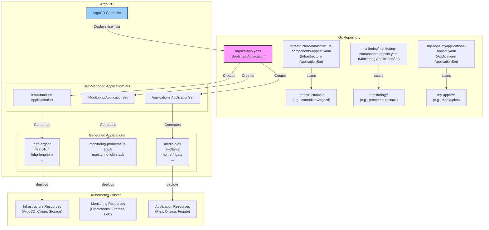

# 🚀 ArgoCD Installation and Configuration

This guide details the setup and configuration of ArgoCD, which serves as the GitOps engine for our **Talos-based Kubernetes cluster**.

## 📋 Overview & Deployment Flow

The cluster follows the **k3s-argocd-starter pattern** - a simple, proven GitOps approach where ArgoCD manages itself and ApplicationSets are deployed separately. This eliminates circular dependencies and follows production best practices.

The deployment flow follows this clean pattern:



## 📦 Installation Steps

The entire cluster bootstrap process is handled by a single bootstrap `Application` that makes ArgoCD manage itself and all other workloads.

### 1. Install Gateway API CRDs
This is a prerequisite for Cilium's Gateway API integration.
```bash
kubectl apply -f https://github.com/kubernetes-sigs/gateway-api/releases/download/v1.2.0/standard-install.yaml
kubectl apply -f https://github.com/kubernetes-sigs/gateway-api/releases/download/v1.2.0/experimental-install.yaml
```

### 2. Bootstrap ArgoCD (k3s-argocd-starter Pattern)
Deploy ArgoCD and ApplicationSets in the correct order to avoid circular dependencies:

```bash
# Step 1: Install ArgoCD Components & CRDs
# This command uses kustomize to install the ArgoCD helm chart, which includes the CRDs.
kubectl apply -k infrastructure/controllers/argocd

# Wait for ArgoCD to be ready (2-5 minutes)
kubectl wait --for=condition=Available deployment/argocd-server -n argocd --timeout=300s

# Step 2: Bootstrap ArgoCD to Manage Itself and Create Projects
# Now that ArgoCD is running, we apply the Application resource that tells
# ArgoCD to manage its own installation from Git. We also apply the projects.
kubectl apply -f infrastructure/controllers/argocd/projects.yaml
kubectl apply -f infrastructure/argocd-app.yaml

# Step 3: Deploy ApplicationSets
# With ArgoCD managing itself and projects created, we can deploy the ApplicationSets.
kubectl apply -f infrastructure/infrastructure-components-appset.yaml
kubectl apply -f monitoring/monitoring-components-appset.yaml
kubectl apply -f my-apps/myapplications-appset.yaml
```

**That's it!** ArgoCD will now manage itself and deploy everything else automatically.

This pattern separates ArgoCD's self-management from ApplicationSet deployment, eliminating SharedResourceWarning issues and following proven GitOps practices.

## 🔧 Project Setup

ArgoCD projects define permissions and boundaries for applications. Our cluster uses three main projects with clear separation:

- **infrastructure**: Core cluster components (ArgoCD, Cilium, Longhorn, Cert-Manager, etc.)
- **monitoring**: Observability stack (Prometheus, Grafana, Loki, etc.)
- **my-apps**: All user workloads (media, AI, dev, privacy, etc.)

These `AppProject` resources are defined in `infrastructure/projects.yaml` and are deployed automatically as part of the ArgoCD bootstrap.

## 📱 ApplicationSet Management

We use **three simple ApplicationSets** following enterprise patterns:

### 1. Infrastructure ApplicationSet (`infrastructure/infrastructure-components-appset.yaml`)
Manages all core infrastructure components:
```yaml
apiVersion: argoproj.io/v1alpha1
kind: ApplicationSet
metadata:
  name: infrastructure-components
  namespace: argocd
spec:
  generators:
    - git:
        repoURL: https://github.com/mitchross/k3s-argocd-proxmox.git
        revision: HEAD
        directories:
          - path: infrastructure/*/*
          - path: infrastructure/controllers/argocd
            exclude: true
  template:
    metadata:
      name: 'infra-{{path.basename}}'
      labels:
        type: infrastructure
    spec:
      project: infrastructure
      source:
        plugin:
          name: kustomize-build-with-helm
        repoURL: https://github.com/mitchross/k3s-argocd-proxmox.git
        targetRevision: HEAD
        path: '{{path}}'
      destination:
        server: https://kubernetes.default.svc
        namespace: '{{path.basename}}'
      syncPolicy:
        automated:
          prune: true
          selfHeal: true
        syncOptions:
          - CreateNamespace=true
```

### 2. Monitoring ApplicationSet (`monitoring/monitoring-components-appset.yaml`)
Manages the observability stack:
```yaml
apiVersion: argoproj.io/v1alpha1
kind: ApplicationSet
metadata:
  name: monitoring-components
  namespace: argocd
spec:
  generators:
    - git:
        repoURL: https://github.com/mitchross/k3s-argocd-proxmox.git
        revision: HEAD
        directories:
          - path: monitoring/*/*
  template:
    metadata:
      name: 'monitoring-{{path.basename}}'
      labels:
        type: monitoring
    spec:
      project: monitoring
      source:
        plugin:
          name: kustomize-build-with-helm
        repoURL: https://github.com/mitchross/k3s-argocd-proxmox.git
        targetRevision: HEAD
        path: '{{path}}'
      destination:
        server: https://kubernetes.default.svc
        namespace: '{{path.basename}}'
      syncPolicy:
        automated:
          prune: true
          selfHeal: true
        syncOptions:
          - CreateNamespace=true
```

### 3. Applications ApplicationSet (`my-apps/myapplications-appset.yaml`)
Manages all user applications:
```yaml
apiVersion: argoproj.io/v1alpha1
kind: ApplicationSet
metadata:
  name: applications
  namespace: argocd
spec:
  generators:
    - git:
        repoURL: https://github.com/mitchross/k3s-argocd-proxmox.git
        revision: HEAD
        directories:
          - path: my-apps/*/*
  template:
    metadata:
      name: '{{path[1]}}-{{path.basename}}'
      labels:
        type: application
    spec:
      project: my-apps
      source:
        plugin:
          name: kustomize-build-with-helm
        repoURL: https://github.com/mitchross/k3s-argocd-proxmox.git
        targetRevision: HEAD
        path: '{{path}}'
      destination:
        server: https://kubernetes.default.svc
        namespace: '{{path.basename}}'
      syncPolicy:
        automated:
          prune: true
          selfHeal: true
        syncOptions:
          - CreateNamespace=true
```

## 📂 Repository Structure

The repository follows a clean three-tier structure that maps directly to the ApplicationSets:

```
├── infrastructure/          # Infrastructure ApplicationSet
│   ├── controllers/         # ArgoCD, External Secrets, etc.
│   │   └── argocd/          # ArgoCD self-management
│   ├── networking/          # Cilium, Gateway API, etc.
│   ├── storage/             # Longhorn, CSI drivers, etc.
│   ├── database/            # PostgreSQL, Redis operators
│   ├── projects.yaml        # ArgoCD projects
│   └── infrastructure-components-appset.yaml     # Infrastructure ApplicationSet
├── monitoring/              # Monitoring ApplicationSet
│   ├── prometheus-stack/    # Prometheus, Grafana, AlertManager
│   ├── loki-stack/          # Loki, Promtail
│   └── monitoring-components-appset.yaml
├── my-apps/                 # Applications ApplicationSet
│   ├── ai/                  # AI tools (Ollama, ComfyUI, etc.)
│   ├── media/               # Media servers (Plex, Jellyfin, etc.)
│   ├── home/                # Home automation (Frigate, HA, etc.)
│   ├── development/         # Dev tools (Headlamp, IT-Tools, etc.)
│   ├── privacy/             # Privacy tools (SearXNG, ProxiTok, etc.)
│   └── myapplications-appset.yaml
└── docs/                    # Documentation
```

## ✅ Key Features

1. **Self-Managing ArgoCD**:
   - ArgoCD manages its own installation and upgrades
   - ApplicationSets are deployed separately to avoid circular dependencies
   - Follows k3s-argocd-starter proven pattern

2. **Enterprise Pattern**:
   - Clear separation of concerns with three ApplicationSets
   - Follows GitOps best practices used in production
   - Scalable and maintainable architecture

3. **Simple Directory Discovery**:
   - Each ApplicationSet scans its own directory pattern
   - No complex excludes or wildcards needed
   - Easy to understand and modify

4. **Production Ready**:
   - Proper error handling and retries
   - Automated sync with self-healing
   - Comprehensive ignore patterns for configuration drift

## 🚀 Deployment Workflow

### Development/Testing
```bash
# Test individual applications
kubectl apply -k infrastructure/controllers/argocd --dry-run=server

# Test entire infrastructure
kubectl apply -k infrastructure/
```

### Production Deployment
```bash
# Step 1: Install ArgoCD Components & CRDs
kubectl apply -k infrastructure/controllers/argocd

# Wait for ArgoCD to be ready
kubectl wait --for=condition=Available deployment/argocd-server -n argocd --timeout=300s

# Step 2: Bootstrap ArgoCD to Manage Itself and Create Projects
kubectl apply -f infrastructure/controllers/argocd/projects.yaml
kubectl apply -f infrastructure/argocd-app.yaml

# Step 3: Deploy ApplicationSets
kubectl apply -f infrastructure/infrastructure-components-appset.yaml
kubectl apply -f monitoring/monitoring-components-appset.yaml
kubectl apply -f my-apps/myapplications-appset.yaml

# Monitor deployment progress
kubectl get applications -n argocd -w

# Check ApplicationSets
kubectl get applicationsets -n argocd

# View generated applications by type
kubectl get applications -n argocd -l type=infrastructure
kubectl get applications -n argocd -l type=monitoring
kubectl get applications -n argocd -l type=application
```

## 🔍 Application Naming Conventions

The ApplicationSets use consistent naming patterns:

| ApplicationSet | Pattern | Example Applications |
|----------------|---------|---------------------|
| **Infrastructure** | `infra-{basename}` | `infra-argocd`, `infra-cilium`, `infra-longhorn` |
| **Monitoring** | `monitoring-{basename}` | `monitoring-prometheus-stack`, `monitoring-loki-stack` |
| **Applications** | `{category}-{basename}` | `media-plex`, `ai-ollama`, `home-frigate` |

## Best Practices

- **All cluster state is managed in Git** - no manual changes
- **ArgoCD manages itself** - including upgrades and configuration changes
- **Clear separation** - infrastructure, monitoring, and applications are separate
- **Simple patterns** - easy directory discovery without complex logic
- **Production ready** - proper retries, error handling, and monitoring

## Troubleshooting

### Check ArgoCD Applications
```bash
# View all applications
kubectl get applications -n argocd

# Check ApplicationSet status
kubectl get applicationsets -n argocd

# View application details
kubectl describe application infra-argocd -n argocd

# Check applications by type
kubectl get applications -n argocd -l type=infrastructure
kubectl get applications -n argocd -l type=monitoring
kubectl get applications -n argocd -l type=application
```

### Common Issues
| Issue | Solution |
|-------|----------|
| **ApplicationSet not generating apps** | Check directory patterns and Git connectivity |
| **Applications stuck in sync** | Review application logs and sync policies |
| **ArgoCD UI not accessible** | Check HTTPRoute and certificate status |
| **Kustomize plugin errors** | Verify plugin configuration in ArgoCD values |

### ArgoCD Self-Management
```bash
# Check ArgoCD managing itself
kubectl get application argocd -n argocd -o yaml

# View ArgoCD ApplicationSets (should show 3)
kubectl get applicationsets -n argocd

# Check ArgoCD kustomization references
kubectl describe application argocd -n argocd
```

## Enterprise Patterns

This setup follows **enterprise GitOps patterns**:

1. **Infrastructure as Code**: Everything defined in Git
2. **Self-Service**: Developers can add applications by creating directories
3. **Separation of Concerns**: Clear boundaries between workload types
4. **Automated Operations**: Zero-touch deployments after bootstrap
5. **Observability**: Full monitoring and alerting stack
6. **Security**: Proper RBAC and project boundaries

## Taking to Production

This homelab setup translates directly to enterprise environments:

1. **Replace Git repo** with your organization's repository
2. **Add proper RBAC** for team-based access
3. **Configure notifications** for Slack/Teams integration
4. **Add policy enforcement** with tools like OPA Gatekeeper
5. **Implement proper secrets management** with External Secrets or Vault
6. **Add multi-cluster support** with ArgoCD ApplicationSets

The patterns and structure remain the same - this is **production-grade GitOps**. 