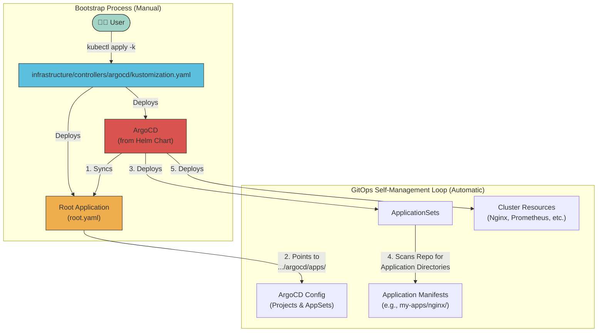

# 🚀 ArgoCD Installation and Configuration

This guide details the setup and configuration of ArgoCD, which serves as the GitOps engine for our **Talos-based Kubernetes cluster**.

## 📋 Overview & Deployment Flow

The cluster follows the **App of Apps** pattern, where ArgoCD manages itself and all other applications from a single, declarative source of truth in Git. This is an enterprise-grade pattern that provides scalability, safety, and clear separation of concerns.

The deployment flow is a two-phase process: a one-time manual bootstrap, followed by a fully automated, self-managing GitOps loop.



## 📦 Installation Steps

The entire cluster bootstrap process is handled by a single command.

### 1. Install Gateway API CRDs (If not already installed)
This is a prerequisite for Cilium's Gateway API integration.
```bash
kubectl apply -f https://github.com/kubernetes-sigs/gateway-api/releases/download/v1.2.0/standard-install.yaml
kubectl apply -f https://github.com/kubernetes-sigs/gateway-api/releases/download/v1.2.0/experimental-install.yaml
```

### 2. Bootstrap ArgoCD
This final step uses our "App of Apps" pattern to bootstrap the entire cluster. This is a multi-step process to avoid race conditions with CRD installation.

```bash
# 1. Apply the ArgoCD main components and CRDs
# This deploys the ArgoCD Helm chart, which creates the CRDs and controller.
kustomize build infrastructure/controllers/argocd --enable-helm | kubectl apply -f -

# 2. Wait for the ArgoCD CRDs to be established in the cluster
# This command pauses until the Kubernetes API server recognizes the 'Application' resource type.
echo "Waiting for ArgoCD CRDs to be established..."
kubectl wait --for condition=established --timeout=60s crd/applications.argoproj.io

# 3. Wait for the ArgoCD server to be ready
# This ensures the ArgoCD server is running before we apply the root application.
echo "Waiting for ArgoCD server to be available..."
kubectl wait --for=condition=Available deployment/argocd-server -n argocd --timeout=300s

# 4. Apply the Root Application
# Now that ArgoCD is running and its CRDs are ready, we can apply the 'root' application
# to kickstart the self-managing GitOps loop.
echo "Applying the root application..."
kubectl apply -f infrastructure/controllers/argocd/root.yaml
```
**That's it!** ArgoCD will now manage itself and deploy everything else automatically.

## 🔧 Project Setup

ArgoCD projects define permissions and boundaries for applications. Our cluster uses three main projects with clear separation:

- **infrastructure**: Core cluster components (ArgoCD, Cilium, Longhorn, Cert-Manager, etc.)
- **monitoring**: Observability stack (Prometheus, Grafana, Loki, etc.)
- **my-apps**: All user workloads (media, AI, dev, privacy, etc.)

These `AppProject` resources are defined in `infrastructure/controllers/argocd/apps/projects.yaml` and are managed automatically by the `root` ArgoCD application.

## 📱 ApplicationSet Management

We use **three simple ApplicationSets** that discover applications based on their directory structure. This follows a "convention over configuration" approach, eliminating the need for metadata files.

### 1. The "Directory as Application" Pattern
Instead of relying on marker files, our `ApplicationSet`s discover applications by looking for directories that match a predefined path pattern. The application's name and target namespace are derived directly from this path.

For an application at `my-apps/development/nginx`, the `ApplicationSet` will automatically:
- Create an ArgoCD Application named `my-apps-development-nginx`.
- Deploy the application into the `nginx` namespace.

### 2. ApplicationSet Configuration
All `ApplicationSet`s live in `infrastructure/controllers/argocd/apps/appsets/` and follow the same pattern. Here is the `my-apps-appset.yaml` as an example:

```yaml
apiVersion: argoproj.io/v1alpha1
kind: ApplicationSet
metadata:
  name: my-apps
  namespace: argocd
spec:
  preserveResourcesOnDeletion: true # Safety feature!
  generators:
    - git:
        repoURL: https://github.com/mitchross/k3s-argocd-proxmox.git
        revision: HEAD
        # Discover any directory matching the pattern.
        directories:
          - path: "my-apps/*/*"
  template:
    metadata:
      # Name is derived from the directory path.
      name: 'my-apps-{{path.basenameNormalized}}-{{path[2]}}'
      namespace: argocd
    spec:
      project: my-apps
      source:
        repoURL: https://github.com/mitchross/k3s-argocd-proxmox.git
        targetRevision: HEAD
        # Path points to the discovered directory.
        path: '{{path}}'
        # Enable Helm charts for Kustomize
        kustomize:
          buildOptions: "--enable-helm"
      destination:
        server: https://kubernetes.default.svc
        # Namespace is the last part of the path (e.g., "nginx").
        namespace: '{{path.basenameNormalized}}'
      syncPolicy:
        automated:
          prune: true
          selfHeal: true
        syncOptions:
          - CreateNamespace=true
```

## 📂 Repository Structure

The repository structure is designed for clarity and co-location of configuration.

```
├── infrastructure/
│   └── controllers/
│       └── argocd/                 # <-- Manually bootstrapped, NOT in AppSet
│           ├── apps/
│           │   ├── appsets/
│           │   │   ├── infrastructure-appset.yaml  #<-- Ignores its own parent
│           │   │   ├── monitoring-appset.yaml
│           │   │   └── my-apps-appset.yaml
│           │   ├── projects.yaml
│           │   └── kustomization.yaml
│           ├── http-route.yaml
│           ├── ns.yaml
│           ├── root.yaml             # <-- The "root" app (App of Apps)
│           ├── values.yaml
│           └── kustomization.yaml    # <-- The BOOTSTRAP kustomization
├── monitoring/
│   └── prometheus-stack/             # <-- Example discovered application
│       └── ...
└── my-apps/
    └── development/
        └── nginx/                    # <-- Example discovered application
            └── ...
```

## ✅ Key Features

1. **Co-located & Self-Managing ArgoCD**:
   - ArgoCD's entire configuration lives logically within `infrastructure/controllers/argocd`.
   - The `root` application manages the projects and `ApplicationSet`s from the `apps/` subdirectory.
   - **Crucially, the `infrastructure-appset` explicitly excludes its own directory (`.../argocd`) to prevent a recursive management loop.**

2. **Enterprise Pattern**:
   - Clear separation of concerns with three `ApplicationSet`s.
   - Follows GitOps best practices used in production.

3. **Simple Directory Discovery**:
   - Applications are discovered automatically based on their directory structure. This is flexible, clear, and requires no boilerplate.

4. **Production Ready**:
   - The `ApplicationSet`s use `preserveResourcesOnDeletion: true` as a safety mechanism to prevent accidental mass-deletions.

## 🚀 Deployment Workflow

### Development/Testing
```bash
# Test individual applications with a server-side dry run
kustomize build my-apps/development/nginx | kubectl apply --dry-run=server -f -
```

### Production Deployment
The deployment is triggered by a merge to the `main` branch. The bootstrap is a one-time operation.

```bash
# Bootstrap ArgoCD and the entire cluster
kustomize build infrastructure/controllers/argocd --enable-helm | kubectl apply -f -

# Monitor deployment progress
kubectl get applications -n argocd -w

# Check ApplicationSets
kubectl get applicationsets -n argocd

# View generated applications by project
kubectl get applications -n argocd -l argocd.argoproj.io/project=infrastructure
kubectl get applications -n argocd -l argocd.argoproj.io/project=monitoring
kubectl get applications -n argocd -l argocd.argoproj.io/project=my-apps
```

## 🔍 Application Naming Conventions

The `ApplicationSet`s use the directory `path` to automatically generate the application name and target namespace. This creates a consistent and predictable naming scheme.

- **Application Name**: Combines the project (`my-apps`, `infrastructure`, `monitoring`) with the directory path.
  - `my-apps/development/nginx` -> `my-apps-nginx-development`
- **Target Namespace**: Uses the final directory in the path.
  - `my-apps/development/nginx` -> `nginx`

## Best Practices

- **All cluster state is managed in Git** - no manual changes are made via `kubectl`.
- **ArgoCD manages itself** - including its projects and `ApplicationSet` configurations.
- **Clear separation** - infrastructure, monitoring, and applications are separate projects.
- **Simple directory patterns** - A new directory is all that's needed to onboard an application.

## Troubleshooting

### Check ArgoCD Applications
```bash
# View all applications
kubectl get applications -n argocd

# Check ApplicationSet status
kubectl get applicationsets -n argocd

# Describe an application to see its sync status, resources, and health
kubectl describe application my-apps-nginx-development -n argocd
```

### Common Issues
| Issue | Solution |
|-------|----------|
| **ApplicationSet not generating apps** | Verify the directory structure matches the `path` pattern in the `ApplicationSet`. Check the `ApplicationSet` controller logs in the `argocd` namespace. Also ensure you are not accidentally excluding the path you want to deploy. |
| **Recursive loop or Helm error on `infra-argocd`** | This happens if the `infrastructure-appset` discovers the `infrastructure/controllers/argocd` directory. The ApplicationSet must have a generator that explicitly excludes this path to prevent ArgoCD from trying to manage itself. |
| **Applications stuck in sync** | Review application logs (`argocd app logs <app-name>`) and check for sync errors in the UI. |
| **ArgoCD UI not accessible** | Check the `http-route.yaml` and the status of the `istio-ingressgateway` service. |

### ArgoCD Self-Management
```