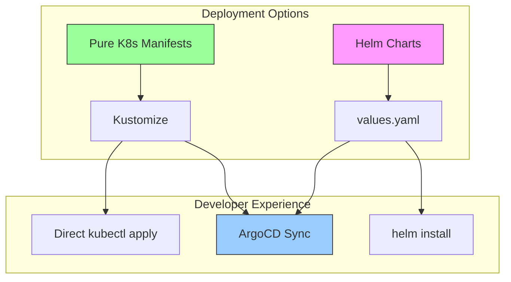
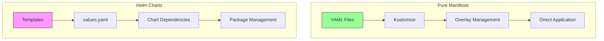
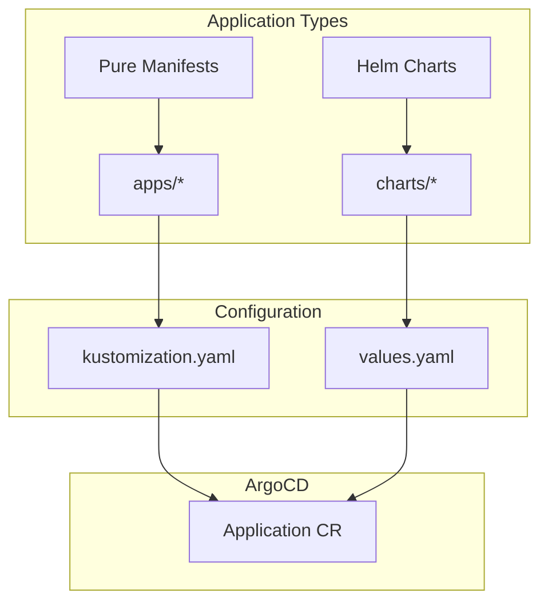
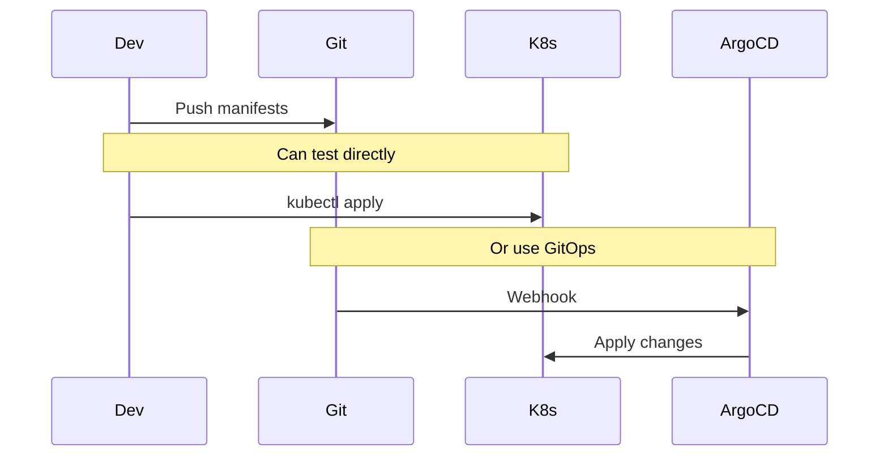
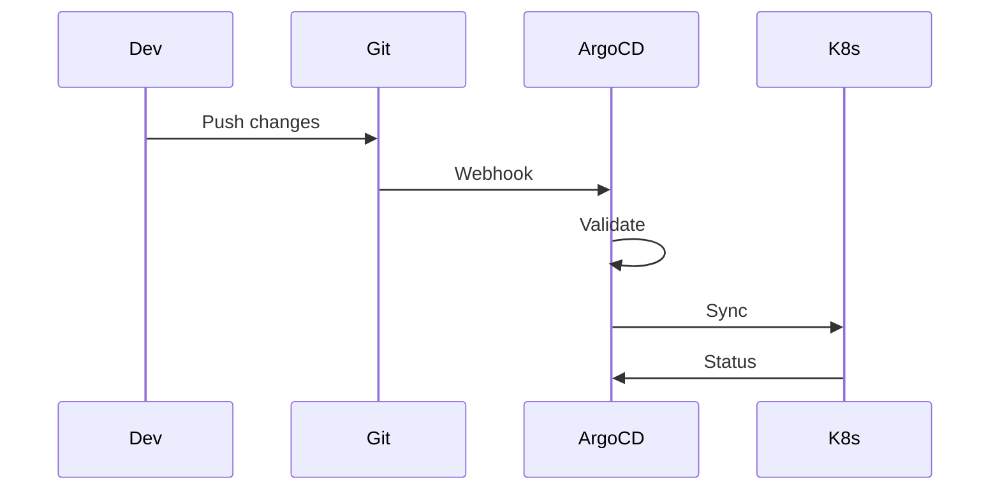
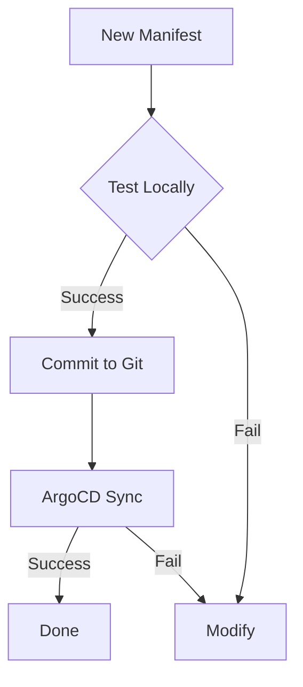

# ArgoCD Setup and Workflow

## Design Philosophy



### Why Pure Kubernetes Manifests?

1. **Portability**
   - Manifests can be applied directly with `kubectl`
   - No dependency on ArgoCD for development/testing
   - Easy to understand and modify

2. **Transparency**
   - Clear view of what's being deployed
   - No templating abstraction
   - Direct mapping to Kubernetes objects

3. **Flexibility**
   - Mix and match with Helm when needed
   - Easy to customize with Kustomize
   - No lock-in to specific tools

## Manifest vs Helm Comparison



### When to Use Each

1. **Pure Manifests + Kustomize**
   - Simple applications
   - Clear configuration needs
   - Direct control requirements
   - Development environments

2. **Helm Charts**
   - Complex applications
   - Many configuration options
   - Version management needed
   - Third-party applications

## ArgoCD Configuration

### Helm Support
```yaml
apiVersion: argoproj.io/v1alpha1
kind: Application
metadata:
  name: example-helm-app
spec:
  source:
    chart: example
    repoURL: https://charts.example.com
    targetRevision: 1.2.3
    helm:
      values: |
        key: value
```

### Pure Manifest Support
```yaml
apiVersion: argoproj.io/v1alpha1
kind: Application
metadata:
  name: example-kustomize-app
spec:
  source:
    path: apps/example
    repoURL: https://github.com/org/repo
    targetRevision: HEAD
```

## Repository Structure



## Deployment Strategies

### 1. Development Workflow


### 2. Production Workflow


## Best Practices

### 1. Manifest Organization
- Group related resources
- Use consistent naming
- Leverage labels and annotations
```yaml
metadata:
  labels:
    app.kubernetes.io/name: example
    app.kubernetes.io/part-of: system
```

### 2. Kustomize Usage
```yaml
# kustomization.yaml
resources:
  - deployment.yaml
  - service.yaml
commonLabels:
  app: example
```

### 3. Helm Integration
```yaml
# Application with both Kustomize and Helm
spec:
  source:
    plugin:
      name: kustomize-with-helm
```

## ArgoCD Enhancement

### 1. Plugin Support
```yaml
configManagementPlugins: |
  - name: kustomize-with-helm
    generate:
      command: ["sh", "-c"]
      args: ["kustomize build --enable-helm"]
```

### 2. Sync Waves
```yaml
metadata:
  annotations:
    argocd.argoproj.io/sync-wave: "1"
```

### 3. Health Checks
```yaml
spec:
  ignoreDifferences:
  - group: apps
    kind: Deployment
    jsonPointers:
    - /spec/replicas
```

## Migration Strategies

### From Helm to Pure Manifests
1. Export current Helm values
2. Generate manifests
3. Adapt to Kustomize
4. Test with kubectl
5. Commit to Git

### From Pure Manifests to Helm
1. Create Helm templates
2. Extract values
3. Test locally
4. Update ArgoCD application

## Validation and Testing

