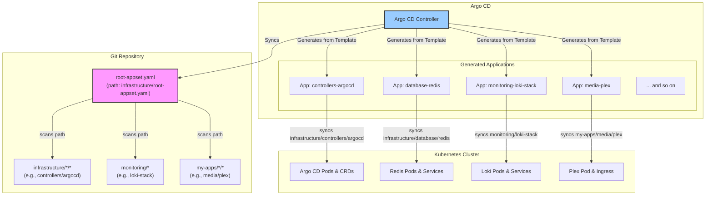
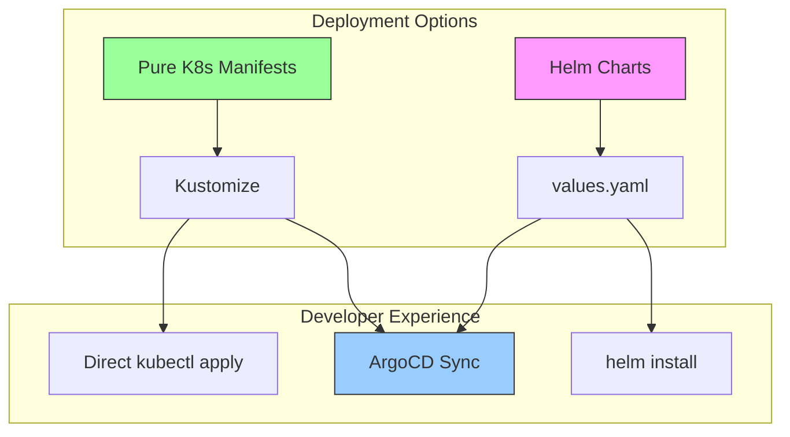
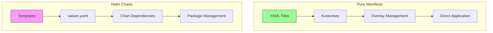
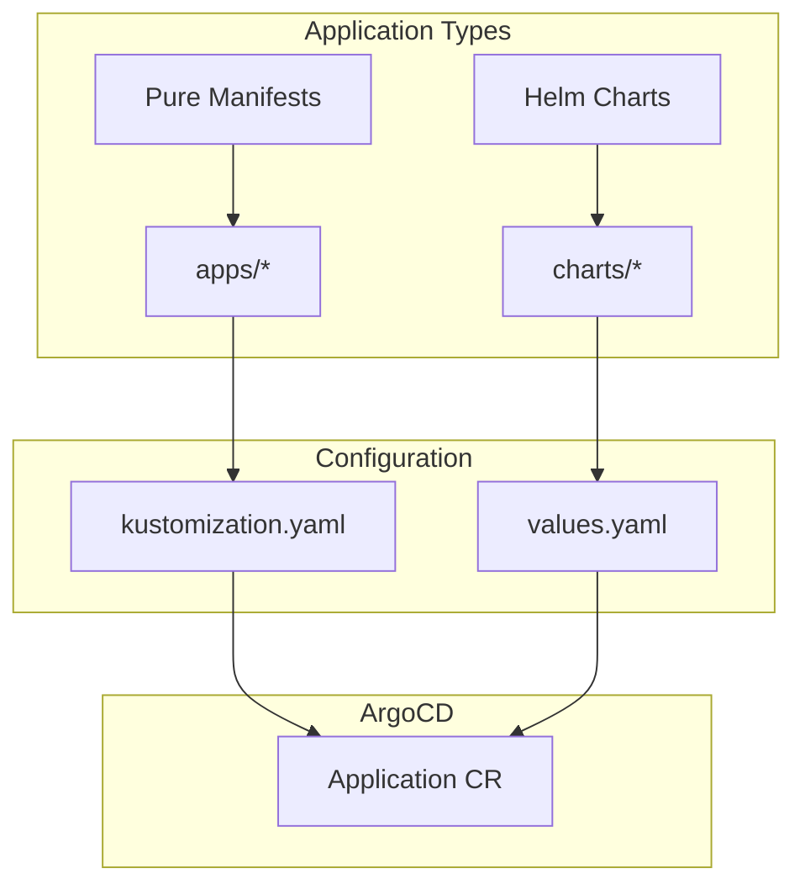
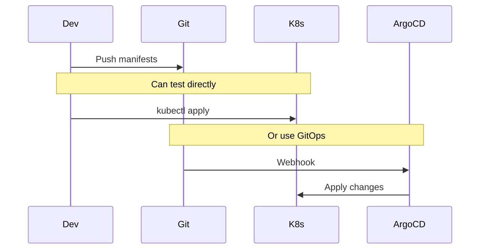
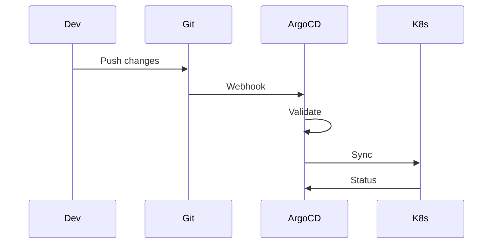
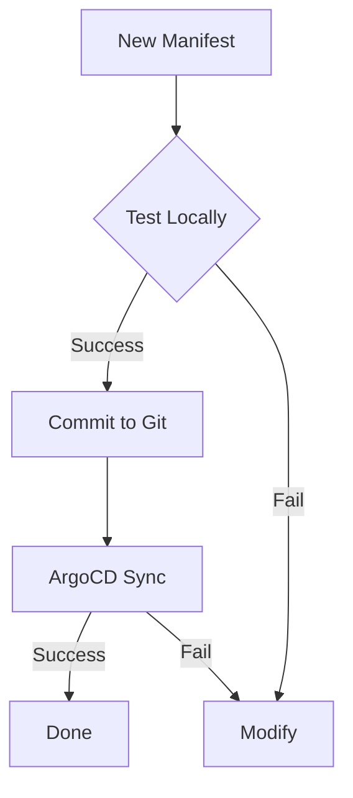
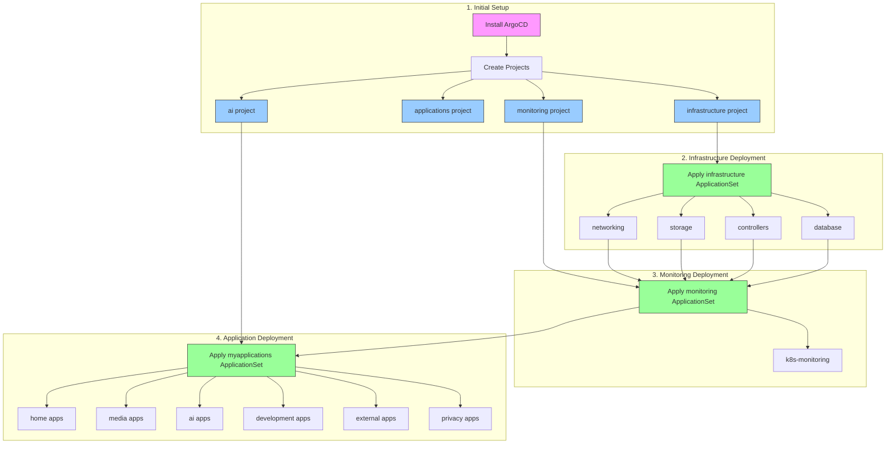

# 🚀 ArgoCD Installation and Configuration

This guide details the setup and configuration of ArgoCD, which serves as the GitOps engine for our **Talos-based Kubernetes cluster**.

## 📋 Overview & Deployment Flow

The cluster's GitOps process is managed by a single, root `ApplicationSet` that implements the **App of Apps** pattern. This `ApplicationSet` is responsible for discovering and managing all other applications, including infrastructure, monitoring, and user-facing apps. This centralized approach simplifies management and ensures the entire cluster state is declared in one place.

The new deployment flow is as follows:



## 📦 Installation Steps

The entire cluster bootstrap process is now handled by a single `Application` manifest. This is the only manual command needed after setting up Talos and the base kubeconfig.

### 1. Install Gateway API CRDs
This is a prerequisite for Cilium's Gateway API integration.
```bash
kubectl apply -f https://github.com/kubernetes-sigs/gateway-api/releases/download/v1.2.0/standard-install.yaml
kubectl apply -f https://github.com/kubernetes-sigs/gateway-api/releases/download/v1.2.0/experimental-install.yaml
```

### 2. Bootstrap Argo CD and Deploy Everything
Deploy the self-managing Argo CD `Application`. This uses the "app of apps" pattern to make Argo CD manage its own installation and upgrades. The `Application` points to the `infrastructure/controllers/argocd` directory, which contains the Argo CD Helm chart configuration.

Once Argo CD is running, it will automatically sync the `root-appset.yaml` from the `infrastructure` directory, which will then discover and deploy all other applications.

```bash
# Apply the Argo CD application. It will self-manage and deploy everything else from this point on.
kubectl apply -f infrastructure/argocd-app.yaml
```
After this command, the entire cluster state is managed via Git. No further `kubectl apply` commands are needed for deployment.

## 🔧 Project Setup

ArgoCD projects define permissions and boundaries for applications. Our cluster uses three main projects, which are automatically assigned by the root `ApplicationSet`:

- **infrastructure**: Cilium, Longhorn, Cert-Manager, External Secrets, etc.
- **monitoring**: Prometheus, Grafana, Loki, Alertmanager, etc.
- **my-apps**: All user workloads (media, AI, dev, privacy, etc.)

These `AppProject` resources are defined in `infrastructure/projects.yaml` and are deployed automatically as part of the `infrastructure-controllers-argocd` application.

## 📱 ApplicationSet Management

Management is now centralized in a single root `ApplicationSet` located at `infrastructure/root-appset.yaml`.

This `ApplicationSet` uses a `directories` generator to scan the repository for all individual application and component directories. For each directory found, it generates a unique Argo CD `Application` resource with the correct settings, including the `kustomize-build-with-helm` plugin to handle any combination of manifests.

This new model eliminates nested `ApplicationSet` resources and provides a flat, easy-to-understand list of applications in the Argo CD UI.

## 📂 Repository Structure

The repository follows a clean three-tier structure:

- `/infrastructure/` - Infrastructure components (network, storage, security, etc.)
- `/monitoring/` - Monitoring components (Prometheus, Grafana, Loki, etc.)
- `/my-apps/` - User applications (media servers, AI tools, etc.)
- `/docs/` - Documentation
- `/iac/` - Infrastructure as Code (Talos, Terraform, etc.)

## ✅ Key Features

1. **Three-Tier Architecture**:
   - Clear separation of concerns
   - Controlled deployment order
   - Simplified management
2. **Sync Waves**:
   - Infrastructure: -2 (deployed first)
   - Monitoring: 0 (deployed second)
   - Applications: 1 (deployed last)
3. **Declarative Storage**:
   - All storage (Longhorn, StorageClasses, PVs, PVCs) is managed via ArgoCD manifests
   - No manual storage setup required on nodes
4. **No SSH**:
   - All node management via Talosctl API
   - Immutable OS, no shell or package manager

## Best Practices

- **All cluster state is managed in Git** (including storage, monitoring, and user apps)
- **No manual changes** to the cluster; always use GitOps workflow
- **Use sync waves** to control deployment order and dependencies
- **Document all customizations** in `/docs/` and keep manifests up to date
- **Monitor ArgoCD sync status** for drift or errors

## Troubleshooting

| Issue Type | Troubleshooting Steps |
|------------|----------------------|
| **ArgoCD Sync Issues** | • Check application sync status<br>• Review application logs<br>• Check for drift or failed syncs |
| **Storage Issues** | • Verify Longhorn/StorageClass manifests are applied<br>• Check PV/PVC status<br>• Validate node affinity and volume binding |
| **Talos Node Issues** | • `talosctl health`<br>• Check Talos logs: `talosctl logs -n <node-ip> -k` |
| **Monitoring Issues** | • Check Prometheus/Grafana/Alertmanager pod status<br>• Review ServiceMonitor and PodMonitor configs |

### ArgoCD Application Cleanup
```bash
# Remove finalizers from all applications
kubectl get applications -n argocd -o name | xargs -I{} kubectl patch {} -n argocd --type json -p '[{"op": "remove","path": "/metadata/finalizers"}]'
# Delete all applications
kubectl delete applications --all -n argocd
# For stuck ApplicationSets
kubectl get applicationsets -n argocd -o name | xargs -I{} kubectl patch {} -n argocd --type json -p '[{"op": "remove","path": "/metadata/finalizers"}]'
kubectl delete applicationsets --all -n argocd
```

## Talos-Specific Notes
- **No SSH**: All management via `talosctl` API
- **Immutable OS**: No package manager, no shell
- **Declarative**: All config in Git, applied via Talhelper/Talosctl
- **System Extensions**: GPU, storage, and other drivers enabled via config

## See Also
- [Storage Configuration](storage.md)
- [Network Configuration](network.md)
- [Secrets Management](secrets.md)
- [GPU Configuration](gpu.md)

## Design Philosophy



### Why Pure Kubernetes Manifests?

1. **Portability**
   - Manifests can be applied directly with `kubectl`
   - No dependency on ArgoCD for development/testing
   - Easy to understand and modify

2. **Transparency**
   - Clear view of what's being deployed
   - No templating abstraction
   - Direct mapping to Kubernetes objects

3. **Flexibility**
   - Mix and match with Helm when needed
   - Easy to customize with Kustomize
   - No lock-in to specific tools

## Manifest vs Helm Comparison



### When to Use Each

1. **Pure Manifests + Kustomize**
   - Simple applications
   - Clear configuration needs
   - Direct control requirements
   - Development environments

2. **Helm Charts**
   - Complex applications
   - Many configuration options
   - Version management needed
   - Third-party applications

## ArgoCD Configuration

### Helm Support
```yaml
apiVersion: argoproj.io/v1alpha1
kind: Application
metadata:
  name: example-helm-app
spec:
  source:
    chart: example
    repoURL: https://charts.example.com
    targetRevision: 1.2.3
    helm:
      values: |
        key: value
```

### Pure Manifest Support
```yaml
apiVersion: argoproj.io/v1alpha1
kind: Application
metadata:
  name: example-kustomize-app
spec:
  source:
    path: apps/example
    repoURL: https://github.com/org/repo
    targetRevision: HEAD
```

## Repository Structure



## Deployment Strategies

### 1. Development Workflow


### 2. Production Workflow


## Best Practices

### 1. Manifest Organization
- Group related resources
- Use consistent naming
- Leverage labels and annotations
```yaml
metadata:
  labels:
    app.kubernetes.io/name: example
    app.kubernetes.io/part-of: system
```

### 2. Kustomize Usage
```yaml
# kustomization.yaml
resources:
  - deployment.yaml
  - service.yaml
commonLabels:
  app: example
```

### 3. Helm Integration
```yaml
# Application with both Kustomize and Helm
spec:
  source:
    plugin:
      name: kustomize-with-helm
```

## ArgoCD Enhancement

### 1. Plugin Support
```yaml
configManagementPlugins: |
  - name: kustomize-with-helm
    generate:
      command: ["sh", "-c"]
      args: ["kustomize build --enable-helm"]
```

### 2. Sync Waves
```yaml
metadata:
  annotations:
    argocd.argoproj.io/sync-wave: "1"
```

### 3. Health Checks
```yaml
spec:
  ignoreDifferences:
  - group: apps
    kind: Deployment
    jsonPointers:
    - /spec/replicas
```

## Migration Strategies

### From Helm to Pure Manifests
1. Export current Helm values
2. Generate manifests
3. Adapt to Kustomize
4. Test with kubectl
5. Commit to Git

### From Pure Manifests to Helm
1. Create Helm templates
2. Extract values
3. Test locally
4. Update ArgoCD application

## Validation and Testing



## Deployment Flow



## Installation

Our ArgoCD installation uses a Kustomize-based approach with custom configurations:

### 1. Installation Steps
```bash
# Install Gateway API CRDs first
kubectl apply -f https://github.com/kubernetes-sigs/gateway-api/releases/download/v1.2.0/standard-install.yaml
kubectl apply -f https://github.com/kubernetes-sigs/gateway-api/releases/download/v1.2.0/experimental-install.yaml

# Install ArgoCD with our custom configuration
kubectl kustomize --enable-helm infrastructure/controllers/argocd | kubectl apply -f -

# Wait for ArgoCD to be ready
kubectl wait --for=condition=available deployment -l app.kubernetes.io/name=argocd-server -n argocd --timeout=300s

# Wait for CRDs to be established
kubectl wait --for=condition=established crd/applications.argoproj.io --timeout=60s
kubectl wait --for=condition=established crd/appprojects.argoproj.io --timeout=60s
```

### 2. Project Setup
We use the following projects to separate different types of applications:

```yaml
# Project definitions (infrastructure/controllers/argocd/projects.yaml)
apiVersion: argoproj.io/v1alpha1
kind: AppProject
metadata:
  name: infrastructure
  namespace: argocd
spec:
  sourceRepos:
    - '*'
  destinations:
    - namespace: '*'
      server: '*'
  clusterResourceWhitelist:
    - group: '*'
      kind: '*'
---
apiVersion: argoproj.io/v1alpha1
kind: AppProject
metadata:
  name: applications
  namespace: argocd
spec:
  sourceRepos:
    - '*'
  destinations:
    - namespace: '*'
      server: '*'
  clusterResourceWhitelist:
    - group: '*'
      kind: 'PersistentVolume'
    - group: cert-manager.io
      kind: ClusterIssuer
    - group: '*'
      kind: 'CustomResourceDefinition'
    - group: '*'
      kind: 'Namespace'
---
apiVersion: argoproj.io/v1alpha1
kind: AppProject
metadata:
  name: monitoring
  namespace: argocd
spec:
  sourceRepos:
    - '*'
  destinations:
    - namespace: '*'
      server: '*'
  clusterResourceWhitelist:
    - group: '*'
      kind: '*'
---
apiVersion: argoproj.io/v1alpha1
kind: AppProject
metadata:
  name: ai
  namespace: argocd
spec:
  sourceRepos:
    - '*'
  destinations:
    - namespace: '*'
      server: '*'
  clusterResourceWhitelist:
    - group: '*'
      kind: 'PersistentVolume'
    - group: '*'
      kind: 'CustomResourceDefinition'
    - group: '*'
      kind: 'ClusterRole'
    - group: '*'
      kind: 'ClusterRoleBinding'
    - group: '*'
      kind: 'Namespace'
```

### 3. Application Management
We use three main ApplicationSets to manage our deployments:

```yaml
# Infrastructure ApplicationSet (infrastructure/infrastructure-components-appset.yaml)
apiVersion: argoproj.io/v1alpha1
kind: ApplicationSet
metadata:
  name: infrastructure-components
  namespace: argocd
  annotations:
    argocd.argoproj.io/sync-wave: "-2"
spec:
  generators:
    - git:
        repoURL: https://github.com/mitchross/k3s-argocd-proxmox
        revision: HEAD
        directories:
          - path: infrastructure/*/*
  template:
    metadata:
      name: 'infra-{{path.basename}}'
      labels:
        type: infrastructure
    spec:
      project: infrastructure
      source:
        plugin:
          name: kustomize-build-with-helm
        repoURL: https://github.com/mitchross/k3s-argocd-proxmox
        targetRevision: HEAD
        path: '{{path}}'
      destination:
        server: https://kubernetes.default.svc
        namespace: '{{path.basename}}'
      syncPolicy:
        automated:
          selfHeal: true
          prune: true

# Monitoring ApplicationSet (monitoring/monitoring-components-appset.yaml)
apiVersion: argoproj.io/v1alpha1
kind: ApplicationSet
metadata:
  name: monitoring-components
  namespace: argocd
  annotations:
    argocd.argoproj.io/sync-wave: "0"
spec:
  generators:
    - git:
        repoURL: https://github.com/mitchross/k3s-argocd-proxmox
        revision: HEAD
        directories:
          - path: monitoring/*/*
  template:
    metadata:
      name: 'monitoring-{{path.basename}}'
      labels:
        type: monitoring
    spec:
      project: infrastructure
      source:
        plugin:
          name: kustomize-build-with-helm
        repoURL: https://github.com/mitchross/k3s-argocd-proxmox
        targetRevision: HEAD
        path: '{{path}}'
      destination:
        server: https://kubernetes.default.svc
        namespace: '{{path.basename}}'
      syncPolicy:
        automated:
          selfHeal: true
          prune: true

# Applications ApplicationSet (my-apps/myapplications-appset.yaml)
apiVersion: argoproj.io/v1alpha1
kind: ApplicationSet
metadata:
  name: applications
  namespace: argocd
  annotations:
    argocd.argoproj.io/sync-wave: "1"
spec:
  generators:
    - git:
        repoURL: https://github.com/mitchross/k3s-argocd-proxmox
        revision: HEAD
        directories:
          - path: my-apps/*/*
  template:
    metadata:
      name: '{{path[1]}}-{{path.basename}}'
      labels:
        type: application
    spec:
      project: ai
      source:
        plugin:
          name: kustomize-build-with-helm
        repoURL: https://github.com/mitchross/k3s-argocd-proxmox
        targetRevision: HEAD
        path: '{{path}}'
      destination:
        server: https://kubernetes.default.svc
        namespace: '{{path.basename}}'
      syncPolicy:
        automated:
          selfHeal: true
          prune: true
```

### 4. Deployment Order
Important: Follow this specific order for deployment:

1. Apply projects first:
```bash
kubectl apply -f infrastructure/controllers/argocd/projects.yaml -n argocd
```

2. Apply infrastructure and wait for it to be ready:
```bash
kubectl apply -f infrastructure/infrastructure-components-appset.yaml -n argocd
```

3. Apply monitoring:
```bash
kubectl apply -f monitoring/monitoring-components-appset.yaml -n argocd
```

4. Finally, apply applications:
```bash
kubectl apply -f my-apps/myapplications-appset.yaml -n argocd
```

### Repository Structure
```
.
├── infrastructure/           # Infrastructure components
│   ├── controllers/          # Kubernetes controllers
│   │   └── argocd/           # ArgoCD configuration and projects
│   ├── networking/           # Network configurations
│   ├── storage/              # Storage configurations
│   └── infrastructure-components-appset.yaml  # Main infrastructure ApplicationSet
├── monitoring/               # Monitoring components
│   ├── k8s-monitoring/       # Kubernetes monitoring stack
│   └── monitoring-components-appset.yaml  # Main monitoring ApplicationSet
├── my-apps/                  # User applications
│   ├── ai/                   # AI-related applications
│   ├── media/                # Media applications
│   ├── development/          # Development tools
│   ├── external/             # External service integrations
│   ├── home/                 # Home automation apps
│   ├── privacy/              # Privacy-focused applications
│   └── myapplications-appset.yaml  # Main applications ApplicationSet
```

### Key Features
- Three-tier architecture separating infrastructure, monitoring, and applications
- Sync waves ensure proper deployment order
- Simple directory patterns without complex exclude logic
- All applications managed through just three top-level ApplicationSets
``` 