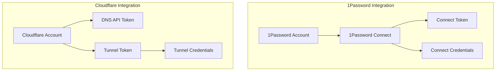

# 🔐 External Services Setup

## 📋 Overview



## 🔑 1Password Setup

### Overview
1Password integration requires two distinct components:
1. **Connect Credentials** (`1password-credentials.json`)
   - Used to authenticate the 1Password Connect server
   - Contains server identity and verification keys
   - Generated once per cluster

2. **Connect Token**
   - Used by applications to access the Connect server
   - Scoped to specific vaults
   - Can be rotated without regenerating credentials

### Setup Steps

1. **Create 1Password Connect Server** 🛠️
```bash
# Install 1Password CLI
brew install 1password-cli  # macOS
# or
curl -sS https://downloads.1password.com/linux/keys/1password.asc | \
sudo gpg --dearmor --output /usr/share/keyrings/1password-archive-keyring.gpg

# Generate Connect Credentials
op connect server create k3s-cluster
# This creates 1password-credentials.json
```

2. **Create Connect Token** 🎟️
```bash
# Create token with access to required vaults
op connect token create k3s-cluster \
  --server k3s-cluster \
  --vault "Infrastructure"
# Save this token securely - it's used in the CONNECT_TOKEN environment variable
```

3. **Required Vault Items** 📝
Create these items in your 1Password vault:

- **cert-manager-cloudflare**
  ```yaml
  token: "your-cloudflare-api-token"  # DNS API token
  ```

- **cloudflared-tunnel**
  ```json
  {
    "AccountTag": "your-account-tag",
    "TunnelSecret": "your-tunnel-secret",
    "TunnelID": "your-tunnel-id"
  }
  ```

## ☁️ Cloudflare Setup

### Required Tokens

1. **DNS API Token** 🔑
   - Used by cert-manager for DNS01 challenges
   - Permissions needed:
     - Zone - DNS - Edit
     - Zone - Zone - Read

2. **Tunnel Token** 🌐
   - Used by cloudflared for tunnel authentication
   - Created automatically when setting up the tunnel

### Setup Steps

1. **Create DNS API Token** 🔧
   ```bash
   # Navigate to Cloudflare Dashboard:
   # 1. Profile > API Tokens
   # 2. Create Token
   # 3. Use "Edit zone DNS" template
   # 4. Configure permissions:
   #    - Zone - DNS - Edit
   #    - Zone - Zone - Read
   # 5. Set zone resources to your domain
   ```

2. **Create Cloudflare Tunnel** 🚇
   ```bash
   # Install cloudflared
   brew install cloudflare/cloudflare/cloudflared  # macOS
   # or
   wget -q https://github.com/cloudflare/cloudflared/releases/latest/download/cloudflared-linux-amd64.deb
   sudo dpkg -i cloudflared-linux-amd64.deb

   # Login to Cloudflare
   cloudflared tunnel login

   # Create tunnel
   cloudflared tunnel create k3s-cluster

   # Get tunnel credentials
   cloudflared tunnel token --cred-file tunnel-creds.json k3s-cluster
   ```

3. **Configure DNS Records** 📡
   ```bash
   # Get tunnel ID
   TUNNEL_ID=$(cloudflared tunnel list | grep k3s-cluster | awk '{print $1}')

   # Create DNS record
   cloudflared tunnel route dns $TUNNEL_ID "*.yourdomain.com"
   ```

## 🔒 Secret Structure

### 1Password Connect Secrets
```yaml
# 1password-credentials secret
apiVersion: v1
kind: Secret
metadata:
  name: 1password-credentials
  namespace: 1passwordconnect
type: Opaque
stringData:
  1password-credentials.json: |
    {
      "verifier": "...",
      "connector": "..."
    }

# Connect token secret
apiVersion: v1
kind: Secret
metadata:
  name: 1password-operator-token
  namespace: 1passwordconnect
type: Opaque
stringData:
  token: "your-connect-token"
```

### Cloudflare Secrets
```yaml
# DNS API token secret
apiVersion: v1
kind: Secret
metadata:
  name: cloudflare-api-token
  namespace: cert-manager
type: Opaque
stringData:
  api-token: "your-dns-api-token"

# Tunnel credentials secret
apiVersion: v1
kind: Secret
metadata:
  name: cloudflare-tunnel
  namespace: cloudflared
type: Opaque
stringData:
  credentials.json: |
    {
      "AccountTag": "...",
      "TunnelSecret": "...",
      "TunnelID": "..."
    }
```

## ✅ Validation

### 1Password Connect
```bash
# Test credentials
curl -v http://1password-connect:8080/heartbeat \
  -H "Authorization: Bearer $CONNECT_TOKEN"

# Test secret access
kubectl get secret -n external-secrets
kubectl get externalsecret -A
```

### Cloudflare
```bash
# Test DNS API token
curl -X GET "https://api.cloudflare.com/client/v4/user/tokens/verify" \
  -H "Authorization: Bearer $DNS_API_TOKEN"

# Test tunnel connection
cloudflared tunnel info k3s-cluster
kubectl get pods -n cloudflared
```

## 🔍 Troubleshooting

### 1Password Issues
1. **Connection Issues** 🔌
   ```bash
   # Check 1Password Connect pods
   kubectl logs -n 1passwordconnect -l app=1password-connect
   
   # Verify credentials secret
   kubectl get secret 1password-credentials -n 1passwordconnect
   ```

2. **Secret Sync Issues** 🔄
   ```bash
   # Check External Secrets Operator
   kubectl logs -n external-secrets -l app=external-secrets
   
   # Check ExternalSecret status
   kubectl describe externalsecret -A
   ```

### Cloudflare Issues
1. **DNS Issues** 🌐
   ```bash
   # Check cert-manager logs
   kubectl logs -n cert-manager -l app=cert-manager
   
   # Check certificate status
   kubectl get certificate,certificaterequest -A
   ```

2. **Tunnel Issues** 🚇
   ```bash
   # Check tunnel status
   kubectl logs -n cloudflared -l app=cloudflared
   
   # Verify tunnel credentials
   kubectl get secret cloudflare-tunnel -n cloudflared
   ``` 