# 🎮 GPU Configuration

## Overview

```mermaid
graph TD
    subgraph "Hardware"
        A[2× RTX 3090] --> B[PCIe Lanes]
        C[Google Coral TPU] --> D[USB 3.1]
    end

    subgraph "Kubernetes"
        E[NVIDIA Operator] --> F[NVIDIA Container Runtime]
        F --> G[NVIDIA Device Plugin]
        G --> H[GPU Resources]
    end

    subgraph "Applications"
        I[AI Models] --> J[Ollama]
        I --> K[ComfyUI]
        I --> L[LLM Applications]
    end

    B --> E
    D --> Applications
    H --> Applications

    style A fill:#f9f,stroke:#333
    style C fill:#bbf,stroke:#333
    style E fill:#9cf,stroke:#333
```



## Declarative GPU Management with Talos & ArgoCD

- **All GPU resources (NVIDIA Operator, node labels, runtime config) are managed declaratively via ArgoCD and Talos.**
- **No manual installation or configuration of drivers or runtimes on nodes.**
- **Talos system extensions enable GPU support, configured in `talconfig.yaml`.**
- **NVIDIA Operator and device plugin are deployed and managed as part of the infrastructure ApplicationSet.**

## Directory Structure

```plaintext
infrastructure/controllers/nvidia-gpu-operator/   # NVIDIA Operator Helm chart and values
infrastructure/gpu/                               # GPU-related manifests, node selectors, priority classes
```

## Talos GPU Node Configuration

- **System extensions for NVIDIA drivers and container toolkit are enabled in `talconfig.yaml`.**
- **Node labels for GPU scheduling are set in Talos config.**
- **Containerd runtime is set to `nvidia` for GPU nodes.**
- **No SSH or manual changes on Talos nodes.**

Example:
```yaml
# In talconfig.yaml (GPU worker node)
nodes:
  - hostname: talos-cluster-gpu-worker-00
    schematic:
      customization:
        systemExtensions:
          officialExtensions:
            - siderolabs/nonfree-kmod-nvidia-production
            - siderolabs/nvidia-container-toolkit-production
    nodeLabels:
      node-type: gpu-worker
    patches:
      - |
        machine:
          kernel:
            modules:
              - name: nvidia
              - name: nvidia_uvm
              - name: nvidia_drm
              - name: nvidia_modeset
          files:
            - path: /etc/cri/conf.d/20-customization.part
              op: create
              content: |
                [plugins]
                  [plugins."io.containerd.cri.v1.runtime"]
                    [plugins."io.containerd.cri.v1.runtime".containerd]
                      default_runtime_name = "nvidia"
```

## NVIDIA Operator & Device Plugin

- **Deployed via Helm and managed by ArgoCD.**
- **All configuration (toolkit, device plugin, time-slicing, etc.) is in Helm values files in Git.**
- **No manual Helm or kubectl commands.**

## Example: AI Workload Deployment

```yaml
apiVersion: apps/v1
kind: Deployment
metadata:
  name: ollama
  namespace: ai
spec:
  replicas: 1
  selector:
    matchLabels:
      app: ollama
  template:
    spec:
      containers:
      - name: ollama
        image: ollama/ollama:latest
        resources:
          limits:
            nvidia.com/gpu: 1
            memory: 32Gi
          requests:
            nvidia.com/gpu: 1
            memory: 16Gi
        volumeMounts:
        - name: ollama-models
          mountPath: /root/.ollama
      nodeSelector:
        node-type: gpu-worker
      volumes:
      - name: ollama-models
        persistentVolumeClaim:
          claimName: ollama-models-pvc
```

## GPU Sharing & Time-Slicing

- **Time-slicing and multi-GPU management are configured in the NVIDIA Operator Helm values.**
- **All changes are made in Git and synced by ArgoCD.**

Example:
```yaml
# In infrastructure/controllers/nvidia-gpu-operator/values.yaml
devicePlugin:
  config:
    name: "time-slicing-config"
    default: "0"
    sharing:
      timeSlicing:
        renameByDefault: false
        failRequestsGreaterThanOne: false
        resources:
          - name: nvidia.com/gpu
            replicas: 4
```

## Validation

```bash
# Check NVIDIA Operator pods
kubectl get pods -n gpu-operator
# Check GPU node labels
kubectl get nodes -l node-type=gpu-worker
# Check GPU resource allocation
kubectl get nodes -o json | jq '.items[].status.allocatable | select(has("nvidia.com/gpu"))'
```

## Troubleshooting

| Issue Type | Troubleshooting Steps |
|------------|----------------------|
| **GPU Not Detected** | • Check Talos system extensions in config<br>• Check NVIDIA Operator pod status<br>• Validate node labels and runtime config |
| **Resource Allocation Issues** | • Check GPU allocation on node<br>• Check pod resource requests<br>• Validate nodeSelector and tolerations |
| **Container Runtime Issues** | • Check containerd runtime config in Talos<br>• Validate NVIDIA toolkit and device plugin pods |
| **Drift** | • Ensure all changes are made in Git, not manually |

## Best Practices

1. **All GPU resources and configuration are managed in Git** (ArgoCD syncs them to the cluster)
2. **Talos system extensions and runtime config are set in `talconfig.yaml`, not via SSH**
3. **No manual installation or configuration of drivers or runtimes**
4. **Regularly validate ArgoCD sync status for GPU manifests**
5. **Monitor GPU metrics in Prometheus/Grafana**
6. **Document all GPU workloads and node requirements**

## Hardware Setup

- **NVIDIA GPUs**: 2× RTX 3090 (24GB VRAM each)
- **Google Coral**: USB Accelerator (TPU)
- **PCIe Lanes**: 64 lanes via Threadripper
- **Cooling**: Custom water cooling loop

## AI Workloads

### Example Configuration

```yaml
apiVersion: apps/v1
kind: Deployment
metadata:
  name: ollama
  namespace: ai
spec:
  replicas: 1
  selector:
    matchLabels:
      app: ollama
  template:
    spec:
      containers:
      - name: ollama
        image: ollama/ollama:latest
        resources:
          limits:
            nvidia.com/gpu: 1
            memory: 32Gi
          requests:
            nvidia.com/gpu: 1
            memory: 16Gi
        volumeMounts:
        - name: ollama-models
          mountPath: /root/.ollama
      nodeSelector:
        gpu: "true"
      volumes:
      - name: ollama-models
        persistentVolumeClaim:
          claimName: ollama-models-pvc
```

## Multiple GPU Management

### Setting Up GPU Fractions

GPU Time-Slicing is configured through the NVIDIA Operator:

```yaml
# Located in infrastructure/controllers/nvidia-gpu-operator/values.yaml
devicePlugin:
  config:
    name: "time-slicing-config"
    default: "0"
    sharing:
      timeSlicing:
        renameByDefault: false
        failRequestsGreaterThanOne: false
        resources:
          - name: nvidia.com/gpu
            replicas: 4
```

### Application Configuration

```yaml
apiVersion: apps/v1
kind: Deployment
metadata:
  name: comfyui
  namespace: ai
spec:
  template:
    spec:
      containers:
      - name: comfyui
        resources:
          limits:
            nvidia.com/gpu: 2  # Uses 2 GPU slices (50% of one GPU)
```

## AI Application Priorities

For best performance, use the following node affinity and priority settings:

```yaml
apiVersion: apps/v1
kind: Deployment
metadata:
  name: high-priority-ai
spec:
  template:
    spec:
      priorityClassName: high-priority
      nodeSelector:
        gpu: "true"
      tolerations:
      - key: "nvidia.com/gpu"
        operator: "Exists"
        effect: "NoSchedule"
```

### Priority Classes

```yaml
apiVersion: scheduling.k8s.io/v1
kind: PriorityClass
metadata:
  name: high-priority
value: 1000000
globalDefault: false
description: "High priority AI workloads"
---
apiVersion: scheduling.k8s.io/v1
kind: PriorityClass
metadata:
  name: medium-priority
value: 100000
globalDefault: false
description: "Medium priority AI workloads"
```

## TPU Setup

For Google Coral TPU:

```yaml
apiVersion: v1
kind: Pod
metadata:
  name: tpu-pod
spec:
  containers:
  - name: tpu-container
    image: tensorflow/tensorflow:latest
    volumeMounts:
    - name: coral-device
      mountPath: /dev/bus/usb
  volumes:
  - name: coral-device
    hostPath:
      path: /dev/bus/usb
```

## Monitoring GPU Usage

GPU metrics are collected by Prometheus and visualized in Grafana:

```yaml
# Part of the monitoring tier
apiVersion: monitoring.coreos.com/v1
kind: PodMonitor
metadata:
  name: nvidia-dcgm-exporter
  namespace: monitoring
spec:
  selector:
    matchLabels:
      app: nvidia-dcgm-exporter
  podMetricsEndpoints:
  - port: metrics
    interval: 15s
```

## Troubleshooting

### Common Issues

1. **GPU Not Detected**
   ```bash
   # Check NVIDIA driver status
   nvidia-smi
   
   # Check device plugin pods
   kubectl get pods -n gpu-operator -l app=nvidia-device-plugin-daemonset
   ```

2. **Resource Allocation Issues**
   ```bash
   # Check GPU allocation
   kubectl describe node <node-name> | grep nvidia.com/gpu
   
   # Check pod resource requests
   kubectl describe pod <pod-name> -n <namespace>
   ```

3. **Container Runtime Problems**
   ```bash
   # Check NVIDIA runtime configuration
   kubectl get cm -n gpu-operator nvidia-container-toolkit-config -o yaml
   
   # Verify container runtime
   kubectl get pods -n gpu-operator -l app=nvidia-container-toolkit-daemonset
   ```

### GPU Recovery

If GPU becomes unavailable:

```bash
# Restart NVIDIA device plugin
kubectl rollout restart ds -n gpu-operator nvidia-device-plugin-daemonset

# Verify GPU resources are available
kubectl get nodes -o json | jq '.items[].status.allocatable | select(has("nvidia.com/gpu"))'

# Check GPU node status
kubectl describe node <node-name> | grep nvidia
``` 