# 🎮 GPU Configuration

## Overview

```mermaid
graph TD
    subgraph "Hardware"
        A[2× RTX 3090 24GB] --> B[PCIe Passthrough]
        C[Google Coral TPU] --> D[USB Passthrough]
    end

    subgraph "Kubernetes"
        B --> E[NVIDIA Operator]
        E --> F[Device Plugin]
        E --> G[Container Toolkit]
        D --> H[Coral Driver]
    end

    subgraph "Workloads"
        F --> I[Ollama]
        F --> J[ComfyUI]
        H --> K[Frigate]
    end

    style A fill:#9f9,stroke:#333
    style C fill:#f9f,stroke:#333
    style E fill:#9cf,stroke:#333
```



## Hardware Setup

### NVIDIA GPUs
- 2× NVIDIA RTX 3090
  - 24GB VRAM each
  - PCIe Gen4 x16
  - CUDA Compute 8.6

### Google Coral TPU
- USB Accelerator
- Edge TPU Coprocessor
- ML Inference Optimized

## 🔧 NVIDIA Operator Setup

### 1. Prerequisites
```bash
# Install NVIDIA drivers
sudo apt install nvidia-driver-535
sudo apt install nvidia-container-toolkit

# Verify installation
nvidia-smi
```

### 2. Install NVIDIA Operator
```yaml
apiVersion: kustomize.config.k8s.io/v1beta1
kind: Kustomization
namespace: gpu-operator
resources:
  - namespace.yaml
  - https://helm.ngc.nvidia.com/nvidia/gpu-operator/charts/gpu-operator-v23.9.1.yaml
patches:
  - target:
      kind: HelmRelease
    patch: |
      - op: replace
        path: /spec/values/operator/defaultRuntime
        value: containerd
```

### 3. Verify Installation
```bash
# Check operator status
kubectl get pods -n gpu-operator

# Verify GPU availability
kubectl get node -o json | jq '.items[].status.allocatable | select(has("nvidia.com/gpu"))'
```

## 🤖 AI Workloads

### 1. Ollama Setup
```yaml
apiVersion: apps/v1
kind: Deployment
metadata:
  name: ollama
spec:
  template:
    spec:
      containers:
      - name: ollama
        image: ollama/ollama:latest
        resources:
          limits:
            nvidia.com/gpu: 1
        env:
        - name: NVIDIA_VISIBLE_DEVICES
          value: "all"
        volumeMounts:
        - name: models
          mountPath: /root/.ollama
```

### 2. ComfyUI Configuration
```yaml
apiVersion: apps/v1
kind: Deployment
metadata:
  name: comfyui
spec:
  template:
    spec:
      containers:
      - name: comfyui
        image: comfyui/comfyui:latest
        resources:
          limits:
            nvidia.com/gpu: 1
        env:
        - name: NVIDIA_VISIBLE_DEVICES
          value: "all"
```

## 🔍 GPU Monitoring

### 1. DCGM Exporter
```yaml
apiVersion: monitoring.coreos.com/v1
kind: ServiceMonitor
metadata:
  name: dcgm-exporter
spec:
  endpoints:
  - port: metrics
  selector:
    matchLabels:
      app: dcgm-exporter
```

### 2. Grafana Dashboard
```yaml
apiVersion: integreatly.org/v1alpha1
kind: GrafanaDashboard
metadata:
  name: gpu-dashboard
spec:
  json: |
    {
      "title": "GPU Metrics",
      "panels": [
        {
          "title": "GPU Utilization",
          "targets": [
            {
              "expr": "DCGM_FI_DEV_GPU_UTIL"
            }
          ]
        }
      ]
    }
```

## 🎯 Resource Management

### GPU Scheduling
```yaml
# Example node label for GPU availability
apiVersion: v1
kind: Node
metadata:
  labels:
    nvidia.com/gpu.present: "true"
    nvidia.com/gpu.product: "NVIDIA-RTX-3090"

# Pod GPU request
apiVersion: v1
kind: Pod
spec:
  containers:
  - name: gpu-container
    resources:
      limits:
        nvidia.com/gpu: 1
```

### Memory Management
- VRAM allocation strategies
- Shared GPU support
- Memory limits for containers

## 🔧 Troubleshooting

### Common Issues

1. **GPU Not Detected**
```bash
# Check NVIDIA driver status
nvidia-smi
# Check container toolkit
nvidia-container-cli info
```

2. **Resource Allocation**
```bash
# Check GPU allocation
kubectl describe node | grep nvidia.com/gpu
# View GPU metrics
kubectl exec -it dcgm-exporter -- dcgm-exporter
```

3. **Performance Issues**
```bash
# Monitor GPU usage
watch nvidia-smi
# Check pod logs
kubectl logs -f ollama-pod
```

## 📊 Performance Tuning

### 1. CUDA Configuration
```bash
# Set CUDA device order
export CUDA_DEVICE_ORDER=PCI_BUS_ID
# Enable TensorCore operations
export NVIDIA_TF32_OVERRIDE=1
```

### 2. Container Settings
```yaml
spec:
  containers:
  - name: gpu-workload
    env:
    - name: NVIDIA_VISIBLE_DEVICES
      value: "all"
    - name: NVIDIA_DRIVER_CAPABILITIES
      value: "compute,utility"
    - name: NVIDIA_REQUIRE_CUDA
      value: "cuda>=11.8"
```

### 3. Resource Quotas
```yaml
apiVersion: v1
kind: ResourceQuota
metadata:
  name: gpu-quota
spec:
  hard:
    requests.nvidia.com/gpu: 2
    limits.nvidia.com/gpu: 2
``` 