# 🎮 GPU Configuration

## Overview

```mermaid
graph TD
    subgraph "Hardware"
        A[2× RTX 3090] --> B[PCIe Lanes]
        C[Google Coral TPU] --> D[USB 3.1]
    end

    subgraph "Kubernetes"
        E[NVIDIA Operator] --> F[NVIDIA Container Runtime]
        F --> G[NVIDIA Device Plugin]
        G --> H[GPU Resources]
    end

    subgraph "Applications"
        I[AI Models] --> J[Ollama]
        I --> K[ComfyUI]
        I --> L[LLM Applications]
    end

    B --> E
    D --> Applications
    H --> Applications

    style A fill:#f9f,stroke:#333
    style C fill:#bbf,stroke:#333
    style E fill:#9cf,stroke:#333
```



## Hardware Setup

- **NVIDIA GPUs**: 2× RTX 3090 (24GB VRAM each)
- **Google Coral**: USB Accelerator (TPU)
- **PCIe Lanes**: 64 lanes via Threadripper
- **Cooling**: Custom water cooling loop

## NVIDIA Operator Setup

The NVIDIA GPU Operator is installed as part of the infrastructure tier via Helm:

### 1. Install NVIDIA Drivers

The drivers are pre-installed on the host:
```bash
# Verify NVIDIA drivers are installed
nvidia-smi

# Check driver version
cat /proc/driver/nvidia/version
```

### 2. Install NVIDIA Operator

The NVIDIA Operator is installed via Helm as part of the infrastructure tier:

```bash
# The installation is handled by the infrastructure ApplicationSet
# The Helm chart is located at infrastructure/controllers/nvidia-gpu-operator/

# If you need to install manually:
helm repo add nvidia https://helm.ngc.nvidia.com/nvidia
helm install --wait --generate-name \
     -n gpu-operator --create-namespace \
     nvidia/gpu-operator \
     --set driver.enabled=false \
     --set toolkit.enabled=true
```

### 3. Verify Installation

```bash
# Check that the pods are running
kubectl get pods -n gpu-operator

# Verify GPU allocation
kubectl get nodes -o json | jq '.items[].status.allocatable | select(has("nvidia.com/gpu"))'
```

## AI Workloads

### Example Configuration

```yaml
apiVersion: apps/v1
kind: Deployment
metadata:
  name: ollama
  namespace: ai
spec:
  replicas: 1
  selector:
    matchLabels:
      app: ollama
  template:
    spec:
      containers:
      - name: ollama
        image: ollama/ollama:latest
        resources:
          limits:
            nvidia.com/gpu: 1
            memory: 32Gi
          requests:
            nvidia.com/gpu: 1
            memory: 16Gi
        volumeMounts:
        - name: ollama-models
          mountPath: /root/.ollama
      nodeSelector:
        gpu: "true"
      volumes:
      - name: ollama-models
        persistentVolumeClaim:
          claimName: ollama-models-pvc
```

## Multiple GPU Management

### Setting Up GPU Fractions

GPU Time-Slicing is configured through the NVIDIA Operator:

```yaml
# Located in infrastructure/controllers/nvidia-gpu-operator/values.yaml
devicePlugin:
  config:
    name: "time-slicing-config"
    default: "0"
    sharing:
      timeSlicing:
        renameByDefault: false
        failRequestsGreaterThanOne: false
        resources:
          - name: nvidia.com/gpu
            replicas: 4
```

### Application Configuration

```yaml
apiVersion: apps/v1
kind: Deployment
metadata:
  name: comfyui
  namespace: ai
spec:
  template:
    spec:
      containers:
      - name: comfyui
        resources:
          limits:
            nvidia.com/gpu: 2  # Uses 2 GPU slices (50% of one GPU)
```

## AI Application Priorities

For best performance, use the following node affinity and priority settings:

```yaml
apiVersion: apps/v1
kind: Deployment
metadata:
  name: high-priority-ai
spec:
  template:
    spec:
      priorityClassName: high-priority
      nodeSelector:
        gpu: "true"
      tolerations:
      - key: "nvidia.com/gpu"
        operator: "Exists"
        effect: "NoSchedule"
```

### Priority Classes

```yaml
apiVersion: scheduling.k8s.io/v1
kind: PriorityClass
metadata:
  name: high-priority
value: 1000000
globalDefault: false
description: "High priority AI workloads"
---
apiVersion: scheduling.k8s.io/v1
kind: PriorityClass
metadata:
  name: medium-priority
value: 100000
globalDefault: false
description: "Medium priority AI workloads"
```

## TPU Setup

For Google Coral TPU:

```yaml
apiVersion: v1
kind: Pod
metadata:
  name: tpu-pod
spec:
  containers:
  - name: tpu-container
    image: tensorflow/tensorflow:latest
    volumeMounts:
    - name: coral-device
      mountPath: /dev/bus/usb
  volumes:
  - name: coral-device
    hostPath:
      path: /dev/bus/usb
```

## Monitoring GPU Usage

GPU metrics are collected by Prometheus and visualized in Grafana:

```yaml
# Part of the monitoring tier
apiVersion: monitoring.coreos.com/v1
kind: PodMonitor
metadata:
  name: nvidia-dcgm-exporter
  namespace: monitoring
spec:
  selector:
    matchLabels:
      app: nvidia-dcgm-exporter
  podMetricsEndpoints:
  - port: metrics
    interval: 15s
```

## Troubleshooting

### Common Issues

1. **GPU Not Detected**
   ```bash
   # Check NVIDIA driver status
   nvidia-smi
   
   # Check device plugin pods
   kubectl get pods -n gpu-operator -l app=nvidia-device-plugin-daemonset
   ```

2. **Resource Allocation Issues**
   ```bash
   # Check GPU allocation
   kubectl describe node <node-name> | grep nvidia.com/gpu
   
   # Check pod resource requests
   kubectl describe pod <pod-name> -n <namespace>
   ```

3. **Container Runtime Problems**
   ```bash
   # Check NVIDIA runtime configuration
   kubectl get cm -n gpu-operator nvidia-container-toolkit-config -o yaml
   
   # Verify container runtime
   kubectl get pods -n gpu-operator -l app=nvidia-container-toolkit-daemonset
   ```

### GPU Recovery

If GPU becomes unavailable:

```bash
# Restart NVIDIA device plugin
kubectl rollout restart ds -n gpu-operator nvidia-device-plugin-daemonset

# Verify GPU resources are available
kubectl get nodes -o json | jq '.items[].status.allocatable | select(has("nvidia.com/gpu"))'

# Check GPU node status
kubectl describe node <node-name> | grep nvidia
``` 