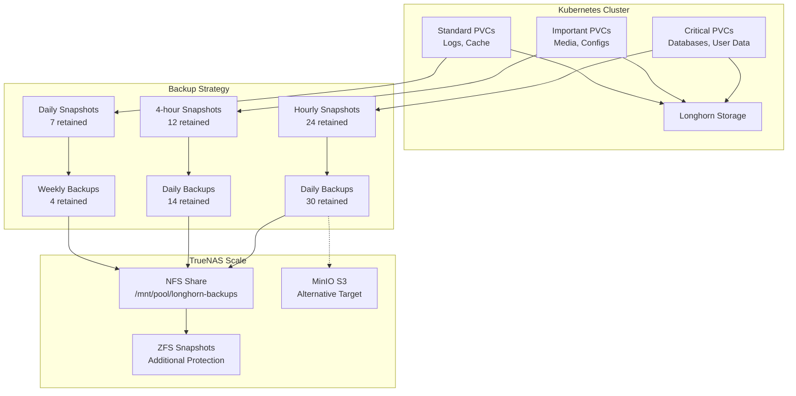

# 🗄️ Longhorn Backup & Disaster Recovery Guide

Complete guide for Longhorn backup strategies, TrueNAS Scale integration, and disaster recovery procedures.

## 📋 Table of Contents

- [Overview](#overview)
- [TrueNAS Scale Setup](#truenas-scale-setup)
- [Backup Configuration](#backup-configuration)
- [Data Tier Strategy](#data-tier-strategy)
- [Snapshot Management](#snapshot-management)
- [Backup Operations](#backup-operations)
- [Disaster Recovery](#disaster-recovery)
- [Monitoring & Alerting](#monitoring--alerting)
- [Troubleshooting](#troubleshooting)
- [Best Practices](#best-practices)

## 📖 Overview

Our Longhorn backup strategy uses a **three-tier approach** with TrueNAS Scale as the backup target:

- **Critical Data**: Hourly snapshots + Daily backups (30-day retention)
- **Important Data**: 4-hour snapshots + Daily backups (14-day retention)  
- **Standard Data**: Daily snapshots + Weekly backups (4-week retention)

### Backup Architecture



## 🏠 TrueNAS Scale Setup

### 1. Create NFS Share for Longhorn Backups

1. **Create Dataset**:
   ```bash
   # On TrueNAS Scale
   zfs create tank/longhorn-backups
   ```

2. **Configure NFS Share**:
   - Go to **Sharing** → **Unix (NFS) Shares**
   - **Path**: `/mnt/tank/longhorn-backups`
   - **Networks**: Your Kubernetes cluster subnet (e.g., `10.0.0.0/24`)
   - **Maproot User**: `root`
   - **Maproot Group**: `wheel`

3. **Set Permissions**:
   ```bash
   chmod 755 /mnt/tank/longhorn-backups
   chown root:wheel /mnt/tank/longhorn-backups
   ```

### 2. Optional: Configure MinIO S3 (Alternative)

1. **Install MinIO App** from TrueNAS Scale Apps
2. **Configure Storage**: Point to dedicated dataset
3. **Create Bucket**: `longhorn-backups`
4. **Generate Access Keys** for Longhorn

### 3. ZFS Snapshot Schedule (Additional Protection)

```bash
# Create automatic ZFS snapshots
zfs set com.sun:auto-snapshot=true tank/longhorn-backups
zfs set com.sun:auto-snapshot:hourly=48 tank/longhorn-backups
zfs set com.sun:auto-snapshot:daily=30 tank/longhorn-backups
zfs set com.sun:auto-snapshot:weekly=8 tank/longhorn-backups
```

## ⚙️ Backup Configuration

### 1. Configure Backup Target

**Option A: NFS (Recommended)**
```bash
# Run the backup management script
./scripts/longhorn-backup-management.sh

# Or manually configure
kubectl patch setting backup-target -n longhorn-system --type='merge' \
  -p='{"spec":{"value":"nfs://TRUENAS_IP:/mnt/tank/longhorn-backups"}}'
```

**Option B: S3 (MinIO)**
```bash
# Create credentials secret
kubectl create secret generic longhorn-backup-credentials \
  --from-literal=AWS_ACCESS_KEY_ID="your-access-key" \
  --from-literal=AWS_SECRET_ACCESS_KEY="your-secret-key" \
  --from-literal=AWS_ENDPOINTS="https://truenas-ip:9000" \
  -n longhorn-system

# Configure S3 target
kubectl patch setting backup-target -n longhorn-system --type='merge' \
  -p='{"spec":{"value":"s3://longhorn-backups@us-east-1/"}}'
```

### 2. Apply Backup Settings

```bash
# Apply all backup configurations
kubectl apply -f infrastructure/storage/longhorn/backup-settings.yaml
kubectl apply -f infrastructure/storage/longhorn/recurring-jobs.yaml
```

### 3. Verify Configuration

```bash
# Check backup target
kubectl get setting backup-target -n longhorn-system -o yaml

# Check recurring jobs
kubectl get recurringjobs -n longhorn-system
```

## 🏷️ Data Tier Strategy

### Classification

| **Tier** | **Data Types** | **Snapshot Frequency** | **Backup Frequency** | **Retention** |
|----------|----------------|------------------------|----------------------|---------------|
| **Critical** | Databases, User uploads, Configs | Every hour | Daily | 30 days |
| **Important** | Media files, App data, Home automation | Every 4 hours | Daily | 14 days |
| **Standard** | Logs, Cache, Temp data | Daily | Weekly | 4 weeks |

### Label Volumes by Tier

```bash
# Run the script to auto-label volumes
./scripts/longhorn-backup-management.sh
# Select option 10: "Label volumes by data tier"

# Or manually label volumes
kubectl label volume pvc-abc123 -n longhorn-system data-tier=critical
kubectl label volume pvc-def456 -n longhorn-system data-tier=important
kubectl label volume pvc-ghi789 -n longhorn-system data-tier=standard
```

### Critical Data Examples

- **PostgreSQL databases** (CloudNative-PG)
- **Immich photo storage**
- **Home Assistant configurations**
- **User uploaded content**

### Important Data Examples

- **Media libraries** (Plex, Jellyfin)
- **Frigate recordings**
- **Application configurations**
- **Document storage**

### Standard Data Examples

- **Application logs**
- **Temporary processing data**
- **Cache directories**

## 📸 Snapshot Management

### Manual Snapshots

```bash
# Create manual snapshot
./scripts/longhorn-backup-management.sh
# Select option 3: "Create manual snapshot"

# Or use kubectl
kubectl apply -f - <<EOF
apiVersion: longhorn.io/v1beta2
kind: Snapshot
metadata:
  name: manual-snapshot-$(date +%Y%m%d-%H%M%S)
  namespace: longhorn-system
spec:
  volume: pvc-volume-name
  labels:
    type: manual
EOF
```

### Automatic Snapshots

Configured via recurring jobs:

- **Critical**: Every hour (24 retained)
- **Important**: Every 4 hours (12 retained)
- **Standard**: Daily (7 retained)

### Snapshot Operations

```bash
# List snapshots for a volume
kubectl get snapshots -n longhorn-system -l longhornvolume=pvc-abc123

# Delete specific snapshot
kubectl delete snapshot snapshot-name -n longhorn-system

# Restore from snapshot (creates new volume)
kubectl apply -f - <<EOF
apiVersion: longhorn.io/v1beta2
kind: Volume
metadata:
  name: restored-volume
  namespace: longhorn-system
spec:
  fromSnapshot: snapshot-name
  numberOfReplicas: 3
  size: "20Gi"
EOF
```

## 💾 Backup Operations

### Manual Backups

```bash
# Create manual backup
./scripts/longhorn-backup-management.sh
# Select option 4: "Create manual backup"

# Monitor backup progress
kubectl get backups -n longhorn-system -w
```

### Automatic Backups

Configured via recurring jobs:

- **Critical**: Daily at 2 AM (30 retained)
- **Important**: Daily at 3 AM (14 retained)
- **Standard**: Weekly on Sunday at 5 AM (4 retained)

### Backup Verification

```bash
# Check backup health
./scripts/longhorn-backup-management.sh
# Select option 9: "Check backup system health"

# List backups for volume
kubectl get backups -n longhorn-system -l longhornvolume=pvc-abc123

# Verify backup integrity
kubectl describe backup backup-name -n longhorn-system
```

## 🚨 Disaster Recovery

### Full Cluster Recovery

1. **Prepare New Cluster**:
   ```bash
   # Deploy Longhorn on new cluster
   kubectl apply -f infrastructure/storage/longhorn/
   ```

2. **Configure Backup Target**:
   ```bash
   # Point to same TrueNAS backup location
   kubectl patch setting backup-target -n longhorn-system --type='merge' \
     -p='{"spec":{"value":"nfs://TRUENAS_IP:/mnt/tank/longhorn-backups"}}'
   ```

3. **Restore Critical Volumes**:
   ```bash
   # List available backups
   kubectl get backups -n longhorn-system

   # Restore each critical volume
   ./scripts/longhorn-backup-management.sh
   # Select option 7: "Restore from backup"
   ```

4. **Recreate PVCs**:
   ```bash
   # Create PVCs pointing to restored volumes
   kubectl apply -f - <<EOF
   apiVersion: v1
   kind: PersistentVolumeClaim
   metadata:
     name: restored-pvc
     namespace: target-namespace
   spec:
     accessModes: [ReadWriteOnce]
     resources:
       requests:
         storage: 20Gi
     storageClassName: longhorn
     volumeName: restored-volume-name
   EOF
   ```

### Single Volume Recovery

```bash
# 1. Identify the backup to restore
kubectl get backups -n longhorn-system | grep volume-name

# 2. Create new volume from backup
kubectl apply -f - <<EOF
apiVersion: longhorn.io/v1beta2
kind: Volume
metadata:
  name: recovered-volume
  namespace: longhorn-system
spec:
  fromBackup: backup-name
  numberOfReplicas: 3
  size: "20Gi"
EOF

# 3. Update PVC to use new volume
kubectl patch pvc pvc-name -n namespace --type='merge' \
  -p='{"spec":{"volumeName":"recovered-volume"}}'
```

### Emergency Procedures

**Complete Data Loss Scenario**:

1. **Stop all applications** using affected storage
2. **Restore from most recent backups**
3. **Verify data integrity** before resuming operations
4. **Update applications** to use restored volumes

**Partial Data Loss**:

1. **Create snapshot** of current state (if possible)
2. **Restore specific files** from backup
3. **Merge data** if necessary
4. **Verify consistency**

## 📊 Monitoring & Alerting

### Backup Health Monitoring

```bash
# Check backup system status
kubectl get settings -n longhorn-system | grep backup

# Monitor recent backup jobs
kubectl get backups -n longhorn-system --sort-by=.metadata.creationTimestamp

# Check recurring job status
kubectl get recurringjobs -n longhorn-system
```

### Prometheus Metrics

Key metrics to monitor:

- `longhorn_backup_state` - Backup job states
- `longhorn_snapshot_actual_size_bytes` - Snapshot sizes
- `longhorn_volume_actual_size_bytes` - Volume utilization
- `longhorn_backup_progress` - Backup progress

### Alert Rules

```yaml
# Example Prometheus alert rules
groups:
  - name: longhorn-backup
    rules:
      - alert: LonghornBackupFailed
        expr: longhorn_backup_state{state="error"} > 0
        for: 5m
        labels:
          severity: critical
        annotations:
          summary: "Longhorn backup failed"
          description: "Backup {{ $labels.backup }} failed"

      - alert: LonghornNoRecentBackup
        expr: time() - longhorn_backup_creation_timestamp > 86400 * 2
        for: 15m
        labels:
          severity: warning
        annotations:
          summary: "No recent Longhorn backup"
          description: "No backup created in last 2 days for volume {{ $labels.volume }}"
```

## 🔧 Troubleshooting

### Common Issues

**Backup Target Unreachable**:
```bash
# Test NFS connectivity
mount -t nfs TRUENAS_IP:/mnt/tank/longhorn-backups /tmp/test

# Check Longhorn manager logs
kubectl logs -n longhorn-system -l app=longhorn-manager
```

**Backup Jobs Failing**:
```bash
# Check backup job logs
kubectl describe backup backup-name -n longhorn-system

# Verify backup target settings
kubectl get setting backup-target -n longhorn-system -o yaml
```

**Snapshot Creation Issues**:
```bash
# Check volume health
kubectl get volumes -n longhorn-system

# Verify node connectivity
kubectl get nodes
kubectl describe node node-name
```

**Restore Failures**:
```bash
# Check volume creation logs
kubectl describe volume restored-volume -n longhorn-system

# Verify backup integrity
kubectl get backup backup-name -n longhorn-system -o yaml
```

### Performance Issues

**Slow Backups**:
- Increase `concurrent-backup-create-per-node` setting
- Use compression (`backup-compression-method: gzip`)
- Check network bandwidth to TrueNAS

**High Snapshot Overhead**:
- Reduce snapshot frequency for non-critical data
- Enable snapshot cleanup during filesystem trim
- Monitor snapshot chain length

## 📚 Best Practices

### Backup Strategy

1. **Test Restores Regularly**:
   ```bash
   # Monthly restore test
   ./scripts/longhorn-backup-management.sh
   # Create test restore and verify data integrity
   ```

2. **Monitor Backup Size Growth**:
   ```bash
   # Track backup storage usage
   kubectl get backups -n longhorn-system -o custom-columns="NAME:.metadata.name,SIZE:.status.size"
   ```

3. **Automate Backup Verification**:
   ```bash
   # Create verification job
   kubectl create job backup-verify --image=busybox -- sh -c "echo 'Backup verification job'"
   ```

### Storage Management

1. **Use Appropriate Replica Counts**:
   - Critical: 3 replicas
   - Important: 2 replicas  
   - Standard: 2 replicas

2. **Monitor Volume Health**:
   ```bash
   kubectl get volumes -n longhorn-system -o custom-columns="NAME:.metadata.name,STATE:.status.state,ROBUSTNESS:.status.robustness"
   ```

3. **Regular Maintenance**:
   - Update Longhorn regularly
   - Monitor node storage capacity
   - Clean up unused volumes

### Disaster Recovery

1. **Document Recovery Procedures**
2. **Test Full DR Scenarios Quarterly**
3. **Maintain Off-site Backup Copies**
4. **Keep Recovery Time Objectives (RTO) < 4 hours**
5. **Maintain Recovery Point Objectives (RPO) < 1 hour for critical data**

### Security

1. **Encrypt Backup Traffic** (NFS with Kerberos or S3 with TLS)
2. **Secure Backup Storage** (TrueNAS access controls)
3. **Regular Security Updates** (TrueNAS and Longhorn)
4. **Backup Credentials Management** (Kubernetes secrets)

---

## 🚀 Quick Start Commands

```bash
# 1. Run backup management script
chmod +x scripts/longhorn-backup-management.sh
./scripts/longhorn-backup-management.sh

# 2. Configure TrueNAS backup target (option 1)
# 3. Label volumes by data tier (option 10)
# 4. Check backup health (option 9)
# 5. Create manual backup for critical volume (option 4)
```

This comprehensive backup strategy ensures your data is protected with multiple layers of redundancy and automated recovery procedures. 🛡️ 