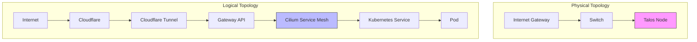
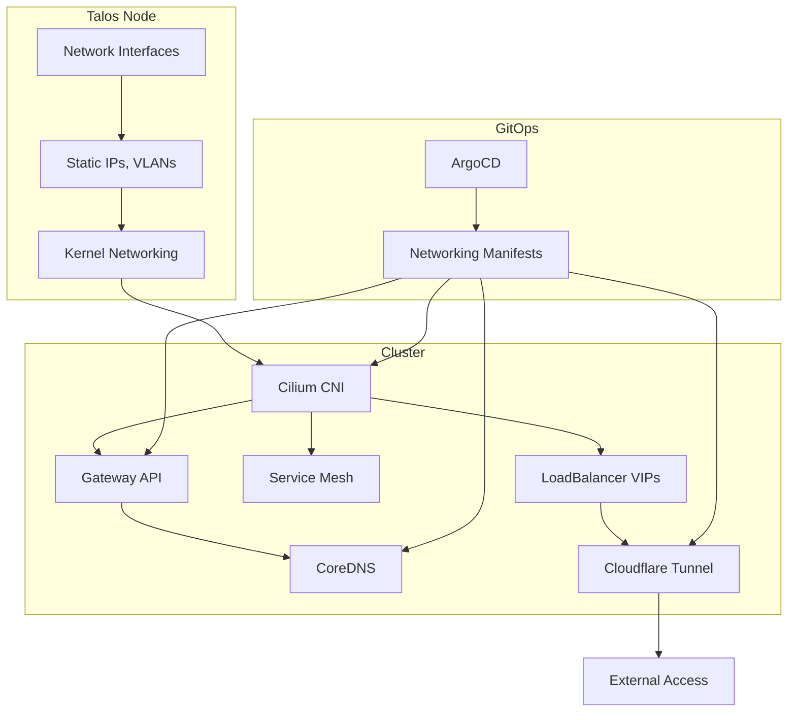
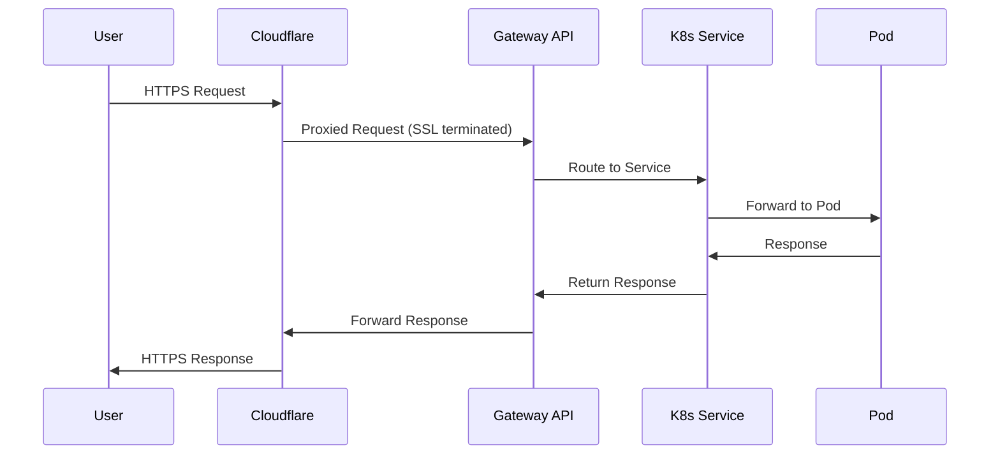
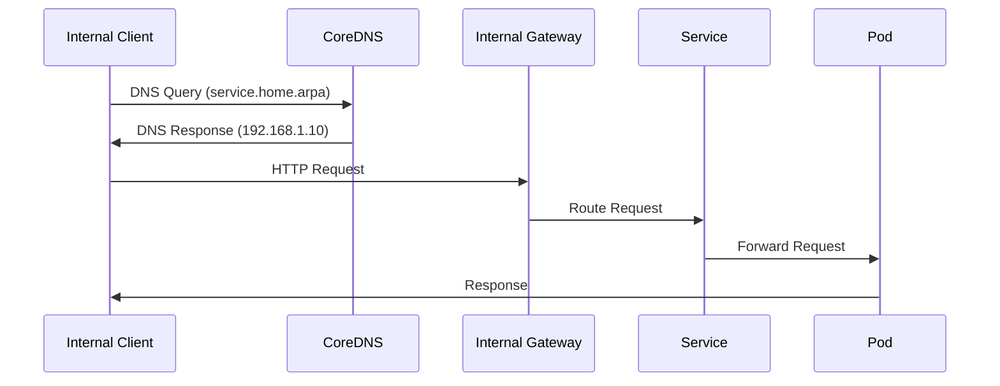
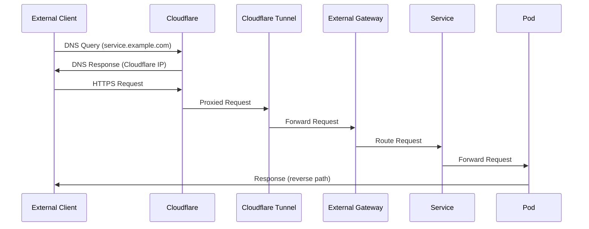

# 🌐 Network Configuration

## Overview



## Declarative Networking with ArgoCD & Talos

- **All networking resources (Cilium, Gateway API, CoreDNS, Cloudflare Tunnel) are managed declaratively via ArgoCD.**
- **No manual creation or editing of network resources on the cluster.**
- **Talos network configuration (interfaces, routes, etc.) is set in `talconfig.yaml` and applied via Talosctl.**
- **Cilium, Gateway API, and CoreDNS are deployed and managed as part of the infrastructure ApplicationSet.**

## Directory Structure

```plaintext
infrastructure/networking/
├── cilium/           # Cilium Helm values, L2/LB policies, VIPs
├── coredns/          # CoreDNS custom configs
├── gateway/          # Gateway API resources (Gateways, HTTPRoutes)
├── cloudflared/      # Cloudflare Tunnel manifests and secrets
└── kustomization.yaml
```

## Network Architecture



## Talos Network Configuration

- **All node-level network config is set in `talconfig.yaml` and applied via Talosctl.**
- **No SSH or manual network changes on Talos nodes.**
- **Example:**
  ```yaml
  # In talconfig.yaml
  nodes:
    - hostname: node-01
      networkInterfaces:
        - deviceSelector:
            hardwareAddr: "xx:xx:xx:xx:xx:xx"
          dhcp: false
          addresses:
            - 192.168.10.100/24
          routes:
            - network: 0.0.0.0/0
              gateway: 192.168.10.1
  ```

## Cilium & Gateway API

- **Cilium** is the CNI, service mesh, and Gateway API provider.
- **Gateway API** is used for ingress and L4/L7 routing, managed by Cilium.
- **All Cilium and Gateway API resources are managed via ArgoCD.**
- **VIPs, L2/LB policies, and IP pools are defined in manifests and synced by ArgoCD.**

## CoreDNS

- **CoreDNS is managed via manifests in `infrastructure/networking/coredns/`.**
- **Custom configs for split DNS, internal domains, etc. are applied declaratively.**

## Cloudflare Tunnel

- **Cloudflare Tunnel is deployed as a Deployment/DaemonSet and managed via ArgoCD.**
- **Tunnel credentials are stored as Kubernetes secrets, managed via External Secrets Operator.**

## Validation

```bash
# Check Cilium status
cilium status
# Check Gateway API resources
kubectl get gateway -A
kubectl get httproute -A
# Check CoreDNS pods
kubectl get pods -n kube-system -l k8s-app=kube-dns
# Check Cloudflare Tunnel pods
kubectl get pods -n cloudflared
```

## Troubleshooting

| Issue Type | Troubleshooting Steps |
|------------|----------------------|
| **Cilium Issues** | • Check Cilium pod status<br>• Review Cilium logs<br>• Validate Helm values and policies in Git |
| **Gateway API Issues** | • Check Gateway/HTTPRoute status<br>• Validate manifests in Git<br>• Review Cilium logs |
| **CoreDNS Issues** | • Check CoreDNS pod status<br>• Validate custom config in Git<br>• Test DNS resolution |
| **Cloudflare Tunnel Issues** | • Check tunnel pod status<br>• Validate secret and deployment manifests<br>• Test external access |
| **Drift** | • Ensure all changes are made in Git, not manually |

## Best Practices

1. **All networking resources are managed in Git** (ArgoCD syncs them to the cluster)
2. **Talos network config is set in `talconfig.yaml`, not via kubectl or SSH**
3. **No manual changes to Cilium, Gateway API, CoreDNS, or Cloudflare Tunnel**
4. **Regularly validate ArgoCD sync status for networking manifests**
5. **Monitor Cilium, Gateway API, and DNS metrics in Prometheus/Grafana**
6. **Document all customizations and keep manifests up to date**

## Traffic Flow



## IP Allocation

- **Internal Network**: 192.168.1.0/24
  - Gateway: 192.168.1.1
  - K3s Node: 192.168.1.10

- **Pod Network**: 10.42.0.0/16 (Cilium)
  - Services: 10.43.0.0/16
  - CoreDNS: 10.43.0.10

## Gateway API Configuration

### External Gateway
```yaml
apiVersion: gateway.networking.k8s.io/v1beta1
kind: Gateway
metadata:
  name: external-gateway
  namespace: gateway-system
spec:
  gatewayClassName: cilium
  listeners:
  - name: http
    port: 80
    protocol: HTTP
    allowedRoutes:
      namespaces:
        from: All
  - name: https
    port: 443
    protocol: HTTPS
    allowedRoutes:
      namespaces:
        from: All
    tls:
      mode: Terminate
      certificateRefs:
      - name: wildcard-cert
```

### Internal Gateway
```yaml
apiVersion: gateway.networking.k8s.io/v1beta1
kind: Gateway
metadata:
  name: internal-gateway
  namespace: gateway-system
spec:
  gatewayClassName: cilium
  listeners:
  - name: http
    port: 80
    protocol: HTTP
    allowedRoutes:
      namespaces:
        from: All
```

## Components

### Cilium
- **Function**: CNI plugin, Service Mesh, Gateway API implementation
- **Installation**: Deployed via Helm in the infrastructure tier
- **Configuration**: Managed through Helm values

### CoreDNS
- **Function**: DNS management for cluster
- **Installation**: Bundled with K3s
- **Configuration**: Custom configmap for internal domains

### Gateway API
- **Function**: Ingress/Gateway management
- **Installation**: CRDs installed separately, implementation by Cilium
- **Configuration**: Gateway and HTTPRoute resources

### Cloudflare Tunnel
- **Function**: Secure external access
- **Installation**: Deployed as a Kubernetes deployment
- **Configuration**: Using tunnel credentials from secrets

## DNS Configuration

### Internal Domains
```yaml
apiVersion: v1
kind: ConfigMap
metadata:
  name: coredns-custom
  namespace: kube-system
data:
  server.conf: |
    home.arpa:53 {
        errors
        cache 30
        forward . 192.168.1.1
    }
```

## Network Flow

### Internal Access


### External Access


## Declarative Setup
All components described in this document (Cilium, CoreDNS, Gateways, Cloudflare Tunnel) are deployed declaratively as part of the `infrastructure` ApplicationSet. There are no manual `helm` or `kubectl` commands required to deploy them. Their manifests are located in `infrastructure/networking/` and are automatically synced by Argo CD.

## Validation

### Cilium Status
```bash
# Check Cilium status
cilium status

# Verify connectivity
cilium connectivity test
```

### DNS Resolution
```bash
# Test internal DNS
kubectl run -it --rm debug --image=curlimages/curl -- nslookup kubernetes.default.svc.cluster.local

# Test external DNS
kubectl run -it --rm debug --image=curlimages/curl -- nslookup example.com
```

### Gateway Routing
```bash
# Check gateway status
kubectl get gateway -A

# Test routes
kubectl get httproute -A
```

### Cloudflare Tunnel
```bash
# Check tunnel pods
kubectl get pods -n cloudflared

# Check tunnel logs
kubectl logs -n cloudflared -l app=cloudflared
```

## Troubleshooting

### DNS Issues
1. Check CoreDNS pods:
   ```bash
   kubectl get pods -n kube-system -l k8s-app=kube-dns
   kubectl logs -n kube-system -l k8s-app=kube-dns
   ```

2. Verify custom config:
   ```bash
   kubectl get configmap -n kube-system coredns-custom -o yaml
   ```

### Gateway Issues
1. Check gateway status:
   ```bash
   kubectl describe gateway -n gateway-system external-gateway
   ```

2. Verify routes:
   ```bash
   kubectl describe httproute -A
   ```

### Cloudflare Issues
1. Check tunnel status:
   ```bash
   kubectl get pods -n cloudflared
   kubectl logs -n cloudflared -l app=cloudflared
   ```

2. Verify tunnel connectivity:
   ```bash
   # Port-forward to cloudflared metrics
   kubectl port-forward -n cloudflared svc/cloudflared 8080:2000
   # Access metrics at http://localhost:8080/metrics
   ``` 