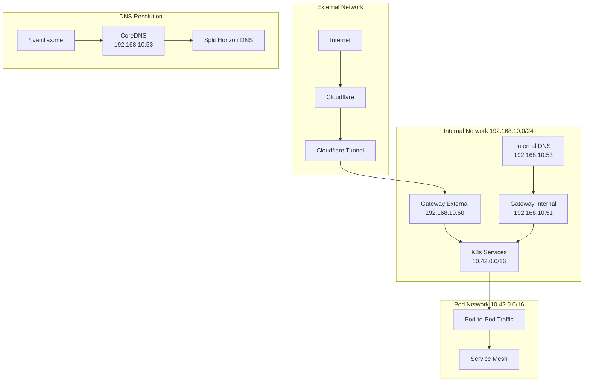

# Network Configuration

## Network Architecture



## IP Allocation

### Network Ranges
- **Internal Network**: 192.168.10.0/24
  - Gateway External: 192.168.10.50
  - Gateway Internal: 192.168.10.51
  - CoreDNS: 192.168.10.53
- **Pod Network**: 10.42.0.0/16
- **Service Network**: 10.43.0.0/16

## Gateway API Configuration

### 1. External Gateway
```yaml
apiVersion: gateway.networking.k8s.io/v1beta1
kind: Gateway
metadata:
  name: external-gateway
  namespace: gateway
spec:
  gatewayClassName: cilium
  listeners:
  - name: http
    port: 80
    protocol: HTTP
    allowedRoutes:
      namespaces:
        from: All
  - name: https
    port: 443
    protocol: HTTPS
    allowedRoutes:
      namespaces:
        from: All
    tls:
      mode: Terminate
      certificateRefs:
      - name: cloudflare-cert
```

### 2. Internal Gateway
```yaml
apiVersion: gateway.networking.k8s.io/v1beta1
kind: Gateway
metadata:
  name: internal-gateway
  namespace: gateway
spec:
  gatewayClassName: cilium
  listeners:
  - name: http
    port: 80
    protocol: HTTP
    allowedRoutes:
      namespaces:
        from: All
```

### 3. HTTPRoute Example
```yaml
apiVersion: gateway.networking.k8s.io/v1beta1
kind: HTTPRoute
metadata:
  name: app-route
spec:
  parentRefs:
  - name: external-gateway
    namespace: gateway
  - name: internal-gateway
    namespace: gateway
  rules:
  - matches:
    - path:
        type: PathPrefix
        value: /app
    backendRefs:
    - name: app-service
      port: 80
```

## Components

### 1. Cilium
- Network plugin replacement for kube-proxy
- Handles pod networking and network policies
- Provides load balancing and service mesh capabilities

### 2. CoreDNS
- Manages internal DNS resolution
- Handles custom domain routing
- Splits traffic between internal and external gateways

### 3. Gateway API
- Two gateway configurations:
  - External (Cloudflare tunnel access)
  - Internal (Local network access)
- HTTPRoute resources for service routing

### 4. Cloudflare Tunnel
- Secure external access
- No port forwarding required
- Automatic SSL/TLS

## DNS Configuration

### Internal Domains
```yaml
vanillax.me:53 {
    hosts {
        192.168.10.50 *.vanillax.me
        192.168.10.50 vanillax.me
        fallthrough
    }
    forward . /etc/resolv.conf
}
```

### External Domains
- Managed through Cloudflare DNS
- Points to Cloudflare Tunnel

## Network Flow

1. **Internal Access**
   ```mermaid
   sequenceDiagram
       Client->>CoreDNS: Query *.vanillax.me
       CoreDNS->>Client: Return 192.168.10.50
       Client->>Gateway: Request service
       Gateway->>Service: Forward request
   ```

2. **External Access**
   ```mermaid
   sequenceDiagram
       Client->>Cloudflare: Query *.vanillax.me
       Cloudflare->>Tunnel: Forward request
       Tunnel->>Gateway: Route to service
       Gateway->>Service: Forward request
   ```

## Setup Steps

1. **Install Cilium**
```bash
cilium install \
  --version 1.16.5 \
  --set kubeProxyReplacement=true
```

2. **Configure CoreDNS**
- Deployed through ArgoCD
- Custom configuration for internal domains

3. **Setup Gateways**
- Deploy Gateway API CRDs
- Configure internal and external gateways
- Create HTTPRoutes for services

4. **Configure Cloudflare**
- Setup DNS records
- Configure Cloudflare Tunnel
- Deploy tunnel operator

## Validation

```bash
# Check Cilium status
cilium status
cilium connectivity test

# Verify DNS resolution
dig @192.168.10.50 service.vanillax.me

# Test gateway routing
curl -v https://service.vanillax.me

# Check Cloudflare tunnel
cloudflared tunnel info
```

## Troubleshooting

### DNS Issues
1. Check CoreDNS pods:
```bash
kubectl get pods -n kube-system -l k8s-app=coredns
kubectl logs -n kube-system -l k8s-app=coredns
```

2. Verify DNS resolution:
```bash
kubectl run -it --rm debug --image=busybox -- nslookup kubernetes.default
```

### Gateway Issues
1. Check gateway status:
```bash
kubectl get gateway -A
kubectl get httproute -A
```

2. Verify gateway pods:
```bash
kubectl get pods -n gateway
```

### Cloudflare Issues
1. Check tunnel status:
```bash
kubectl get pods -n cloudflared
kubectl logs -n cloudflared -l app=cloudflared
```

2. Verify tunnel connectivity:
```bash
cloudflared tunnel list
cloudflared tunnel info <tunnel-id>
``` 