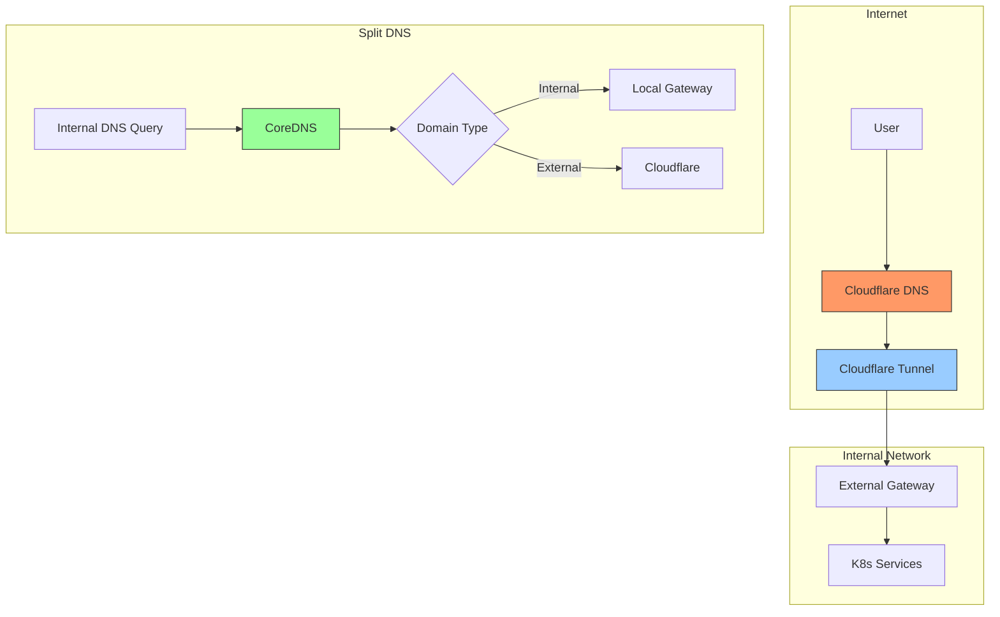
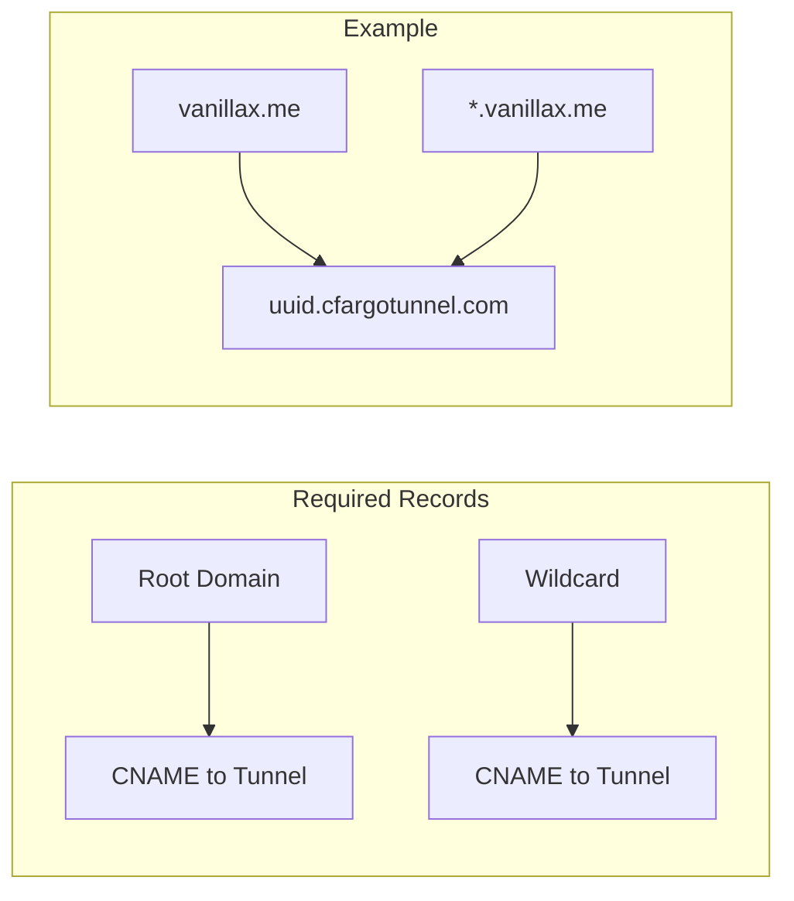
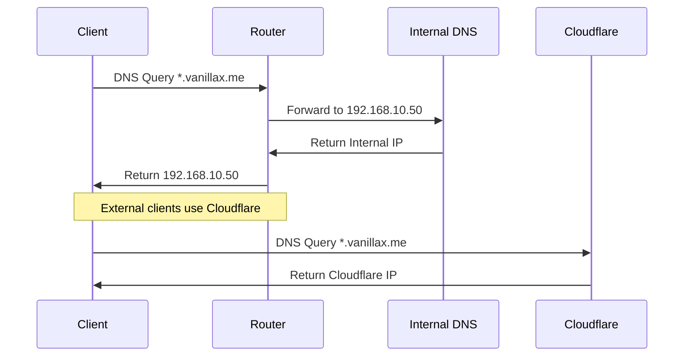
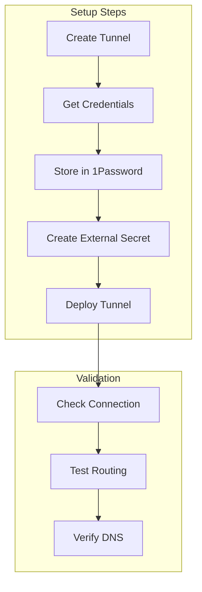
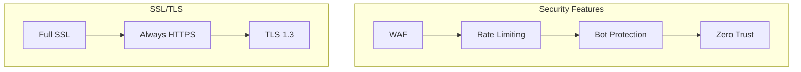
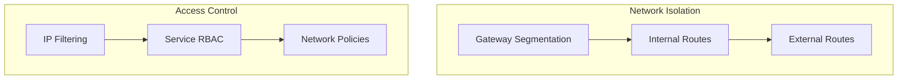
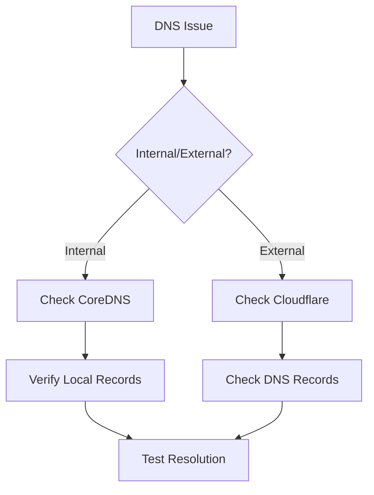

# Network Security

## Cloudflare Configuration

### Architecture Overview


## DNS Configuration

### Cloudflare DNS Records


### Router DNS Settings


## Cloudflare Tunnel Setup

### Configuration Flow


### Required DNS Configuration

1. **Cloudflare Records**
```yaml
# Root domain
vanillax.me IN CNAME {uuid}.cfargotunnel.com
# Wildcard
*.vanillax.me IN CNAME {uuid}.cfargotunnel.com
```

2. **Router Configuration**
```plaintext
Domain: vanillax.me
DNS Server: 192.168.10.50 (CoreDNS)
Search Domain: vanillax.me
```

## Security Measures

### 1. Cloudflare Security


### 2. Internal Security


## Tunnel Management

### 1. Deployment
```yaml
apiVersion: v1
kind: Secret
metadata:
  name: tunnel-credentials
  namespace: cloudflared
stringData:
  credentials.json: |
    {
      "AccountTag": "your-account",
      "TunnelSecret": "your-secret",
      "TunnelID": "your-tunnel-id"
    }
```

### 2. Monitoring
```bash
# Check tunnel status
cloudflared tunnel info <tunnel-id>

# View active connections
cloudflared tunnel route list

# Check logs
kubectl logs -n cloudflared -l app=cloudflared
```

## Troubleshooting

### DNS Resolution


### Common Issues

1. **Split DNS Problems**
   - Verify router DNS settings
   - Check CoreDNS configuration
   - Test internal resolution

2. **Tunnel Connectivity**
   - Check tunnel status
   - Verify credentials
   - Review connection logs

3. **SSL/TLS Issues**
   - Verify Cloudflare SSL mode
   - Check certificate validity
   - Review origin server settings 