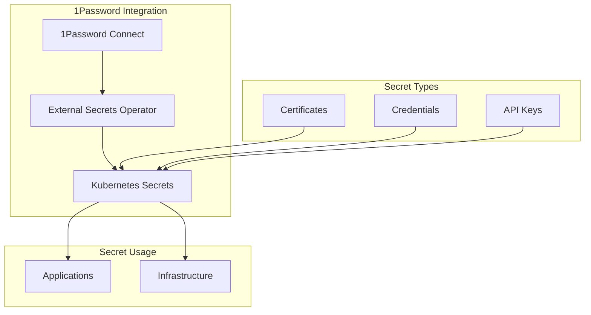

# Secrets Management

## Overview



## Components

### 1. 1Password Connect
- Secure connection to 1Password vault
- Token-based authentication
- Automatic secret rotation

### 2. External Secrets Operator
- Syncs secrets from 1Password to Kubernetes
- Handles secret versioning
- Manages secret lifecycle

## Setup Steps

1. **Deploy 1Password Connect**
```yaml
apiVersion: v1
kind: Secret
metadata:
  name: 1password-credentials
  namespace: external-secrets
type: Opaque
stringData:
  credentials.json: |
    {
      "verifier": "YOUR_VERIFIER",
      "connector": "YOUR_CONNECTOR"
    }
```

2. **Configure External Secrets Operator**
```yaml
apiVersion: external-secrets.io/v1
kind: ClusterSecretStore
metadata:
  name: 1password
spec:
  provider:
    onepassword:
      connectHost: http://1password-connect:8080
      vaults:
        infrastructure: 1
      auth:
        secretRef:
          connectTokenSecretRef:
            name: 1password-token
            key: token
            namespace: external-secrets
```

## Secret Management

### 1. Creating External Secrets
```yaml
apiVersion: external-secrets.io/v1
kind: ExternalSecret
metadata:
  name: app-secrets
spec:
  refreshInterval: 1h
  secretStoreRef:
    kind: ClusterSecretStore
    name: 1password
  target:
    name: app-secrets
    creationPolicy: Owner
  data:
    - secretKey: API_KEY
      remoteRef:
        key: api-key
        property: value
```

### 2. Using Secrets in Applications
```yaml
apiVersion: apps/v1
kind: Deployment
metadata:
  name: app
spec:
  template:
    spec:
      containers:
        - name: app
          env:
            - name: API_KEY
              valueFrom:
                secretKeyRef:
                  name: app-secrets
                  key: API_KEY
```

## Secret Categories

1. **Infrastructure Secrets**
   - Cloudflare API tokens
   - Database credentials
   - Storage access keys

2. **Application Secrets**
   - API keys
   - Service credentials
   - OAuth tokens

3. **TLS Certificates**
   - Internal certificates
   - External certificates
   - Cloudflare Origin certificates

## Best Practices

1. **Secret Rotation**
   - Enable automatic rotation where possible
   - Set appropriate refresh intervals
   - Monitor secret expiration

2. **Access Control**
   - Use namespace-specific secrets
   - Implement RBAC for secret access
   - Audit secret access regularly

3. **Secret Organization**
   - Use consistent naming conventions
   - Group related secrets
   - Document secret purpose and usage

## Troubleshooting

### Common Issues

1. **Secret Sync Issues**
```bash
# Check External Secrets status
kubectl get externalsecret -A
kubectl describe externalsecret <name>

# Check 1Password Connect
kubectl logs -n external-secrets -l app=1password-connect
```

2. **Secret Access Issues**
```bash
# Verify secret existence
kubectl get secret <name> -n <namespace>

# Check secret permissions
kubectl auth can-i get secret <name> -n <namespace>
```

3. **1Password Connection Issues**
```bash
# Test 1Password Connect
kubectl port-forward -n external-secrets svc/1password-connect 8080:8080
curl -v http://localhost:8080/health

# Check credentials
kubectl get secret 1password-credentials -n external-secrets
```

## Security Considerations

1. **Secret Storage**
   - Use encrypted storage
   - Enable etcd encryption
   - Regular backup of secrets

2. **Network Security**
   - Restrict 1Password Connect access
   - Use internal network for secret sync
   - Enable TLS for all connections

3. **Monitoring**
   - Alert on sync failures
   - Monitor secret usage
   - Track secret changes 