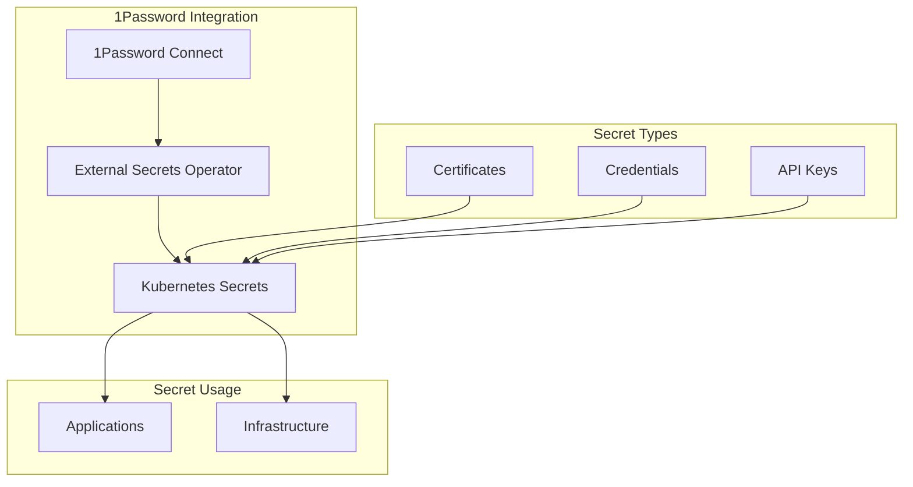
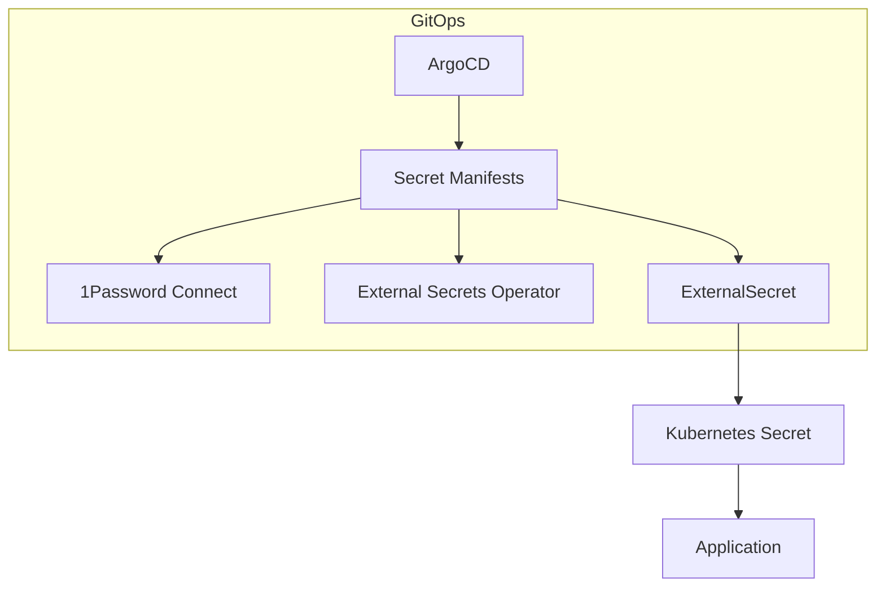
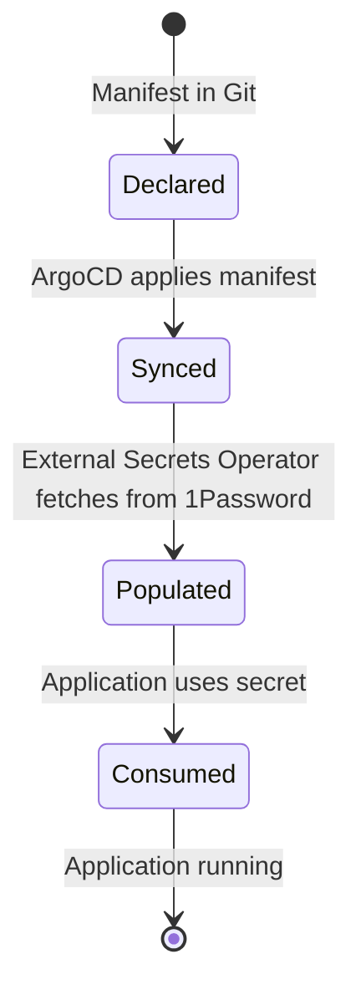

# Secrets Management

## Overview



## Declarative Secrets with ArgoCD & Talos

- **All secret management resources (1Password Connect, External Secrets Operator, ExternalSecret manifests) are managed declaratively via ArgoCD.**
- **No manual creation or editing of secrets or secret stores on the cluster.**
- **Talos nodes do not store or manage secrets directly; all secret references are in manifests.**
- **1Password Connect and External Secrets Operator are deployed and managed as part of the infrastructure ApplicationSet.**

## Directory Structure

```plaintext
infrastructure/controllers/
├── 1password-connect/         # 1Password Connect manifests
├── external-secrets/          # External Secrets Operator manifests
└── kustomization.yaml
```

## Secrets Architecture



## 1Password Connect

- **Deployed as a Deployment and Service, managed via ArgoCD.**
- **Credentials and tokens are stored as Kubernetes secrets, managed via External Secrets Operator.**
- **No manual secret creation; all secrets are defined in manifests and synced by ArgoCD.**

## External Secrets Operator

- **Deployed as a Deployment, managed via ArgoCD.**
- **ClusterSecretStore and ExternalSecret resources are defined in manifests.**
- **All secret sync and refresh intervals are managed declaratively.**

## Secret Lifecycle (GitOps)



## Example: ExternalSecret Manifest

```yaml
apiVersion: external-secrets.io/v1
kind: ExternalSecret
metadata:
  name: app-secrets
spec:
  refreshInterval: 1h
  secretStoreRef:
    kind: ClusterSecretStore
    name: 1password
  target:
    name: app-secrets
    creationPolicy: Owner
  data:
    - secretKey: API_KEY
      remoteRef:
        key: api-key
        property: value
```

## Validation

```bash
# Check 1Password Connect pods
kubectl get pods -n 1passwordconnect
# Check External Secrets Operator pods
kubectl get pods -n external-secrets
# Check ExternalSecret status
kubectl get externalsecret -A
# Check synced secrets
kubectl get secret -A
```

## Troubleshooting

| Issue Type | Troubleshooting Steps |
|------------|----------------------|
| **Secret Sync Issues** | • Check External Secrets status<br>• Check 1Password Connect pod logs<br>• Validate manifests in Git |
| **Secret Access Issues** | • Verify secret existence<br>• Check secret permissions<br>• Validate ExternalSecret and ClusterSecretStore manifests |
| **1Password Connection Issues** | • Check 1Password Connect pod logs<br>• Validate credentials secret<br>• Test 1Password Connect health endpoint |
| **Drift** | • Ensure all changes are made in Git, not manually |

## Best Practices

1. **All secret resources are managed in Git** (ArgoCD syncs them to the cluster)
2. **No manual creation or editing of secrets or secret stores**
3. **Talos nodes do not store secrets directly; all secret references are in manifests**
4. **Regularly validate ArgoCD sync status for secret manifests**
5. **Monitor External Secrets Operator and 1Password Connect in Prometheus/Grafana**
6. **Rotate secrets regularly and document all secret usage**

## Secret Management

### 1. Creating External Secrets
```yaml
apiVersion: external-secrets.io/v1
kind: ExternalSecret
metadata:
  name: app-secrets
spec:
  refreshInterval: 1h
  secretStoreRef:
    kind: ClusterSecretStore
    name: 1password
  target:
    name: app-secrets
    creationPolicy: Owner
  data:
    - secretKey: API_KEY
      remoteRef:
        key: api-key
        property: value
```

### 2. Using Secrets in Applications
```yaml
apiVersion: apps/v1
kind: Deployment
metadata:
  name: app
spec:
  template:
    spec:
      containers:
        - name: app
          env:
            - name: API_KEY
              valueFrom:
                secretKeyRef:
                  name: app-secrets
                  key: API_KEY
```

## Secret Categories

1. **Infrastructure Secrets**
   - Cloudflare API tokens
   - Database credentials
   - Storage access keys

2. **Application Secrets**
   - API keys
   - Service credentials
   - OAuth tokens

3. **TLS Certificates**
   - Internal certificates
   - External certificates
   - Cloudflare Origin certificates

## Security Considerations

1. **Secret Storage**
   - Use encrypted storage
   - Enable etcd encryption
   - Regular backup of secrets

2. **Network Security**
   - Restrict 1Password Connect access
   - Use internal network for secret sync
   - Enable TLS for all connections

3. **Monitoring**
   - Alert on sync failures
   - Monitor secret usage
   - Track secret changes 