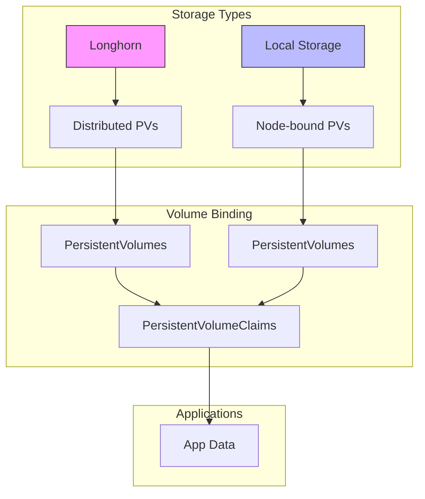
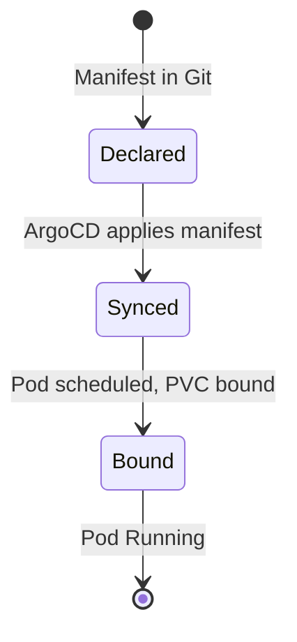

# Storage Configuration

## Overview



## Declarative Storage with ArgoCD & Talos

- **All storage resources (Longhorn, StorageClasses, PVs, PVCs) are managed declaratively via ArgoCD.**
- **No manual creation of PVs/PVCs or StorageClasses on nodes.**
- **Talos nodes are labeled for storage affinity in the Talos config (`talconfig.yaml`).**
- **Longhorn is deployed and managed as part of the infrastructure ApplicationSet.**

## Directory Structure

```plaintext
infrastructure/storage/
├── longhorn/                # Longhorn manifests, patches, and configs
├── storageclasses/          # StorageClass definitions (Longhorn, local, etc.)
├── pvs/                     # (Optional) Static PVs for local storage
└── kustomization.yaml       # Kustomize entrypoint for storage
```

## Storage Architecture

```mermaid
graph TD
    subgraph "Talos Node"
        A[Longhorn System Extension] --> B[/var/lib/longhorn]
        B --> C[Longhorn Engine]
    end
    subgraph "Cluster"
        C --> D[Longhorn Manager]
        D --> E[StorageClass: longhorn]
        E --> F[Dynamic PVs]
        F --> G[PVCs]
    end
    G --> H[Applications]
    subgraph "GitOps"
        I[ArgoCD] --> J[Storage Manifests]
        J --> E
    end
```

## Node Affinity and PVC Binding

- **Node labels for storage affinity are set in Talos config (`talconfig.yaml`).**
- **Example:**
  ```yaml
  # In talconfig.yaml
  nodes:
    - hostname: storage-node-01
      nodeLabels:
        storage: "true"
  ```
- **StorageClasses** use `WaitForFirstConsumer` and node affinity to ensure correct scheduling.

## Storage Classes

### Longhorn
```yaml
apiVersion: storage.k8s.io/v1
kind: StorageClass
metadata:
  name: longhorn
provisioner: driver.longhorn.io
reclaimPolicy: Delete
volumeBindingMode: WaitForFirstConsumer
allowVolumeExpansion: true
```

### Local Storage
```yaml
apiVersion: storage.k8s.io/v1
kind: StorageClass
metadata:
  name: local-storage
provisioner: kubernetes.io/no-provisioner
volumeBindingMode: WaitForFirstConsumer
```

## Volume Lifecycle (GitOps)



## Storage Management

- **All changes to storage (add/remove StorageClass, PV, PVC) are made in Git and synced by ArgoCD.**
- **No manual kubectl or dashboard changes.**
- **Talos nodes are never SSHed into for storage setup.**

### Directory Preparation (Talos)
- Talos mounts and prepares storage as defined in `talconfig.yaml` (see `extraMounts` and `disks` sections).
- Example:
  ```yaml
  # In talconfig.yaml (worker patch)
  machine:
    kubelet:
      extraMounts:
        - destination: /var/lib/longhorn
          type: bind
          source: /var/lib/longhorn
          options:
            - bind
            - rshared
            - rw
    disks:
      - device: /dev/sdb
        partitions:
          - mountpoint: /var/mnt/longhorn_sdb
  ```

## Validation

```bash
# Check Longhorn pods
kubectl get pods -n longhorn-system
# Check StorageClasses
kubectl get storageclass
# Check PV/PVC status
kubectl get pv
kubectl get pvc -A
```

## Troubleshooting

| Issue Type | Troubleshooting Steps |
|------------|----------------------|
| **Pending PVCs** | • Check PV existence<br>• Check node affinity/labels<br>• Validate StorageClass and volumeBindingMode |
| **Mount Issues** | • Check Talos node config for correct mounts<br>• Validate disk presence in Talos<br>• Check Longhorn pod logs |
| **Volume Recovery** | • Restore from backup/snapshot<br>• Update manifests in Git and re-sync |
| **Drift** | • Ensure all changes are made in Git, not manually |

## Best Practices

1. **All storage resources are managed in Git** (ArgoCD syncs them to the cluster)
2. **Node affinity is set via Talos config, not manual kubectl label**
3. **No SSH or manual intervention on Talos nodes**
4. **Regularly validate ArgoCD sync status for storage manifests**
5. **Monitor Longhorn and storage metrics in Prometheus/Grafana**
6. **Backup and test restore procedures regularly** 