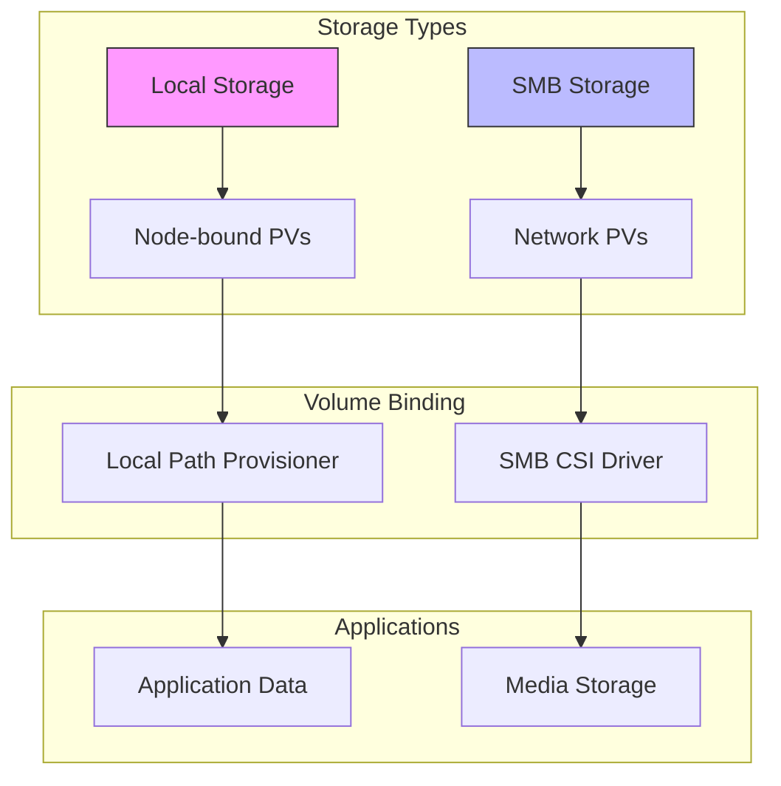
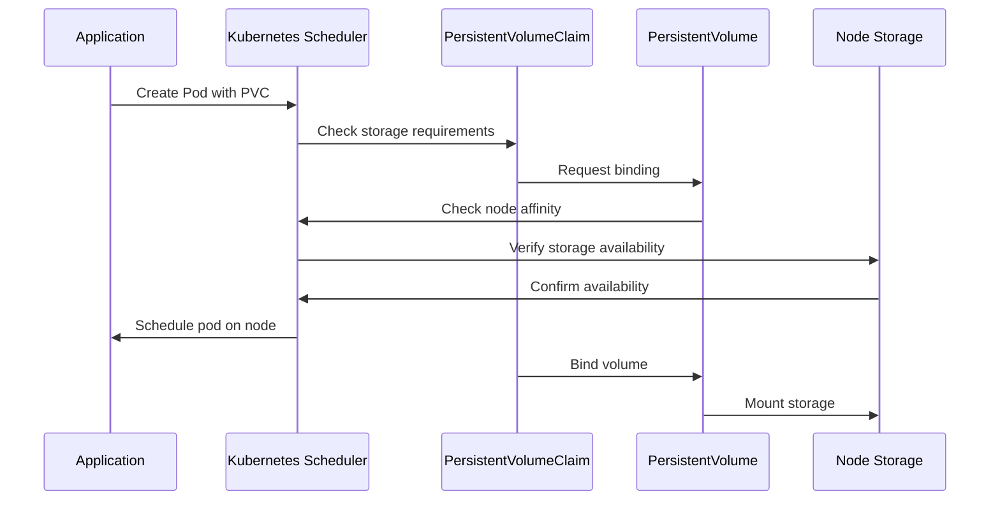
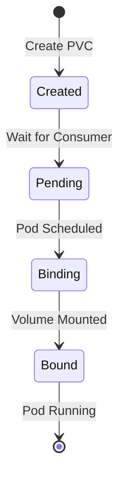
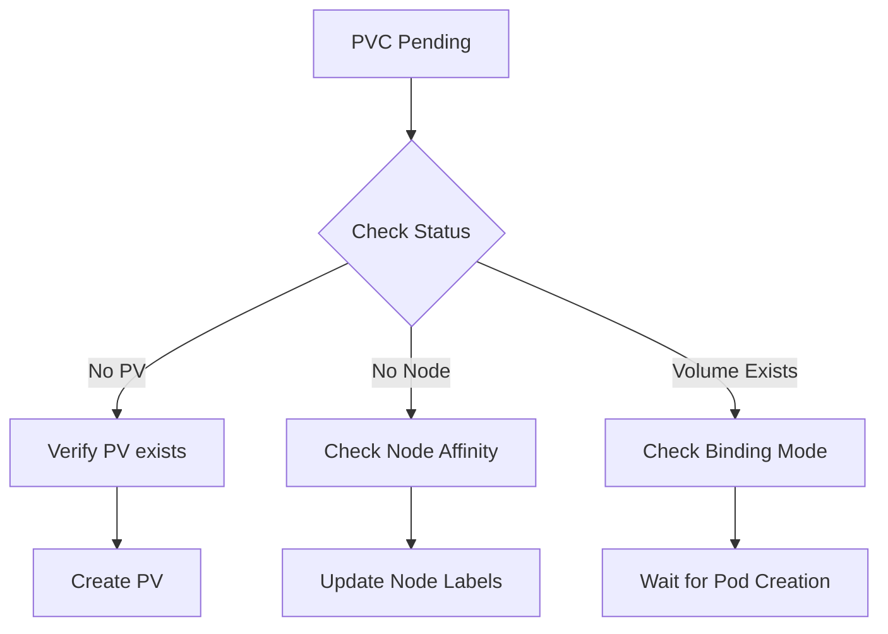

# Storage Configuration

## Overview



## Directory Structure

```plaintext
/datapool/kubernetes/
├── arr/                  # *arr apps data
├── comfyui/             # ComfyUI storage
├── config/              # Application configs
├── crowdsec/            # Security monitoring
├── frigate/             # Camera monitoring
├── homepage-dashboard/  # Dashboard data
├── jellyfin/            # Media server
├── khoj/                # Search data
├── monitoring/          # Monitoring data
├── nestmtx/            # Matrix server
├── ollama-models/      # AI models
├── ollama-webui/       # UI configurations
├── perplexica/         # AI data
├── plex/               # Media server
├── postgres/           # Database storage
├── prometheus/         # Metrics storage
├── proxitok/           # ProxiTok cache
├── reubah/             # Application data
├── searxng/            # Search engine data
└── TEMP/               # Temporary storage
```

## Storage Architecture

```mermaid
graph TD
    subgraph "Node: vanillax-ai"
        A[Local Storage] --> B[/datapool/kubernetes]
        B --> C[PersistentVolumes]
        C --> D[PersistentVolumeClaims]
    end

    subgraph "Applications"
        D --> E[AI Models]
        D --> F[Media Apps]
        D --> G[Databases]
    end

    subgraph "Volume Binding"
        H[StorageClass] --> I[WaitForFirstConsumer]
        I --> J[Node Affinity]
        J --> C
    end
```

## Node Affinity and PVC Binding



## Storage Classes

### Local Storage
```yaml
apiVersion: storage.k8s.io/v1
kind: StorageClass
metadata:
  name: local-storage
provisioner: kubernetes.io/no-provisioner
volumeBindingMode: WaitForFirstConsumer
```

### Node Affinity Configuration
```yaml
apiVersion: v1
kind: PersistentVolume
metadata:
  name: app-data-pv
spec:
  nodeAffinity:
    required:
      nodeSelectorTerms:
      - matchExpressions:
        - key: kubernetes.io/hostname
          operator: In
          values:
          - vanillax-ai
```

## Volume Lifecycle



## Storage Management

### Directory Preparation
```bash
# Create base directory
mkdir -p /datapool/kubernetes

# Create application directories
for dir in arr comfyui config frigate jellyfin monitoring ollama-models; do
    mkdir -p /datapool/kubernetes/$dir
done

# Set permissions
chown -R 1000:1000 /datapool/kubernetes/*
```

### Volume Validation
```bash
# Check PV status
kubectl get pv -o custom-columns=NAME:.metadata.name,STATUS:.status.phase,NODE:.spec.nodeAffinity.required.nodeSelectorTerms[0].matchExpressions[0].values[0]

# Verify PVC binding
kubectl get pvc -A -o custom-columns=NAMESPACE:.metadata.namespace,NAME:.metadata.name,STATUS:.status.phase,VOLUME:.spec.volumeName
```

## Troubleshooting

### Common Issues

1. **Pending PVCs**


2. **Mount Issues**
```bash
# Check mount points
kubectl describe pod <pod-name> -n <namespace>

# Verify directory permissions
ls -la /datapool/kubernetes/<app-directory>

# Check node capacity
df -h /datapool
```

### Volume Recovery
1. Backup data:
```bash
rsync -av /datapool/kubernetes/<app>/ /backup/<app>/
```

2. Recreate PV/PVC:
```bash
kubectl delete pvc <pvc-name> -n <namespace>
kubectl delete pv <pv-name>
kubectl apply -f storage/
```

## Best Practices

1. **Volume Naming**
   - Use consistent naming: `<app>-<type>-{pv|pvc}`
   - Include node affinity in PV names
   - Label volumes for easy identification

2. **Backup Strategy**
   - Regular snapshots of /datapool
   - Application-specific backup procedures
   - Test restore procedures regularly

3. **Monitoring**
   - Set up alerts for storage capacity
   - Monitor PV/PVC binding status
   - Track volume performance metrics 