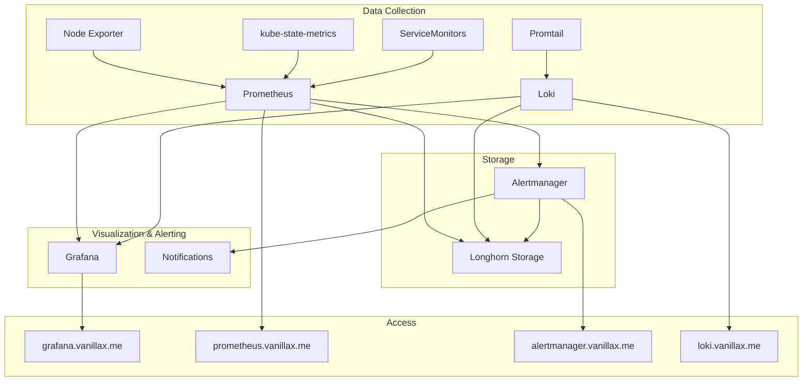

# 📊 Comprehensive Monitoring Stack

This directory contains a complete observability stack for Kubernetes, including metrics, logs, and alerting.

## 🏗️ Architecture Overview



## 📦 Components

### 🎯 Core Monitoring (prometheus-stack/)
- **Prometheus**: Metrics collection and storage
- **Grafana**: Visualization and dashboards
- **Alertmanager**: Alert routing and notifications
- **Node Exporter**: System-level metrics
- **kube-state-metrics**: Kubernetes resource metrics

### 📝 Log Aggregation (loki-stack/)
- **Loki**: Log aggregation and storage
- **Promtail**: Log collection agent
- **Gateway**: HTTP access gateway

## 🔧 Key Optimizations Applied

### ✅ Version Updates
- Updated `kube-prometheus-stack` to v72.6.3 (latest)
- Added Loki v6.17.0 for log aggregation

### 🛡️ Security Enhancements
- Non-root containers with proper security contexts
- Resource limits and requests for all components
- Secure cookie settings for Grafana

### 📈 Performance Optimizations
- WAL compression enabled for Prometheus
- Optimized scrape intervals (30s)
- Proper resource allocation based on workload size
- Increased storage allocation (20Gi for Prometheus)

### 🔔 Comprehensive Alerting
- Custom AlertManager configuration with routing rules
- Infrastructure health alerts (nodes, pods, storage)
- Application performance alerts (CPU, memory)
- ArgoCD monitoring alerts
- Longhorn storage alerts

### 📊 Enhanced Monitoring Coverage
- ServiceMonitors for ArgoCD components
- NVIDIA GPU device plugin monitoring
- Cilium CNI monitoring
- Longhorn storage monitoring
- Gateway API monitoring

## 🚀 Quick Start

### 1. Deploy the Monitoring Stack
```bash
# The monitoring ApplicationSet will automatically deploy both stacks
kubectl apply -f monitoring/monitoring-components-appset.yaml -n argocd
```

### 2. Access the Services
- **Grafana**: https://grafana.vanillax.me (admin/prom-operator)
- **Prometheus**: https://prometheus.vanillax.me
- **Alertmanager**: https://alertmanager.vanillax.me
- **Loki**: https://loki.vanillax.me

### 3. Configure Grafana Data Sources
The Prometheus data source is automatically configured. To add Loki:

1. Go to Configuration → Data Sources
2. Add Loki data source: `http://loki-gateway.loki-stack.svc.cluster.local`
3. Save & Test

## 📊 Default Dashboards

The stack includes comprehensive dashboards for:
- **Kubernetes Cluster Overview**
- **Node Statistics**
- **Pod Resources**
- **Persistent Volumes**
- **ArgoCD Applications**
- **Longhorn Storage**
- **Cilium Networking**
- **NVIDIA GPU Usage** (if available)

## 🔔 Alerting Configuration

### Alert Severities
- **Critical**: Immediate attention required (5s group wait)
- **Warning**: Important but not urgent (10m group interval)
- **Infrastructure**: System-level issues (5s group wait)

### Notification Channels
Currently configured with webhook placeholders. To enable real notifications:

1. Edit `monitoring/prometheus-stack/alertmanager-config.yaml`
2. Uncomment and configure your preferred notification method:
   - Email (SMTP)
   - Slack
   - PagerDuty
   - Discord
   - Custom webhooks

Example Slack configuration:
```yaml
slack_configs:
  - api_url: 'YOUR_SLACK_WEBHOOK_URL'
    channel: '#alerts'
    title: 'CRITICAL Alert'
    text: '{{ range .Alerts }}{{ .Annotations.summary }}{{ end }}'
```

## 📝 Log Management

### Log Sources
Promtail automatically collects logs from:
- All Kubernetes pods
- Container runtime logs
- System logs

### Log Retention
- **Loki**: 31 days (744h)
- **Prometheus**: 30 days
- **Alertmanager**: 72 hours

### Querying Logs
Use LogQL in Grafana to query logs:
```logql
# All logs from a specific namespace
{namespace="default"}

# Error logs across all containers
{} |= "error"

# Logs from specific application
{app="my-app"} | json | level="error"
```

## 🔍 Custom Metrics

### Adding Custom ServiceMonitors
Create new ServiceMonitor resources in the `prometheus-stack` namespace:

```yaml
apiVersion: monitoring.coreos.com/v1
kind: ServiceMonitor
metadata:
  name: my-app-metrics
  namespace: prometheus-stack
  labels:
    release: kube-prometheus-stack
spec:
  selector:
    matchLabels:
      app: my-app
  endpoints:
    - port: metrics
      interval: 30s
```

### Application Metrics
To expose metrics from your applications:
1. Add a `/metrics` endpoint to your app
2. Create a ServiceMonitor (see above)
3. Metrics will automatically be scraped by Prometheus

## 🛠️ Troubleshooting

### Common Issues

#### Prometheus Not Scraping Targets
```bash
# Check Prometheus configuration
kubectl get prometheus -n prometheus-stack -o yaml

# Check ServiceMonitor labels
kubectl get servicemonitor -n prometheus-stack --show-labels

# Check Prometheus targets
# Visit: https://prometheus.vanillax.me/targets
```

#### Alertmanager Not Sending Alerts
```bash
# Check Alertmanager configuration
kubectl get secret alertmanager-kube-prometheus-stack-alertmanager -n prometheus-stack -o yaml

# Check alert rules
kubectl get prometheusrule -n prometheus-stack

# Check firing alerts
# Visit: https://prometheus.vanillax.me/alerts
```

#### Grafana Dashboard Issues
```bash
# Check Grafana logs
kubectl logs -n prometheus-stack deployment/kube-prometheus-stack-grafana

# Reset admin password
kubectl patch secret kube-prometheus-stack-grafana -n prometheus-stack -p '{"data":{"admin-password":"'$(echo -n "newpassword" | base64)'"}}'
```

#### Loki Not Receiving Logs
```bash
# Check Promtail status
kubectl get pods -n loki-stack -l app.kubernetes.io/name=promtail

# Check Promtail logs
kubectl logs -n loki-stack -l app.kubernetes.io/name=promtail

# Check Loki targets
# Visit: https://loki.vanillax.me/targets
```

### Resource Usage Monitoring
Monitor resource usage of the monitoring stack itself:
```bash
# Check resource usage
kubectl top pods -n prometheus-stack
kubectl top pods -n loki-stack

# Check storage usage
kubectl get pvc -n prometheus-stack
kubectl get pvc -n loki-stack
```

## 📈 Scaling Considerations

### For Larger Clusters (>50 nodes)
1. Increase Prometheus resources:
   ```yaml
   resources:
     requests:
       cpu: 1000m
       memory: 4Gi
     limits:
       cpu: 4000m
       memory: 8Gi
   ```

2. Enable Prometheus federation or Thanos
3. Increase storage retention and sizing
4. Consider multiple Alertmanager replicas

### For High Log Volume
1. Increase Loki write replicas
2. Add object storage backend (S3, GCS)
3. Implement log sampling
4. Adjust retention policies

## 🔗 Useful Links

- [Prometheus Documentation](https://prometheus.io/docs/)
- [Grafana Documentation](https://grafana.com/docs/)
- [Loki Documentation](https://grafana.com/docs/loki/)
- [kube-prometheus-stack Helm Chart](https://github.com/prometheus-community/helm-charts/tree/main/charts/kube-prometheus-stack)
- [Loki Helm Chart](https://github.com/grafana/helm-charts/tree/main/charts/loki)

## 🏷️ Labels and Annotations

### Important Labels for Monitoring
- `release: kube-prometheus-stack` - Required for ServiceMonitor discovery
- `grafana_dashboard: "1"` - Auto-import Grafana dashboards
- `prometheus: kube-prometheus-stack-prometheus` - Associate with Prometheus instance

### Useful Annotations for Pods
```yaml
annotations:
  prometheus.io/scrape: "true"
  prometheus.io/port: "8080"
  prometheus.io/path: "/metrics"
```

This monitoring stack provides enterprise-grade observability for your Kubernetes cluster with automatic service discovery, comprehensive alerting, and log aggregation. 