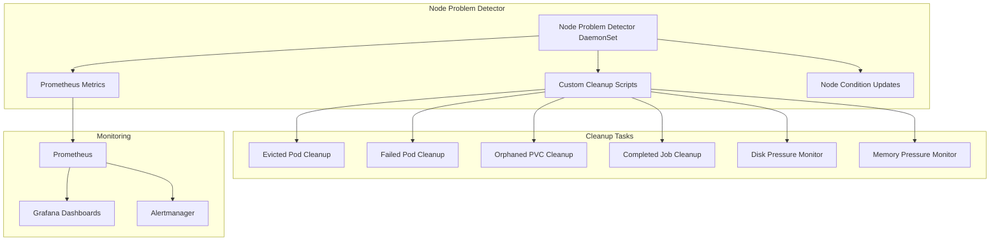

# Node Problem Detector with Automatic Cleanup

This directory contains a comprehensive Node Problem Detector (NPD) setup with automatic cleanup capabilities for Kubernetes clusters running on Talos Linux.

## 🎯 Overview

Node Problem Detector is a Kubernetes add-on that monitors nodes and reports node problems. This enhanced setup includes:

- **Automatic Cleanup**: Automatically removes evicted pods, failed pods, orphaned PVCs, and completed jobs
- **Resource Monitoring**: Monitors disk and memory pressure, triggering cleanup actions
- **Prometheus Integration**: Exposes metrics for monitoring and alerting
- **Talos Compatibility**: Optimized for Talos Linux security model

## 🏗️ Architecture



## 📦 Components

### Core Components
- **DaemonSet**: Runs on every node with privileged access
- **Custom Scripts**: Bash scripts for various cleanup tasks
- **ServiceAccount**: RBAC permissions for cleanup operations
- **ServiceMonitor**: Prometheus integration for metrics collection

### Cleanup Scripts
1. **evicted-pod-cleanup.sh**: Removes evicted pods immediately
2. **failed-pod-cleanup.sh**: Removes failed pods older than 1 hour
3. **orphaned-pvc-cleanup.sh**: Removes orphaned PVCs older than 24 hours
4. **completed-job-cleanup.sh**: Removes completed jobs older than 1 hour
5. **disk-pressure-monitor.sh**: Monitors and responds to disk pressure
6. **memory-pressure-monitor.sh**: Monitors and responds to memory pressure

## 🚀 Features

### Automatic Cleanup
- **Evicted Pods**: Cleaned up immediately when detected
- **Failed Pods**: Cleaned up after 1 hour to allow for debugging
- **Orphaned PVCs**: Cleaned up after 24 hours
- **Completed Jobs**: Cleaned up after 1 hour
- **Periodic Execution**: Runs every 10 minutes across all namespaces

### Resource Pressure Response
- **Disk Pressure**: Triggers cleanup of temporary files and empty directories
- **Memory Pressure**: Triggers memory cache cleanup
- **Node Conditions**: Updates node conditions to reflect current state

### Monitoring Integration
- **Prometheus Metrics**: Exposes cleanup activity metrics
- **Grafana Dashboards**: Visualize cleanup activities
- **Alertmanager**: Alerts for NPD health and cleanup failures

## 🔧 Configuration

### Custom Plugin Configuration
The NPD is configured with custom plugins that run cleanup scripts:

```yaml
problemDaemon:
  customPluginMonitor:
    - name: "evicted-pod-cleanup"
      path: "/custom-plugins/evicted-pod-cleanup.sh"
      timeout: "30s"
    - name: "failed-pod-cleanup"
      path: "/custom-plugins/failed-pod-cleanup.sh"
      timeout: "30s"
    # ... additional plugins
```

### RBAC Permissions
The ServiceAccount has permissions to:
- Read and delete pods across all namespaces
- Read and delete PVCs across all namespaces
- Read and delete jobs across all namespaces
- Read node information and update node conditions
- Read and create events

## 📊 Monitoring

### Metrics Available
- `node_problem_detector_problems_total`: Total problems detected
- `node_problem_detector_evicted_pods_cleaned_total`: Evicted pods cleaned
- `node_problem_detector_failed_pods_cleaned_total`: Failed pods cleaned
- `node_problem_detector_orphaned_pvcs_cleaned_total`: Orphaned PVCs cleaned
- `node_problem_detector_completed_jobs_cleaned_total`: Completed jobs cleaned

### Alerts
- **NodeProblemDetectorDown**: NPD is not running
- **NodeProblemDetectorHighCPU**: High CPU usage
- **NodeProblemDetectorHighMemory**: High memory usage
- **NodeProblemDetectorCleanupFailure**: Cleanup failures detected
- **EvictedPodCleanupActive**: Evicted pod cleanup activity
- **FailedPodCleanupActive**: Failed pod cleanup activity

## 🛠️ Usage

### Deploy via ArgoCD
The Node Problem Detector is automatically deployed by the monitoring ApplicationSet:

```bash
# Check deployment status
kubectl get pods -n node-problem-detector

# Check NPD logs
kubectl logs -n node-problem-detector -l app=node-problem-detector
```

### Manual Cleanup (if needed)
```bash
# Clean up evicted pods manually
kubectl delete pods --field-selector=status.phase=Evicted --all-namespaces

# Clean up failed pods manually
kubectl delete pods --field-selector=status.phase=Failed --all-namespaces

# Clean up completed jobs manually
kubectl get jobs --all-namespaces -o jsonpath='{range .items[?(@.status.succeeded==1)]}{.metadata.namespace}{" "}{.metadata.name}{"\n"}{end}' | xargs -L1 kubectl delete job
```

### Check Cleanup Activity
```bash
# View NPD metrics
kubectl port-forward -n node-problem-detector svc/node-problem-detector 20257:20257

# Check cleanup logs
kubectl logs -n node-problem-detector -c cleanup-cron -l app=node-problem-detector
```

## 🔍 Troubleshooting

### Common Issues

#### NPD Not Starting
```bash
# Check if pods are scheduled
kubectl get pods -n node-problem-detector -o wide

# Check node tolerations
kubectl describe pod -n node-problem-detector node-problem-detector-xxxxx

# Check RBAC
kubectl auth can-i delete pods --as=system:serviceaccount:node-problem-detector:node-problem-detector
```

#### Cleanup Not Working
```bash
# Check ServiceAccount permissions
kubectl get clusterrolebinding node-problem-detector -o yaml

# Check cleanup script logs
kubectl logs -n node-problem-detector -c cleanup-cron -l app=node-problem-detector

# Test cleanup manually
kubectl exec -n node-problem-detector -c node-problem-detector -- /custom-plugins/evicted-pod-cleanup.sh default $(hostname)
```

#### High Resource Usage
```bash
# Check resource usage
kubectl top pods -n node-problem-detector

# Check for stuck cleanup processes
kubectl exec -n node-problem-detector -c node-problem-detector -- ps aux
```

### Talos-Specific Considerations

#### Security Context
The NPD runs with privileged security context to access host logs and perform cleanup operations:

```yaml
securityContext:
  privileged: true
  allowPrivilegeEscalation: true
  capabilities:
    add:
      - SYS_ADMIN
      - SYS_PTRACE
```

#### Host Path Mounts
Required host path mounts for log access and time synchronization:

```yaml
volumes:
  - name: log
    hostPath:
      path: /var/log
  - name: localtime
    hostPath:
      path: /etc/localtime
```

## 📈 Performance Considerations

### Resource Limits
- **CPU**: 50m request, 200m limit
- **Memory**: 50Mi request, 200Mi limit
- **Cleanup Cron**: 10m request, 100m limit

### Cleanup Frequency
- **Periodic Cleanup**: Every 10 minutes
- **Immediate Cleanup**: On problem detection
- **Age-based Cleanup**: Respects minimum age thresholds

### Scalability
- **DaemonSet**: Runs on every node
- **Namespace Scanning**: Processes all namespaces
- **Concurrent Operations**: Multiple cleanup tasks can run simultaneously

## 🔒 Security

### RBAC Model
- **Least Privilege**: Only necessary permissions granted
- **Namespace Scope**: Can operate across all namespaces
- **Resource Types**: Limited to pods, PVCs, jobs, and nodes

### Pod Security
- **Privileged**: Required for host log access
- **Host Network**: Required for node-level operations
- **Host Paths**: Required for log monitoring

## 📝 Best Practices

### For Production Use
1. **Monitor Cleanup Activity**: Watch metrics and logs for unusual patterns
2. **Adjust Age Thresholds**: Modify cleanup scripts for your environment
3. **Test Cleanup Scripts**: Validate scripts work in your environment
4. **Set Up Alerts**: Configure alerts for NPD health and cleanup failures
5. **Review Permissions**: Regularly audit RBAC permissions

### For Development
1. **Start with Monitoring**: Deploy without cleanup initially
2. **Gradual Rollout**: Enable cleanup features one at a time
3. **Test in Staging**: Validate in non-production environment first
4. **Monitor Impact**: Watch for unintended side effects

## 🔗 Related Components

- **Prometheus Stack**: For metrics collection and alerting
- **Grafana**: For visualization of cleanup activities
- **Alertmanager**: For notification of cleanup events
- **ArgoCD**: For GitOps deployment management

This Node Problem Detector setup provides comprehensive automatic cleanup capabilities while maintaining full observability and security compliance for Talos Linux environments. 